# DECENTRALIZED ENERGY EXCHANGE

## Mass-Scale Research & Architecture Specification — V1 (Phase 2)

**Date:** 1 October 2026 · **Primary jurisdiction:** India · **Status:** research and architecture blueprint (no code)

**Evidence key used throughout** (so you can see how much weight each statement carries):

| Tag | Meaning |
| --- | --- |
| **\[P1\]** | Primary patent text read, including claims |
| **\[P2\]** | Patent identified from snippet/citation only; claims NOT read |
| **\[R\]** | Regulator, standards body or official-document text, or press report of an order (primary order not fully read unless stated) |
| **\[L\]** | Peer-reviewed or preprint literature, abstract-level |
| **\[A\]** | My analysis or engineering judgment, not sourced; validate by prototype or benchmark |
| **\[B\]** | Background knowledge not re-verified this session; verify before relying on it |

**Not legal advice.** Patent notes are technical design research. Any freedom-to-operate, infringement or regulatory-compliance conclusion requires a qualified patent attorney and a qualified Indian power-sector regulatory counsel.

---

## 1. Executive Summary

The research changed the Phase 1 design in four material ways.

1. **India now has regulator-approved P2P trading pilots** (Delhi and Uttar Pradesh, February 2026), run by licensed distribution companies under the Ministry of Power's India Energy Stack. The Phase 1 assumption that P2P is simply not permitted is outdated. The accurate position is: permitted only in time-bound, regulator-approved pilots run by licensees. A student/research platform cannot itself trade electricity. \[R\]
2. **Real metering authority sits with the DISCOM's AMI** (smart meter, head-end system, MDMS), not with a prosumer-owned secure element. This changes the oracle trust model: the dominant signer in a real India deployment is an institutional AMI/MDMS signer, and device-level secure-element signing is the research/sandbox and future path. \[R\]
3. **The Phase 1 "EnergyLot" conflated two different things.** It is split into (a) a non-transferable **delivery obligation** settled against metered data, and (b) a separate **granular attestation certificate** (research analogue of a REC/GoO). Indian RECs are 1 MWh, issued by a central agency, and cannot be replicated by a prototype. \[R\]\[A\]
4. **Pay-as-delivered with pro-rata release is modified, not kept as is.** Physical power flows regardless of the contract, so settlement must be a financial overlay on metered positions, with a bounded shortfall charge and a T+1 finality driven by when AMI data becomes available. \[A\]

**What is retained:** off-chain interval batch clearing with on-chain commitment and settlement; Merkle-committed meter epochs; hybrid chain architecture; ML as advisory only.

**Honest research status:** claims of four patents read in full (\[P1\]); nine further patents/applications identified but claims not read (\[P2\]); regulatory facts rely largely on press reports of orders plus one regulator PDF fragment (\[R\]). Section 6 lists what remains.

---

## 2. Problem

Rooftop solar and other distributed resources create surplus that today is monetised only through net-metering or feed-in arrangements with the DISCOM. Direct exchange between neighbours needs (a) trustworthy energy data, (b) price discovery, (c) settlement, and (d) provenance, without placing full trust in one intermediary. Existing blockchain energy proposals tend to fail on three points: putting too much on-chain, trusting meter data that nobody can verify, and ignoring the regulatory and physical reality of grid delivery.

## 3. Vision

A research-grade reference architecture for decentralized energy markets that (i) turns attested meter data into verifiable epoch commitments, (ii) clears markets off-chain with a deterministic, auditable algorithm, (iii) settles and records provenance on a blockchain, and (iv) offers ML-based market intelligence that never touches settlement. It runs in two modes:

- **Mode S (Sandbox/Simulation):** synthetic meters, test tokens, no real money, no claim of legal trading. This is what we build and demonstrate.
- **Mode R (Regulated-pilot-compatible reference):** the same core with adapters for DISCOM AMI data and DISCOM billing, representing what a licensee-operated pilot would need. We design the interfaces but do not claim to be, or to replace, a licensed operator.

## 4. India Regulatory Context

| Topic | Finding | Tag |
| --- | --- | --- |
| P2P trading status | DERC approved six-month P2P solar pilots in February 2026 (petitions by TPDDL, which proposed a blockchain-based platform, and BRPL), covering intra-DISCOM, intra-state and Delhi–UP interstate trades; UPERC approved the interstate pilot. DERC's P2P Guidelines 2024 exist. | \[R\] |
| Framework | India Energy Stack (IES), launched June 2025 under the Ministry of Power; REC Limited is the nodal agency. A live P2P demonstration was shown in February 2026. | \[R\] |
| Pilot terms (Delhi) | Prices discovered on the platform between prosumers and consumers; transaction fee ₹0.42/kWh shared equally; wheeling charges waived within the TPDDL area; capacity-linked cap removed; under-injection/under-drawal penalties replaced for the pilot; P2P settlements integrated into DISCOM billing with priority over regular supply charges; inter-state transmission charge waivers need CERC. DERC will review after the pilot. | \[R\] press; primary order PDF only fragmentarily read |
| Who may operate | Pilots are petitioned by licensees. An unlicensed third-party platform cannot be assumed to be allowed. Counsel needed. | \[A\] |
| REC mechanism | CERC REC Regulations 2022; one certificate = 1 MWh of renewable energy injected or deemed injected; issued by the central agency (Grid-India); redemption removes the certificate from the registry; traded on power exchanges (IEX, PXIL); Grid-India procedure Rev. 3 effective 2024-04-01. DISCOMs and open-access consumers can be eligible for issuance only for RE bought beyond their obligation. | \[R\] |
| Green Energy Open Access | Rules from 2022 are referenced in the Grid-India REC procedure. Content (thresholds, aggregation) not verified here. | \[B\] |
| Smart meters | Smart meter = IS 16444 (Part 1 direct-connected, Part 2 transformer-operated); data protocols per the IS 15959 series (DLMS/COSEM companion specification); AMI = meters + communication network + data management; AMISP roles; DISCOMs read at least once daily; consumer data protection under IT Act 2000 and CEA guidelines. | \[R\] |
| Data protection | Digital Personal Data Protection Act 2023 likely applies to consumption data. | \[B\] |

**Architectural consequences:**

1. Metering truth = DISCOM AMI. Our oracle must accept institutional signers.
2. Money in Mode R moves through DISCOM billing. Our settlement contract needs a payment-adapter abstraction; on-chain escrow of tokens is a Mode S feature.
3. Settlement latency is bounded by AMI data availability (daily reads), so final settlement is T+1 by design, with interval-level provisional results.
4. Our fractional certificates are **not RECs**. They are labelled "prototype attestation certificates" everywhere in UI and contracts.
5. Sybil resistance in Mode R comes from binding a wallet to a DISCOM consumer account, which is stronger than any on-chain mechanism.

## 5. Market Model

Participants: prosumers, consumers, DISCOM/licensee (Mode R), market operator, oracle operators (independent institutions), auditors/regulator observer. Products: 15-minute-delivery-interval energy obligations per **zone** (zone ≈ distribution transformer/feeder cluster, a configuration parameter), plus separate attribute certificates. Price band configurable per zone (floor and cap set by operator/regulator, e.g., bounded by export and retail tariffs). Network charges and fees are parameters, not constants (the ₹0.42/kWh Delhi figure is a pilot example only).

## 6. Research Methodology and Gaps

Method: searched patent databases (Google Patents, USPTO publication server), regulator and standards sites, preprint and publisher abstracts. Claims read in full for four patents. All other items as per tags.

**Not done (to be completed in a later pass):** claims of EP3736760, IN202341070142, US11626990B1, US11962710B2, WO2023159292A1, US20220271535A1, WO2021009371A1, US11532055B2, US11115218B2 and the oracle-interface patent US11854101 (identified only); primary DERC/UPERC order text beyond fragments; CEA Smart Meter Regulations text; GEOA Rules text; dedicated ML-forecasting and DB-benchmark literature (Sections 26–27 are therefore \[A\] and benchmark-gated); Indian Patent Office search for relevant Indian applications.

## 7. Patent Landscape

### 7.1 Claims read in full \[P1\]

| Patent | Assignee / priority | Independent claims, in brief |
| --- | --- | --- |
| **US11983765B2** | Distro Energy BV; 2022-02-25; granted 2024-05-14 | Poll IoT devices for production/consumption of the previous interval; receive weather API data; receive bids/offers *from a central modelling solution* in a trading window; create orders; match; publish matched trades to a message queue; commit as blockchain transactions; transfer tokens between wallets. |
| **US10762564B2** | IBM; 2016-11-10; granted 2020-09-01 | Meters measure energy metrics of devices operating under blockchain-stored energy contracts; identify potential changes; log metrics and changes in an energy-measurement block; an *energy optimizer block of the blockchain* decides whether a contract is kept or replaced by an optimized one. |
| **US12380497** | Assignee not stated in the retrieved text; EP priority 2019-12-10, PCT 2020-12-08 | A first meter measures generated energy in a period; a *second, different meter* verifies it (per-generator or at the grid connection point); a computing unit flags manipulation/error if the deviation exceeds a threshold; issues an energy certificate (period timestamp, generator identifier, energy amount) when verification passes; encrypts it; adds it to a blockchain/DLT block. |
| **US11720526** | ClearTrace Technologies; provisional 2019-11-12, filed 2020-11-11; granted 2023-08-08 | Hash each physical-phenomena data record; store hashes in a Merkle trie; aggregate records for a *predetermined quantum*; create a blockchain block storing the Merkle root for the aggregate; associate the block with validation data (claim 18: transmission data). |

### 7.2 Claimed vs. described (selected)

**US11983765B2.** *Claimed:* the pipeline above; true-up of traded vs. actual volumes with token transfers (claim 2); trained trading agents tied to user profiles (3); FIX protocol (5); on-chain validation of format, interval timing and price bounds (6). *Described only:* signed orders held off-chain until final, a relayer using a Redis priority queue to control chain-write rate, permissioned Ethereum, fiat banking bridge, Kafka bus, 48-hour forward market.

**US10762564B2.** *Claimed:* metering, logging, optimizer decision on contract replacement; dependent claims cover bids/contracts, bidirectional metering for balance payments, forecasts from historical contracts, suggested bid price. *Described only (not in the claims I read):* the reputation score formula from bid vs. supplied energy, tamper-resistant meter memory, a financial-system credit gateway.

**US12380497.** *Claimed:* dual-meter deviation check as a gate to certificate issuance; periods 1–60 min, preferably 10 or 15; asymmetric encryption/digital signature; permissioned ledger (dependent). *Described only:* \~1% example tolerance, looser tolerance at grid connection points because of losses, proof-of-authority, regulator as auditor node, certificate parameter table.

**US11720526.** *Claimed:* hash/Merkle/quantum-aggregation/root-on-chain/validation-data association; token generation (2); validation by comparing roots at two times plus leaf (15–17, 20). *Described only:* hourly anchoring cadence, deduplication, "energy fragments" splitting records across quanta, CO2e assets, RTO/ISO market-data linkage, REC double-counting prevention, validator nodes, multi-chain support.

### 7.3 Identified, claims not read \[P2\]

EP3736760 (meter-certified energy tokens); IN 202341070142 (IIT Madras, blockchain electricity market, patent pending per university listing); US11626990B1 (Nzero, energy contracting via distributed ledger); US11962710B2 (Farad, energy-backed digital units); WO2023159292A1 (Eneltec, meter-to-token issuance); US20220271535A1 (Hitachi Energy, ledger with grid constraints); WO2021009371A1 (ABB, decentralized forecasting/scheduling); US11532055B2 (Itron, DER commitment validation); US11115218B2 (Fisher-Rosemount, secure metering of untrusted data); US11854101 (oracle interface with threshold-signature discussion); US 2017/0103468 A1 (cited in US12380497's background as prior art on token-based P2P settlement); sibling US11817704B2 / EP4047543B1 / GB2617260A (Distro).

## 8. Technical Literature \[L\]

Mengelkamp et al. 2018 (Brooklyn Microgrid market framework; noted regulation blocked local P2P markets at the time); Mengelkamp et al. 2018 (private-chain local market, 100 households); Kirpes et al. 2019 (21 requirements via SGAM; value proposition, standardized data exchange, physical implementation are key challenges); SPETS (permissioned chain, discrete-time double auction, reputation); privacy work: ZKP double auction (IEEE Blockchain 2022), Quartierstrom privacy (coin mixing vs TEE), Languille et al. 2024 (verifiable private multi-unit auctions), MPC wrapper (Sensors 2023); MEV/batch work: CoW Protocol documentation, "Do backrun auctions protect traders?" (arXiv 2401.08302), Budish-style frequent batch auctions via ethresear.ch; oracle security: Chainlink OCR/DON material, threshold-signature oracle research (arXiv 2411.02945); granular certificates: EnergyTag Granular Certificate standards, EU RED III GoO provisions, Climate Group guidance. Referenced inside US11720526: Pop et al., *Blockchain-Based Scalable and Tamper-Evident Solution for Registering Energy Data* (Sensors 2019), a prior-art lead for Merkle-based energy-data registration.

## 9. Standards

| Standard | Role in our design | Tag |
| --- | --- | --- |
| IEC 62056 (DLMS/COSEM); IS 15959 series | Meter data exchange; the protocol a real gateway must speak to AMI/HES | \[R\] |
| IS 16444 (Parts 1–2) | Indian smart meter specification; AMI integration | \[R\] |
| IEEE 2030.5 (SEP 2.0) | REST/TLS DER-to-utility communication; DER, metering, pricing, DR function sets; our DER-side northbound option | \[R\] |
| OpenADR | Demand-response signalling; future extension | \[R\] |
| IEC 61850 / IEEE 1547 | DER interconnection and information models; background for inverter data | \[B\] |
| IETF draft-chursin-rats-energy-attestation-00 | Individual (not adopted) Internet-Draft for COSE-signed meter attestation tokens with Merkle commitment; template for our attestation format. Standing is that of a personal draft, not a standard | \[L\] |
| EnergyTag GC Scheme and Matching Standards | Template for time-stamped certificates and matching | \[R\] |

## 10. Patent-Derived Engineering Insights

1. Off-chain matching with a rate-controlled relayer into on-chain settlement is an established pattern (US11983765B2); on-chain validation of delivery-interval timing and price bounds is simple and valuable.
2. A deviation-gated certificate from independent metering (US12380497) shows the core integrity idea: cross-checking independent measurements before issuing claims.
3. Hash→Merkle→root-on-chain with leaf-level auditability (US11720526) is the scalability pattern for energy data; the literature and IETF draft converge on it.
4. Delivery reliability should feed a reputation signal (US10762564B2, described), best computed off-chain from settled data.
5. Settlement needs a post-interval true-up against actual metering (US11983765B2, US10762564B2), but physical reality and Indian rules shape its form (Section 22).
6. Oracle quorum protects against compromised oracle nodes, not against a compromised data source; source diversity matters (Section 17).

## 11. IP-Sensitive Areas ("Potential IP / patent-risk area")

| Area | Related patent | Class | Design stance |
| --- | --- | --- | --- |
| Automated cross-check of a generation meter against a second meter before issuing a blockchain certificate | US12380497 claims 1, 10 | **C** | In India the DISCOM bidirectional meter plus an inverter meter is exactly a two-meter setup, so this is close to our natural design. **Highest-priority item for counsel.** Options: treat the authoritative meter as sole source, use cross-checks only for risk flags and audits rather than automatic issuance gating; counsel must judge whether that avoids the claim. |
| Merkle hashing of meter records, aggregated by a predetermined energy quantum, root in a blockchain block, linked to validation data | US11720526 claims 1, 18 | **C** | We aggregate by *time interval and zone*, not by reaching a fixed energy quantum, and anchor in a contract rather than minting quanta blocks. This is a design difference on one element, not a clearance. |
| Matching pipeline fed by a central model that generates bids from IoT and weather data, then queue, then chain | US11983765B2 claim 1 | **C** | Our users submit their own signed orders; ML is advisory. |
| True-up of traded vs. metered volumes with token transfers | US11983765B2 claim 2 | **C/B** | Functionally close to any settlement need. Alternative framing (D): bounded shortfall charges against collateral, parameterized by regulator rules. |
| On-chain optimizer that keeps or replaces energy contracts | US10762564B2 claims 1, 7, 13 | **C** | Omitted. Contract changes are explicit user actions. |
| Off-chain relay + on-chain settlement; Merkle batching; EIP-712 signed orders; escrow; reputation | various | **A/B** | General patterns; still part of the counsel review. |

---

## 12. Final Product Requirements

**Functional (core):** participant registration with DISCOM-account binding (Mode R) or sandbox KYC; device registry; attested meter ingestion; zonal interval market with sealed orders; deterministic clearing; settlement against attested data; certificate issuance and retirement; portfolio, history, analytics; operator and auditor consoles; notifications; audit trail. **Non-functional:** deterministic reproducible clearing; verifiable provenance; T+1 final settlement; ingestion of 1M-meter scale data (Section 32); privacy by default; 99.9% availability target for the order/clearing path \[A\]; every critical decision explainable and auditable. **Out of scope:** real-money custody, grid control, autonomous AI trading.

## 13. Trust Model

| Question | Answer |
| --- | --- |
| Who do we trust? | Registered device/AMI signing keys *as data sources* (bounded by plausibility checks); the registrar for identity binding; a threshold of independent oracle operators for epoch acceptance; the smart-contract code (after audit); the chain's consensus. |
| Who do we not trust? | The market operator for clearing correctness (verifiable); any single oracle node; the gateway for data content (it can only delay/drop); users; ML outputs for settlement (never used). |
| Verified cryptographically | Reading authenticity (device/AMI signature); inclusion of a reading in an epoch (Merkle proof); order authenticity (EIP-712 signature); equivocation (two signed values for one device-interval). |
| Verified economically | Oracle operator honesty (stake/bond, slashing); seller delivery (collateral); buyer payment (escrow/credit). |
| Verified statistically | Physical plausibility of readings (capacity bounds, irradiance/weather residuals, peer comparison); anomaly scores (advisory flags). |
| Verified by hardware | Key non-extractability, where a secure element is used (sandbox/optional; not assumed for Indian AMI). |
| Verified by consensus | Order of settlement transactions, escrow balances, retirement nullifiers, finalized clearing commitments. |
| **Irreducible gap** | A signature proves a trusted device said a number, not that the physical event occurred. Our defence is layered detection and economic penalties, not proof. |

## 14. System Architecture

Layers (see diagram B1): User → Application → Market → Energy Data → Oracle → Blockchain → Data/Analytics. Deployment style (Phase 1 "modular monolith" challenged, Appendix A): **hybrid** — a modular monolith for API/identity/portfolio/certificates, plus separately deployed processes where trust or scaling boundaries demand it: ingestion gateway, oracle nodes (separate operators), batch matcher, settlement relayer, indexer, ML service.

## 15. Energy-Data Architecture

Sources → protocol adapters → normalizer → attestation envelope → epoch builder → oracle → chain.

- Normalization: integer Wh per 15-min interval per device (no floating point), interval index in IST-aligned UTC, device id, monotonic counter.
- Missing intervals: explicit `MISSING` marker, never interpolated into a certificate or settlement.
- Late data: accepted until a configurable cut-off (default T+3 days) and flagged; late epochs are appended as supplemental epochs, never rewriting finalized roots.
- Duplicates: unique (deviceId, intervalIdx); conflicting signed duplicates = equivocation proof.
- Storage: raw signed attestations archived to object storage (Parquet) because Merkle proofs must be regenerable; hot copies in the time-series store.

## 16. Meter Architecture

```
Physical meter (IS 16444, DLMS/COSEM)  ->  AMI Head-End/MDMS (DISCOM)         [Mode R path]
Inverter / DER meter (IEEE 2030.5 / Modbus) -> Edge gateway + secure element  [research/optional path]
Software meter simulator (our interface)    -> same attestation envelope       [Mode S path]
                         |
                 Attestation envelope  (deviceId, intervalIdx, energyWh, direction, counter, signerType, signature)
                         v
                  Ingestion gateway -> oracle nodes
```

- **Signer abstraction:** `signerType ∈ {SIMULATED, DEVICE_SE, DISCOM_MDMS}`. Contracts and oracle logic treat all three identically except for the trust weight stored in the DeviceRegistry.
- **Simulator interface** exposes the same envelope and a pluggable fault injector (drift, replay, bypass, offline, equivocation) for the test strategy.
- **Format:** COSE_Sign1/CBOR as in the IETF draft is the reference; compact binary acceptable internally. Signature scheme: Ed25519 for devices (cheap), secp256k1/EIP-712 for user orders (wallet-native).
- **Protocol mapping:** DLMS/COSEM is the real-meter protocol in India; we implement the *adapter interface* and test it against recorded/synthetic DLMS-like payloads, not a certified implementation. IEEE 2030.5 is the optional DER-side adapter; OpenADR is a later extension.

## 17. Oracle Architecture

Phase 1's "3-of-5 quorum" is **modified**. Evidence: a quorum of operators all reading the same upstream source is not decentralization (oracle-security literature), and in India the upstream source is typically a single DISCOM head-end.

**Design:**

1. **Source tier:** signed attestations (Section 16).
2. **Validation tier (N independent operators, e.g., DISCOM, SLDC/regulator-observer, independent auditor, university/academic, optional commercial node):** each node independently verifies signatures, device registration/status, counter monotonicity, interval uniqueness, capacity bounds, weather-model residuals, and peer/zone consistency, then builds its own epoch Merkle tree from the archive. Nodes compare roots.
3. **Acceptance:** t-of-N signatures over `(zoneId, intervalRange, root, leafCount, totalWh)` posted to `EpochOracle`. Prototype uses a list of t ECDSA signatures (simple, auditable); threshold signatures (Schnorr/BLS) are a later optimization. Patent US11854101 discusses threshold-signature oracle designs (claims unread): flag for counsel before adopting a specific threshold-signature protocol.
4. **Freshness and liveness:** `EpochOracle` rejects reads older than a configured age; on an L2, also checks sequencer-uptime status (ignoring it is a documented class of oracle incidents).
5. **Disputes:** anyone with a signed leaf can submit (a) an inclusion proof showing a leaf missing/modified, or (b) an equivocation proof (two different signed values for one device-interval), triggering device revocation and operator review.
6. **What it does *not* solve:** a compromised AMI/MDMS signer producing consistent false data. Mitigations: plausibility, cross-source checks as *flags*, sampled physical audits, DISCOM accountability under regulation, and capped exposure per device (certificate and trade limits tied to registered capacity).

Attack coverage: replay (counter + unique key), stale data (age checks), false readings (plausibility + audits), compromised meter (equivocation + revocation), compromised gateway (cannot forge; drop/delay only), colluding nodes (t-of-N across independent operators + stake + public archive for re-derivation), fabricated production (capacity bounds, weather residual, per-device exposure caps).

## 18. Marketplace Architecture — Mechanism Comparison \[A, informed by CoW/Budish-style batch-auction literature and the Quartierstrom/SPETS papers\]

| Mechanism | Fairness | Price discovery | Complexity | Scalability | MEV / front-run exposure | Strategic bidding | Liquidity | Impl. effort | Verdict |
| --- | --- | --- | --- | --- | --- | --- | --- | --- | --- |
| Continuous double auction / order book | Speed-advantaged | Continuous, thin at household scale | Low–Med | Matching fast; on-chain writes heavy | **High** if on-chain; operator-latency edge off-chain | Sniping, spoofing | Fragmented across 15-min products | Med | Reject |
| **Discrete-time uniform-price double auction (call market) per zone and delivery interval** | Same price for all; no speed edge | One clearing price per interval | Low (sort + intersect) | O(n log n) per zone | **Order-independent within batch**; residual risk = operator and revealing orders early | Marginal-trader shading remains | Concentrates liquidity at gate closure | Low–Med | **Select** |
| Pay-as-bid (discriminatory) auction | Complex for small users | Poor signal; bid shading | Low | Same | Same | **High** | OK | Low | Reject for default (Quartierstrom used discriminatory pricing, but uniform is easier for lay users) |
| Bilateral / OTC contracts | Negotiated | None | Low | N/A | N/A | N/A | Illiquid | Low | Tier 3 add-on |
| Combinatorial auction | Rich preferences | Good | **Very high** (winner determination is hard in general) | Poor | Low | Complex | Good | High | Reject |
| Grid-aware / network-constrained clearing | Reflects physical limits | Good | Med–High | Needs network model | Low | Med | Good | High | Adopt the simple form: **zonal capacity limits** inside the call market; full network-constrained clearing is Tier 3 |
| Truthful double auctions (e.g., McAfee-style trade reduction) | Strategy-resistant | Good | Low–Med | Same | Same | Low | Gives up one trade | Med | Research option (Tier 3) \[B\] |

**Why this choice:** it removes ordering advantage (the core of MEV-style attacks), produces a single auditable price, aligns with 15-minute settlement intervals and with Indian interval accounting \[B\], and makes the clearing a pure function of the order set, which allows verification.

**Where front-running still exists, and mitigations:**

- *Public mempool:* orders are signed messages sent to the matcher, not chain transactions. On-chain activity is limited to deposits, commitments and claims, whose ordering has no price effect.
- *Matcher insider:* orders carry a matcher-signed receipt with a sequence number; the matcher publishes a Merkle root of the closed order set at gate closure, then the clearing result computed by a published deterministic function; anyone can recompute and challenge. For stronger secrecy, orders may be encrypted to a per-interval key released at gate closure (commit-reveal variant; operator-held key in the prototype, threshold-shared key later). Penalising non-reveal needs deposits \[L, ethresear.ch discussion\].
- *Oracle-timing games:* meter roots aggregate across the zone and are posted after delivery, so they carry no exploitable price information.

## 19. Pricing

- Uniform clearing price per (zone, interval) from the call market, k-double-auction with k = 0.5 between marginal bid and ask (parameterized).
- Price band \[floor, cap\] per zone set by governance/regulator (Mode R). Orders outside the band are rejected on-chain and in the matcher (the interval/price-bound validation idea of US11983765B2 claim 6 is a general contract-validation technique; see Section 11).
- Fees (transaction fee, wheeling/network charge) are separate line items in the settlement statement, never embedded in price.
- Time-of-use effects emerge from interval-level clearing; no separate dynamic-tariff engine in v1.
- Renewable incentives: in v1 modelled only as certificate attributes, not price subsidies.

## 20. Matching

- Gate closure at T−Δ before delivery (default Δ = 60 min) \[A, tunable\].
- Algorithm: sort buys descending, sells ascending; find the largest q where bid(q) ≥ ask(q); price per Section 19; pro-rata at the margin with a deterministic tie-break (hash of order id + interval seed).
- **Determinism:** integer arithmetic only (Wh, paise); stable sort keys; the algorithm is a pure function packaged as a shared library (TypeScript/WASM) used by the matcher and by the independent verifier.
- Partial fills allowed; zone capacity limit enforced as a constraint (reduce marginal volume).
- Complexity per zone-interval is O(n log n); not a bottleneck even at 20% participation (Section 32).

---

## 21. Token Model (Phase 1 "EnergyLot" challenged)

**Decision: two asset classes, not one.**

| Asset | What it is | Representation | Transferable? |
| --- | --- | --- | --- |
| **Delivery obligation** | A financial position: buyer, seller, zone, interval, quantity Wh, price, collateral. Physical electricity is delivered by the grid regardless; this is a metered-position overlay. | **Not a token.** A record in `BatchSettlement` (Merkle leaf of the clearing result; claimable). | No |
| **Granular attestation certificate (GAC)** | Claim to the environmental attribute of attested generation: zone, source type, interval, Wh. Research analogue of REC/GoO, **not a REC**. | ERC-1155, id = hash(zone, source, intervalStart), amount in Wh, lazy Merkle-claim minting. | Yes, among registered wallets; retirement burns it. |
| **Payment** | Settlement currency | Test stablecoin (Mode S); billing-credit statement (Mode R). | Per adapter |

**Standards comparison** \[A, standards behaviour is well known; ERC-3525 maturity \[B\]\]:

| Option | Scalability | Divisibility | Time/zone/source attributes | Retirement / double count | Gas | Verdict |
| --- | --- | --- | --- | --- | --- | --- |
| ERC-20 | Good | Yes | None (needs one contract per class) | Weak | Low | Payment token only |
| **ERC-1155** | Good (batch ops) | Yes | Via token id classes | Burn + nullifier | Low–Med | **Select for GAC** |
| ERC-721 | Poor at 96M/day | No | Per-token metadata | Strong | High | Reject |
| ERC-3525 (slot + value) | Good | Yes | Slot = class, value = Wh (elegant fit) | Good | Med | Research alternative; less audit/tooling coverage in my judgment |
| Custom accounting | Best | Yes | Anything | Anything | Lowest | Used internally; ERC-1155 wrapper only for those who want on-chain transfer |
| Off-chain ledger + on-chain anchors | Best | Yes | Anything | Needs on-chain nullifiers | Lowest | **System of record for balances**, with on-chain nullifier set |

Rule: *retirement* is the only operation that must be globally consistent on-chain, because it prevents double counting. Everything else can be batched and lazily claimed.

## 22. Settlement (Phase 1 pro-rata release challenged)

**Evidence driving change:** physical power flows irrespective of contracts; AMI data arrives at best daily; Indian pilots integrate P2P settlement into DISCOM billing with regulator-defined deviation treatment; US patents describe true-up with token transfers (see Section 11).

**Decision: metered-delivery settlement with bounded shortfall charge, T+1 finality.**

1. *At clearing (provisional):* buyer's payment authorisation and seller's collateral are locked (Mode S: escrow; Mode R: credit limit check by licensee).
2. *Delivery interval passes.* Matcher publishes provisional obligations root.
3. *After attested epoch finalization (T+1):* for each obligation, delivered D = min(Q, seller metered injection allocation, buyer metered draw allocation) using a published allocation rule across the zone.
4. Payment = D × clearing price. Shortfall S = Q − D triggers a shortfall charge on the failing side, equal to the counterparty's cost difference to the reference tariff, capped by collateral and by regulator rules (Mode R takes deviation rules from the regulator; the sandbox uses configurable defaults).
5. Net positions per participant are rolled into a **daily settlement statement** (Merkle root on-chain); users claim or the licensee bills.
6. *Disputes* concern only data validity or allocation arithmetic: a challenge window; evidence is the public epoch archive; resolution by operator council in v1, DAO deferred.

**Why not pure pro-rata release:** it ignores the buyer's replacement cost and creates a free option for sellers to over-commit. **Why not instant settlement:** impossible with daily AMI reads. **Why not payment channels:** per-interval bilateral flows are small and net well; netting daily is simpler and cheaper. **Why not fiat gateway in v1:** regulated rails belong to the licensee in Mode R.

## 23. Certificates

- Issued per (zone, source, interval) from the finalized epoch via Merkle claim; the claimant proves leaf inclusion for a device they are bound to.
- Temporal granularity 15 minutes, geographic granularity zone; consumers can retire at any granularity ≥ interval; EnergyTag-style hourly matching is a view over retired certificates.
- Double counting: `RetirementRegistry` stores nullifier = hash(leafId, amountRange); a leaf's Wh can be claimed/retired once. Bundled energy+attribute trades transfer the GAC with the obligation; unbundled GAC trades are separate.
- UI language: "prototype attestation certificate"; any link to Indian REC issuance is an *off-chain, registry-driven* process out of scope.
- Fractional-REC and 24/7 matching are acknowledged in international practice (RED III permits sub-MWh GoOs and time-stamping), but Indian REC remains 1 MWh \[R\].

## 24. Blockchain Architecture

**What the blockchain does** (the critical artifact):

| Function | On-chain? | Off-chain? | Why |
| --- | --- | --- | --- |
| User identity | Pseudonymous participant id + registrar-signed binding hash | PII, DISCOM account mapping | Privacy; DPDP exposure |
| Raw meter reading | No | Time-series store + object archive | Volume (96M/day) and privacy |
| Meter signature | No (verified off-chain; leaf proofs verifiable on-chain) | Yes | Cost |
| Merkle epoch root | **Yes** (super-root per interval) | Trees built off-chain | Integrity anchor |
| Orders | No (signed, receipt-sequenced); root of closed set published | Yes | Throughput, secrecy |
| Matching | No (deterministic function) | Yes | Cost; verifiable by recomputation |
| Clearing result | **Commitment** (root) on-chain | Full result off-chain | Auditability |
| Escrow / collateral | **Yes** (Mode S) | Licensee credit in Mode R | Custody without trust |
| Settlement | **Daily net statement root**; claims on-chain | Computation off-chain | Cost, finality |
| Energy ownership | N/A: energy not transferred; obligations are records | Yes | Physical reality |
| Certificate issuance & retirement | **Yes** (mint-by-claim, nullifier) | Balances optionally off-chain | Double-counting prevention |
| Analytics / ML | No | Yes | Not consensus-critical |

**Contracts** (revised from Phase 1; each with `Pausable`, role-based access, timelocked admin):

| Contract | Purpose | Key state | Key events | Critical functions | Invariants |
| --- | --- | --- | --- | --- | --- |
| `AccessRegistry` | Roles: REGISTRAR, OPERATOR, ORACLE, AUDITOR, PAUSER | role maps | RoleGranted | grant/revoke (timelock) | No role escalation without timelock |
| `ParticipantRegistry` | Wallet ↔ participant id, zone, role | participants | ParticipantRegistered | register (registrar-signed), suspend | One active participant per binding hash |
| `DeviceRegistry` | Device key, signerType, zone, capacity, status, trust weight | devices | DeviceRegistered/Revoked | register, revoke, submitEquivocationProof | Revoked devices cannot join new epochs |
| `EpochOracle` | Accept t-of-N signed epoch roots | roots\[zone\]\[interval\], operator set | EpochFinalized | submitEpoch, challenge | Root immutable once finalized; staleness and sequencer checks |
| `Escrow` | Deposits, locks, collateral | balances, locks | Deposited, Locked, Released | deposit, withdraw (not if locked), lock/release by Settlement | Σ balances = token balance; locked ≤ balance |
| `BatchSettlement` | Orders-root + clearing commitment, challenge window, daily statements, claims | commitments, statements, claimed bitmap | ClearingCommitted, StatementFinalized, Claimed | commitClearing, challenge, finalize, claim(proof) | A leaf is claimed once; Σ statement credits = Σ debits |
| `CertificateRegistry` (ERC-1155) | GAC mint-by-claim, transfer-gated | supplies, claimed leaves | CertificateMinted | claim(proof) | Minted Wh ≤ epoch-attested Wh |
| `RetirementRegistry` | Nullifiers | spent set | Retired | retire | Nullifier unique |
| `Treasury/Fees` (optional) | Fee accounting | fee balances | FeeCollected | – | Fees ≤ configured cap |

Security: checks-effects-interactions, pull-over-push payments, reentrancy guards on escrow and claims, signature domain separation and nonces (EIP-712), no upgradeable proxies on Escrow in v1 (or proxy + timelock + audit), invariant tests (Section 36).

**Chain choice (Phase 1 "L2" modified):** contracts are plain EVM and chain-agnostic. Reference targets: local dev chain; an EVM L2 testnet for demonstration; a permissioned EVM network for a consortium/licensee context (matches pilot reality where DISCOMs operate the platform) \[A\]. L1 is optional for periodic anchoring only. See Section 32 for why.

## 25. Backend Architecture

- **Core API (TypeScript/Node, modular monolith):** modules identity, participants/devices, orders gateway, portfolio, settlement statements, certificates, notifications, admin. OpenAPI-first; JWT access tokens with short TTL + rotating refresh; wallet auth via Sign-In with Ethereum style nonces; RBAC + object-level authorization on every resource id (IDOR prevention).
- **Workers (separate processes):** `ingest-gateway` (envelope validation, dedupe, rate limits), `epoch-builder`, `oracle-node` (deployable by independent operators, own keys), `matcher` (pure clearing lib), `settlement-relayer` (queues chain writes with rate control, retries, idempotency keys), `indexer` (chain events → Postgres), `ml-service` (Python).
- **Messaging (Phase 1 Redis challenged):** Redis for cache, rate limiting, idempotency keys, short-lived staging only. Durable event log: Redis Streams with AOF acceptable for the prototype; target a Kafka-compatible log (or NATS JetStream) once sustained ingest or replay needs exceed what the prototype shows \[A\]. Peak ingest estimated 16.7k msgs/s at 1M meters (Section 32).
- **Regions/edge:** zone-sharded ingestion; regional gateways close to AMI head-ends; global services stateless.

## 26. Database Architecture (benchmark-gated \[A\])

| Data | Store | Reason |
| --- | --- | --- |
| Users, participants, orders, trades, obligations, statements, certificates, audit log | **PostgreSQL** | Transactional integrity; strong constraints; partition orders/trades by month |
| Meter readings | **TimescaleDB** (Postgres extension) hypertables, chunked by day, space-partitioned by zone | Same SQL/ops model; compression and continuous aggregates; 35B rows/yr at 1M meters |
| Raw signed attestations | **Object storage** (Parquet, zstd), partitioned by zone/day | Cheap; needed to regenerate Merkle proofs; legal retention |
| Analytics at scale | ClickHouse or warehouse **deferred** until query load/volume proves Timescale insufficient | Avoid premature polyglot sprawl |
| Cache/rate limit/idempotency | Redis | Ephemeral |
| Event log | Redis Streams → Kafka-compatible | See Section 25 |
| Blockchain events | Custom indexer → Postgres | The Graph considered; custom indexer keeps data local and handles reorg logic for permissioned chains |

Practices: UUIDv7 or ULID ids; money in integer paise, energy in integer Wh; append-only audit tables with hash chaining; read replicas for portfolio queries; row-level security for tenant/participant isolation; retention tiers (hot 90 days in Timescale, then compressed, then archive only).

## 27. AI/ML Architecture \[A — model choices to be benchmarked; no dedicated literature pass yet\]

ML never writes to settlement, orders, or oracle acceptance. Flow: Energy data → features → models → **forecasts and risk scores** → dashboards and optional *bid suggestions the user must confirm*.

| Use | Inputs | Model (start → escalate) | Output | Where/latency | Failure handling | Effect on trading |
| --- | --- | --- | --- | --- | --- | --- |
| PV generation forecast | Weather forecast, irradiance, device capacity, history | Persistence/seasonal-naive baseline → gradient-boosted trees (LightGBM/XGBoost) → sequence models only if they beat the baseline | Day-ahead interval forecast + interval | Batch, hourly refresh | Fall back to baseline; display staleness | Suggested sell volume |
| Load forecast | History, calendar, weather | Same ladder | Day-ahead profile | Batch | Same | Suggested buy volume |
| Meter anomaly score | Residual vs forecast, physical bounds, peer deviation | Rule bounds + residual z-scores → isolation-forest-style detector | Risk score per device-interval | Streaming near-real-time | If down, rules-only | Flags for operator review; may lower per-device exposure caps by policy, never auto-slash |
| Fraud/Sybil indicators | Order patterns, wallet graph | Rules → graph features later | Risk flags | Batch | Rules-only | Review queue |
| Price forecast | Past clearing prices | Deprioritized: price is auction-set | – | – | – | – |

Excluded for v1: deep transformers/N-BEATS/TFT/GNN (data volume and benefit unproven), reinforcement-learning trading agents (IP-sensitive area in Section 11 and trust risk). Benchmark metric: MAE/pinball loss vs seasonal-naive on held-out weeks.

## 28. Privacy

| Tier | Mechanisms | When |
| --- | --- | --- |
| **1 (v1)** | Pseudonymous wallets; PII and raw readings off-chain; on-chain aggregates and commitments only; encryption at rest/in transit; purpose-limited access logs; zone-level and 15-min aggregation in public dashboards | Build now |
| **2** | Selective disclosure via Merkle proofs (reveal only the leaf needed); sealed/encrypted orders with time-released key; per-zone k-anonymity thresholds for public stats; differential-privacy noise on published aggregates | After core works |
| **3** | ZK proofs of order validity/clearing correctness, MPC auctions, TEEs for sealed bids | Research track; literature shows feasibility but extra gas/complexity |

Migration path is additive: Tier 2 reuses the Merkle leaves, Tier 3 replaces the challenge window with proofs. Do not claim anonymity: even pseudonymous wallets are linkable to consumption through settlement amounts; Tier 1 is data minimisation, not anonymity.

## 29. Security

Smart contracts: audits (internal + tool-assisted), fuzz/invariant tests, formal properties for Escrow and Settlement, pause + timelocked governance, no unbounded loops, pull payments. Backend: OWASP ASVS controls, parameterized queries, strict schema validation, rate limits per wallet/IP/device, replay protection on every signed message (nonce + expiry + domain), secrets in a vault, KMS/HSM for oracle and relayer keys, signed container images and SBOM. Keys: operator/oracle keys never co-located; relayer hot key with spending limits. Admin: multi-sig + timelock; all admin actions audit-logged on-chain.

## 30. Threat Model (STRIDE + blockchain-specific)

| Component | Threat | Attack | Impact | Mitigation |
| --- | --- | --- | --- | --- |
| User | Spoofing, Sybil | Many wallets claiming many identities | Market manipulation | DISCOM-account binding (Mode R), sandbox KYC, per-binding limits |
| Wallet | Key theft, phishing, blind signing | Malicious signature requests | Fund loss, fake orders | EIP-712 typed data, domain separation, human-readable prompts, order expiry |
| Meter | Tamper, bypass, replay | Physical bypass, record replay | False generation or consumption | Counter + unique (device,interval), capacity bounds, audits, equivocation proofs, tamper flags |
| Gateway | Compromise, drop/delay | Withhold readings, inject unsigned data | Missed settlement; DoS | Signature required; multiple gateways; late-data window; alerts |
| Oracle | Collusion, key theft, stale root | Colluding t nodes sign false root | False certificates/settlement | Independent operators, stake/slashing, public archive re-derivation, challenge window, key rotation |
| Matcher | Insider ordering advantage, censorship | Reorder or omit orders, selective reveal | Unfair clearing | Receipts + published order-set root, deterministic clearing, challenge, rotation of operators, optional sealed orders |
| Backend API | IDOR, privilege escalation, JWT misuse, injection, API abuse | Object id guessing, token replay | Data leak, fraud | Object-level auth tests, short JWT TTL, refresh rotation, input validation, WAF/rate limits |
| Database | Injection, exfiltration, tampering | Stolen creds, SQLi | Privacy breach, ledger drift | Least privilege, RLS, encryption, hash-chained audit tables, reconciliation against chain |
| Blockchain | Reorg, sequencer outage, MEV | L2 downtime, tx ordering | Stale or wrong state | Sequencer-uptime checks, finality-aware indexer, order-independent batch logic |
| Smart contracts | Reentrancy, access control, signature replay, rounding, DoS, oracle misuse | Standard exploits | Fund loss | Pull payments, guards, nonces, invariant fuzzing, caps, pause |
| Admin | Insider abuse, key compromise | Role misuse | Systemic | Multi-sig + timelock, separation of duties, on-chain role logs |
| ML | Poisoning, evasion, over-trust | Crafted data to shift thresholds | False flags or misses | ML advisory only, robust baselines, drift monitoring, human review |
| Infrastructure | Supply chain, secrets leakage, container escape | Malicious dependency | Full compromise | Pinned and signed artifacts, vault, network policies, runtime monitoring |
| Market | Wash trading, spoofing, price manipulation | Self-dealing, large fake orders | Distorted prices | Position/exposure limits tied to capacity, collateral on orders, same-owner matching rules, surveillance analytics |

## 31. Scalability

Bottleneck ranking at 1M meters \[A, from Section 32 calculations\]: (1) meter ingestion bursts and storage growth; (2) oracle verification fan-out; (3) per-user on-chain action cost; (4) not matching. Scaling levers: zone sharding of ingest/epoch/match; batching; lazy claims; compression/tiering; horizontal oracle verification (sample verification for low-risk devices with full verification of audited subsets); regional gateways.

## 32. Performance Calculations

**Assumptions:** 15-minute readings, 96/day/meter; compact attestation ≈ 96 B, COSE/CBOR ≈ 160 B (assumed), JSON ≈ 350 B (assumed); 100 or 1,000 zones; 48 active trading intervals/day; per-claim gas ≈ 50k; 30M gas-per-block reference, 7,200 blocks/day (reference only; current limits differ, so verify).

**Meter data at 1M meters**

| Metric | Value |
| --- | --- |
| Readings/day | 96,000,000 |
| Readings/month (30 d) | 2.88 billion |
| Readings/year | 35.04 billion |
| Average rate | 1,111 readings/s |
| Burst if all arrive within 60 s of each interval | 16,667/s (3,333/s over 5 min) |
| Storage/day: compact / COSE / JSON | 9.2 GB / 15.4 GB / 33.6 GB |
| Storage/year: compact / COSE / JSON | 3.4 TB / 5.6 TB / 12.3 TB |
| Signature verifications/day | 96,000,000 per verifying node (about 16.7k/s burst; a few cores for Ed25519 \[A\]) |
| Merkle leaves/day | 96,000,000 |
| Trees/roots per day | 100 zones: 9,600 (10,000 leaves, depth 14, proof 448 B); 1,000 zones: 96,000 (1,000 leaves, depth 10, proof 320 B) |
| On-chain commitments (one super-root per interval) | 96/day ≈ 4.3M gas/day at \~45k gas each \[A\] |
| Oracle operations | 9,600–96,000 zone-epochs/day × N nodes verifying and signing |

**Trading** (participation of 1M meters; one order per active interval)

| Scenario | Participants | Orders/day | Avg orders/s | Burst/s (60 s) | Weekly claims/day | Claim gas/day (50k each) | % of L1 daily gas (30M×7,200) |
| --- | --- | --- | --- | --- | --- | --- | --- |
| A: 1% | 10,000 | 480,000 | 5.6 | 167 | 1,429 | 71M | 0.03% |
| B: 5% | 50,000 | 2.4M | 27.8 | 833 | 7,143 | 357M | 0.17% |
| C: 20% | 200,000 | 9.6M | 111 | 3,333 | 28,571 | 1.43B | 0.66% |

**Architecture options**

| Option | Per-reading on chain | Per-trade on chain | Hybrid (roots + daily statement) | Notes |
| --- | --- | --- | --- | --- |
| A: Ethereum L1 | Impossible (96M tx/day vs \~10⁶ capacity \[B\]) | Scenario A would consume a large share of daily L1 transactions; C exceeds it | Capacity fine (96 tx/day + weekly claims at \<1% of gas), **but per-claim cost = gas × gas price, too high for household-sized trades** | Use only for optional anchoring |
| B: EVM L2 | Impossible at scale | Feasible for A–B, costly and sequencer-dependent at C | Good; cheap claims; need sequencer-uptime checks and L1 data-availability cost awareness | Good demo target |
| C: Appchain / permissioned EVM | Impractical | Feasible | Best throughput/finality; trust = consortium | Matches licensee-operated pilots |
| D: Hybrid settlement (roots to L2/L1 anchor, operations in permissioned chain) | n/a | n/a | Strongest trust/cost balance, more moving parts | Research/Tier 2 |
| E: Off-chain ledger + periodic anchoring only | n/a | n/a | Cheapest; loses on-chain enforceability | Fallback for Mode R if custody stays with licensee |

**Conclusion:** matching is cheap; the architecture's cost drivers are data ingest/storage and per-user chain actions. Therefore: root-only on-chain data, daily netted statements, lazy claims, chain-agnostic contracts.

## 33. Failure Handling

| Failure | Behaviour |
| --- | --- |
| RPC outage | Relayer queues with idempotency keys; multi-RPC failover; matching continues; settlement deferred |
| L2 sequencer down | Freeze oracle consumption, extend challenge windows, resume on uptime confirmation |
| Oracle node down | t-of-N tolerates N−t offline; below t, epoch pending; alert |
| Oracle disagreement | Epoch held; investigators compare archives; no partial finalization |
| Database failure | Postgres HA with PITR; chain is the integrity backstop; indexer rebuilds state from events |
| Redis failure | Fall back to DB-backed rate limiting; idempotency from DB constraints |
| Message queue failure | Replay from durable log; outbox pattern ensures at-least-once with idempotent consumers |
| Meter offline | Late-data window; `MISSING` markers; no certificates or settlement credit for missing intervals |
| Contract emergency | Pause (limited to new commitments/claims), timelocked fix, user withdrawal path never pausable beyond statutory window \[A\] |
| Network partition | Regional ingestion buffers; epochs finalize per zone independently |

## 34. Observability

OpenTelemetry traces end-to-end (order → clearing → commitment → settlement), Prometheus metrics, Grafana dashboards, structured JSON logs with correlation ids. Key metrics: ingest rate and lag per zone; signature failure rate; duplicate/equivocation counts; epoch finalization latency; oracle node agreement rate and latency; matching latency and orders/interval; clearing price and volume; settlement latency; failed settlements; gas used per commitment; relayer queue depth; RPC error rate; sequencer status; ML drift and forecast error; API p95 latency; security events (auth failures, rate-limit hits). Alerts on stale epochs, oracle disagreement, reconciliation mismatch (DB vs chain).

## 35. Deployment

Dev: Docker Compose (Postgres+Timescale, Redis, local chain, mock AMI/meter simulator, MinIO, Prometheus/Grafana). Staging: cloud, single region, L2 testnet. Production-style: Kubernetes, zone-sharded ingest deployments, independent oracle deployments per operator, managed Postgres with replicas, object storage, vault/KMS, private networking between ingest and AMI adapters. Edge gateways as small containers on regional hardware. Infrastructure as code (Terraform).

## 36. Testing

- **Contracts:** unit, property-based fuzz, **invariant tests** (escrow conservation, Σ statement credits = Σ debits, nullifier uniqueness, minted ≤ attested), attack simulations (reentrancy, replay, signature malleability, oracle staleness, griefing withdrawals).
- **Clearing library:** golden vectors, differential tests vs a reference implementation, determinism across runtimes, property tests (no price outside band, volume conservation).
- **Oracle/meter:** fault-injection simulator (replay, equivocation, drift, bypass, offline, compromised gateway), multi-node agreement tests.
- **Backend:** unit, integration, API contract tests, authorization matrix tests (every route × role × object), load tests with k6.
- **Frontend:** component tests, E2E (Playwright) for trade → settle flow, accessibility checks.
- **System:** scale tests for Scenarios A–D from Section 32 (synthetic meters), chaos tests for RPC/oracle/DB/Redis failures, reconciliation tests between DB and chain.

## 37. Repository Structure

Monorepo (pnpm workspaces; Foundry for contracts; Python for ML), because shared deterministic libraries (clearing, attestation format, types) must be identical across matcher, verifier, oracle and tests.

```
decentralized-energy-exchange/
├── apps/
│   ├── web/                    # Next.js trader/prosumer app
│   └── console/                # operator, oracle, auditor console
├── services/
│   ├── api/                    # modular monolith (identity, portfolio, certs, admin)
│   ├── ingest-gateway/
│   ├── epoch-builder/
│   ├── oracle-node/            # independently deployable
│   ├── matcher/
│   ├── settlement-relayer/
│   ├── indexer/
│   └── ml-service/             # Python (forecast, anomaly)
├── contracts/                  # Foundry: src/, test/ (unit, fuzz, invariant), script/
├── packages/
│   ├── clearing/               # pure deterministic clearing function
│   ├── attestation/            # envelope, COSE, Merkle utils
│   ├── contracts-client/       # typed bindings (viem)
│   ├── types/  config/  ui/
├── simulators/
│   └── meter-sim/              # fault-injecting software meters + DLMS-like adapter stubs
├── database/ (migrations, seeds)
├── infrastructure/ (docker, kubernetes, terraform, monitoring)
├── docs/ (architecture, research/patents, security, regulatory, api, adr)
├── tests/ (e2e, load, chaos)
└── docker-compose.yml  README.md  LICENSE
```

## 38. Development Roadmap

| # | Milestone | Objectives / components | Depends on | Tests | Result |
| --- | --- | --- | --- | --- | --- |
| 1 | Foundations | Monorepo, CI, ADR process, compose stack | – | Lint/build | Reproducible env |
| 2 | Attestation + simulator | Envelope format, Ed25519 signing, Merkle lib, meter simulator with fault injection | 1 | Golden vectors, fuzz | Valid/invalid reading corpus |
| 3 | Registries | `AccessRegistry`, `ParticipantRegistry`, `DeviceRegistry` | 1 | Unit/invariant | Identity + device onboarding |
| 4 | Ingest + epoch builder | Gateway, dedupe, TimescaleDB, object archive, epoch trees | 2,3 | Load, replay tests | Epochs from simulated 10k meters |
| 5 | Oracle | Node validation, t-of-N signing, `EpochOracle`, challenge/equivocation proofs | 3,4 | Fault injection, agreement tests | Finalized roots on chain |
| 6 | Clearing library + matcher | Deterministic call-market, order gateway, receipts, order-set root | 1 | Property/differential tests | Auditable clearing |
| 7 | Escrow + BatchSettlement | Commitments, challenge window, statements, claims | 5,6 | Invariants, attack tests | Settlement end-to-end on testnet |
| 8 | Certificates | `CertificateRegistry`, `RetirementRegistry`, Merkle claims | 5 | Double-count tests | Mint/retire flow |
| 9 | Indexer + backend API | Event ingestion, portfolio, auth, RBAC | 7,8 | Authz matrix | Consistent DB view |
| 10 | Frontend | Lifecycle UI, market, portfolio, oracle, certificates, explorer | 9 | Component + E2E | Demonstrable product |
| 11 | Analytics + ML | Forecast baselines, anomaly scores, dashboards | 4,9 | Backtests | Advisory intelligence |
| 12 | Security | Threat-model review, audit, pen-test, key management | 7–10 | Security tests | Findings closed |
| 13 | Scale and chaos | Scenarios A–D synthetic, failure drills | all | Load/chaos | Measured bottlenecks |
| 14 | Mode R adapters | DLMS-like AMI adapter interface, billing-credit adapter, DISCOM-binding flow (stubs/mocks) | 5,7 | Contract tests | Pilot-compatible reference |
| 15 | Hardening and release | Docs, runbooks, observability, deployment | all | Smoke/DR drills | v1 |

## 39. Research Roadmap

1. Read claims of all \[P2\] patents; run Indian Patent Office and further family searches.
2. Read primary DERC, UPERC, CERC, CEA texts (P2P Guidelines 2024, pilot orders, Smart Meter Regulations, GEOA Rules) and talk to a regulatory counsel.
3. Benchmark DB choices (Postgres vs Timescale vs ClickHouse) with the synthetic 1M-meter generator.
4. ML literature pass on Indian PV/load forecasting and data availability.
5. Formal modelling of the settlement rule and strategic bidding in the uniform-price auction.
6. Prior-art search before any novelty claim.

## 40. Future Extensions

Sealed orders with threshold-shared keys; ZK proofs of clearing correctness; threshold-signature oracle; network-constrained clearing; bilateral and forward contracts; EV/BESS participation; OpenADR demand response; DAO-style oracle/operator governance; interop with REC registry data flows.

## Statement on Positioning (honest)

The finished design can be described as: *a research architecture integrating attested energy data, deterministic off-chain market clearing, blockchain settlement and provenance, multi-operator oracle verification, and advisory ML.* Each component is a known pattern in the literature and patent record. **Novelty has not been established** by a prior-art search; the integration is India-aware (AMI-signer model, dual-mode operation, asset-class separation, challengeable deterministic clearing) and these are design choices selected for technical usefulness and feasibility. Formal IP analysis and regulatory review are required before any commercial deployment.

---

# Appendix A — Phase 1 Decisions Challenged

| Phase 1 decision | New evidence | Outcome | Reason |
| --- | --- | --- | --- |
| Batch auction | MEV literature favours batch/uniform-price; matching is cheap; operator trust is the residual risk | **Keep, modify** | Zonal uniform-price call market with order-set root and verifiable clearing |
| ERC-1155 EnergyLot | RECs are certificates, energy is not transferable; India REC = 1 MWh central registry | **Replace/split** | Obligation record + GAC (ERC-1155) |
| L2 | Cost drivers are claims and ingest, not matching; pilots run by licensees | **Modify** | Chain-agnostic contracts; L2 for demo, permissioned EVM option, L1 anchoring optional |
| Oracle quorum 3-of-5 | Upstream source concentration; DISCOM AMI as signer | **Modify** | Independent validators + signer tiers + equivocation proofs |
| Merkle epochs | US11720526, IETF draft, literature | **Keep, modify** | Time/zone-based epochs, not fixed-quantum blocks; flagged for counsel |
| Pro-rata settlement | Physical delivery, daily AMI reads, regulated deviation rules | **Modify** | Metered-delivery settlement + bounded shortfall charge, T+1 |
| Modular monolith | Trust boundaries (oracle, matcher) need separation | **Modify to hybrid** | Monolith API + independent workers |
| Redis | Needed for ephemeral state; not durable log | **Keep for cache, replace as queue at scale** | Redis Streams prototype → Kafka-compatible |
| PostgreSQL | 35B rows/yr readings | **Keep + add Timescale** | Transactional stays; time-series moves |
| ML scope | Trust/IP risk of autonomous agents | **Keep, narrow** | Advisory forecasts and risk flags |
| Privacy | Settlement amounts still link users | **Keep tiers, clarify** | Tier 1 is minimisation, not anonymity |

# Appendix B — Diagrams

**B1. Global system architecture**

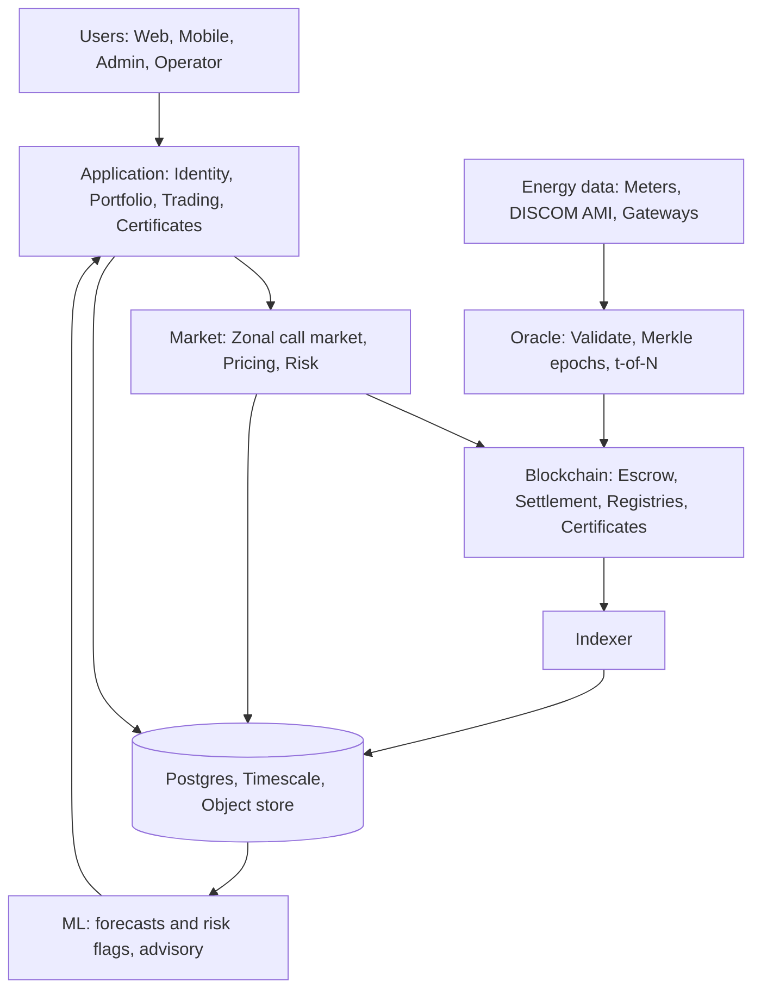

**B2. Energy-data pipeline**

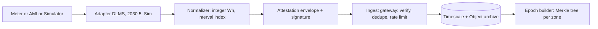

**B3. Meter attestation flow**

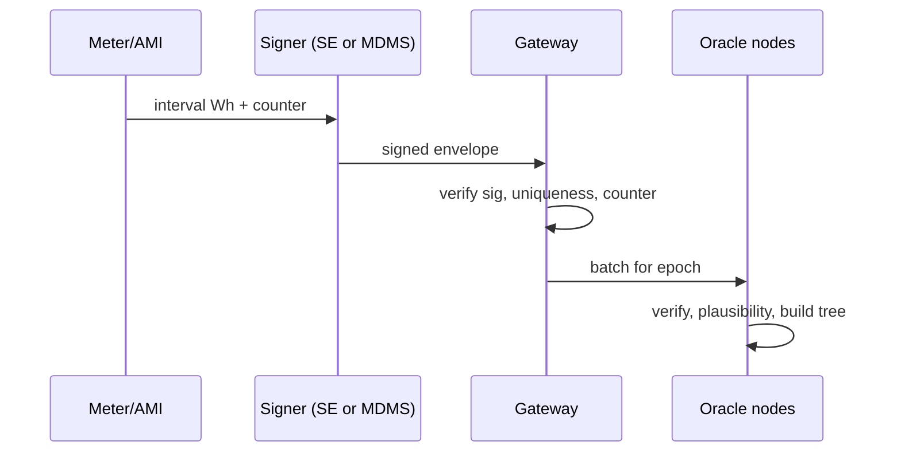

**B4. Oracle architecture**

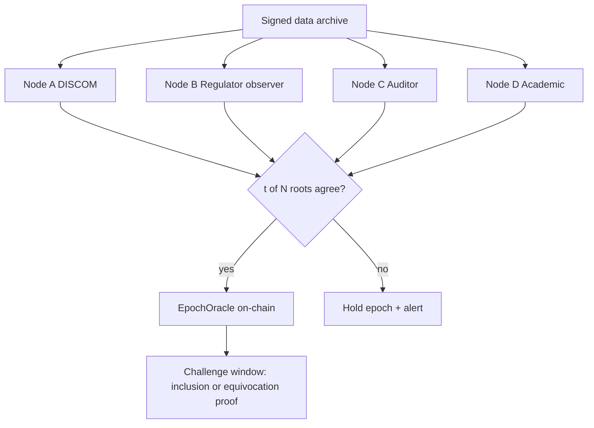

**B5. Marketplace**


**B6. Batch auction**

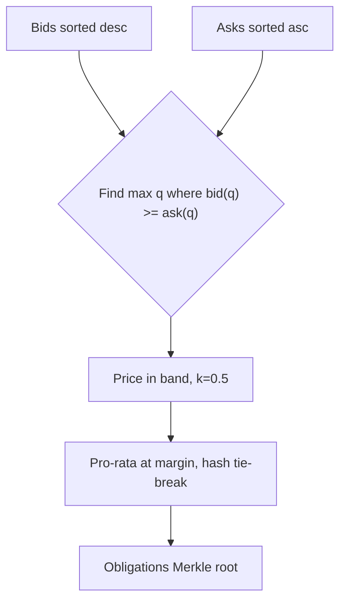

**B7. Settlement**

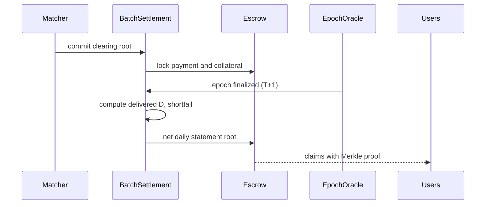

**B8. Token lifecycle**

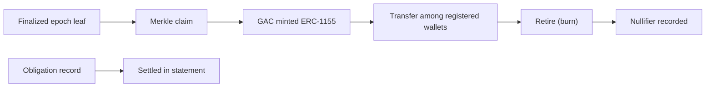

**B9. Certificate lifecycle**

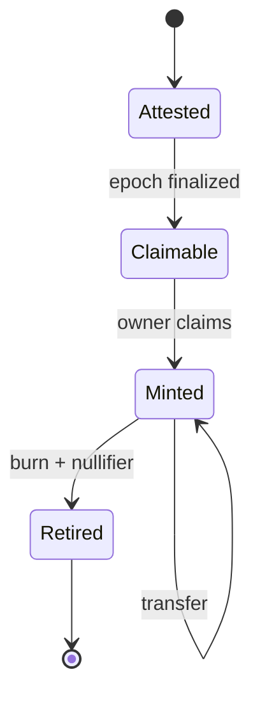

**B10. Smart-contract architecture**

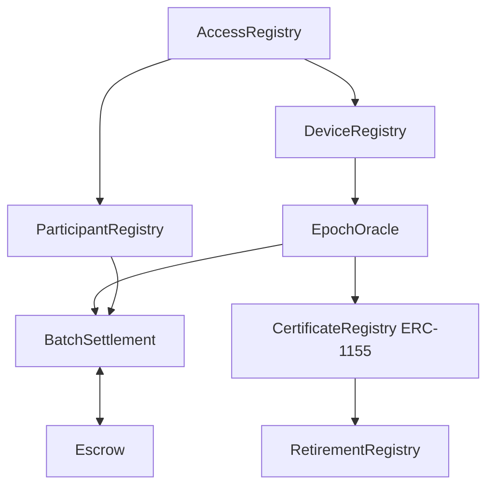

**B11. Backend services**

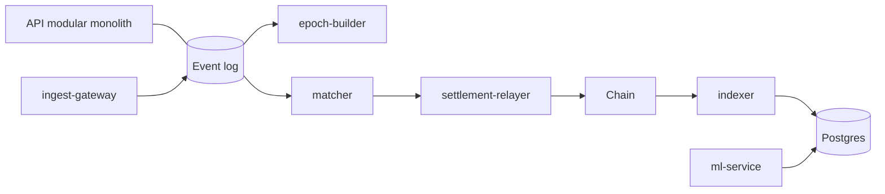

**B12. Database architecture**

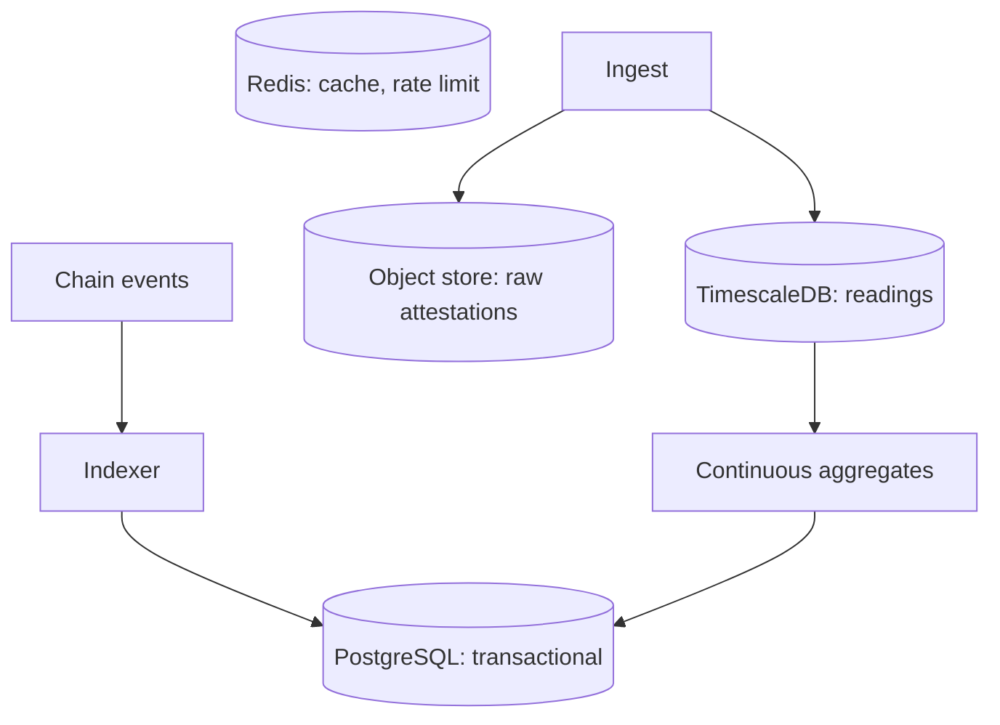

**B13. ML pipeline**

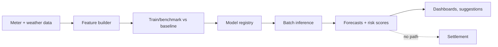

**B14. Security architecture**

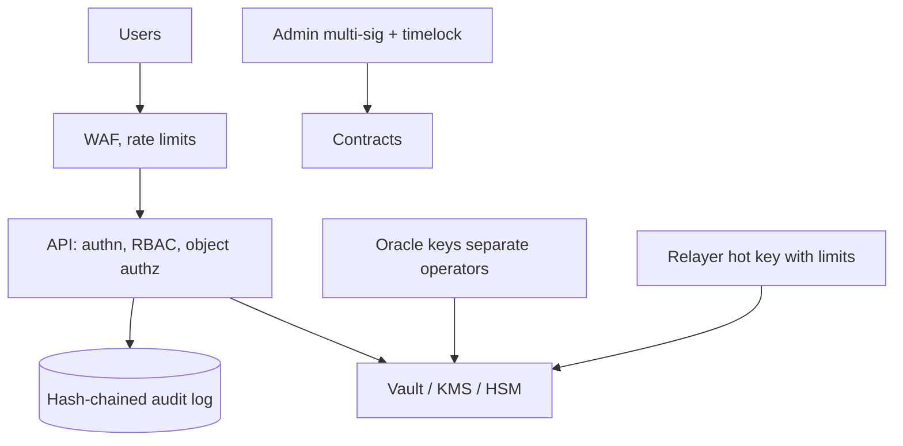

**B15. Deployment**

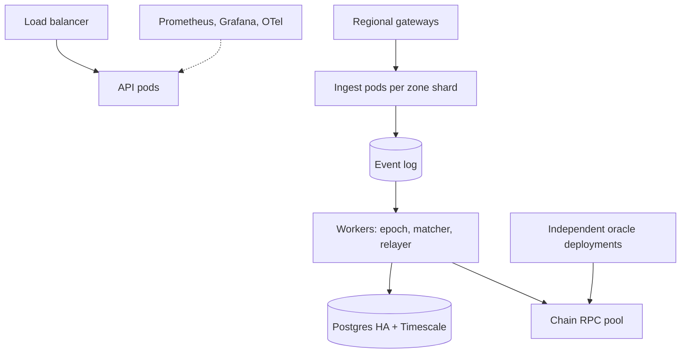

**B16. Disaster recovery**

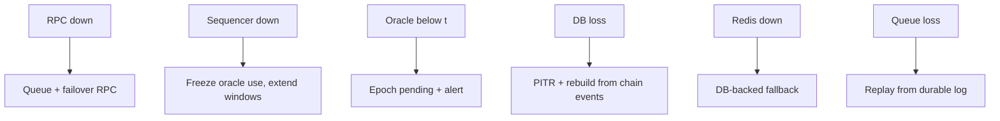

# Appendix C — FINAL DECISION TABLE

| Component | FINAL DECISION | Why |
| --- | --- | --- |
| Blockchain | EVM-compatible, chain-agnostic contracts | Tooling maturity; portability across demo L2 and permissioned deployment |
| L2/Appchain | L2 testnet for demo; permissioned EVM option for licensee context; L1 anchoring optional | Cost drivers are claims/ingest; pilots are licensee-run |
| Token standard | No token for obligations; ERC-1155 for GAC; ERC-20 test token for payment (Mode S) | Energy is not transferable; certificate ≠ energy; REC is 1 MWh in India |
| Marketplace | Zonal discrete-time double auction, 15-min delivery intervals | Order-independent, auditable, scalable |
| Pricing | Uniform clearing price within configurable band; fees as separate lines | Simplicity, fairness, regulatory flexibility |
| Matching | Deterministic pure-function clearing, published order-set root, challenge | Verifiable without trusting the operator |
| Settlement | Metered-delivery settlement, bounded shortfall charge, daily net statements, T+1 | AMI data cadence, physical reality, cost |
| Oracle | Independent validators, t-of-N signed epoch roots, equivocation proofs | Protects against node compromise; source trust acknowledged |
| Meter verification | Signer tiers (simulated, device SE, DISCOM MDMS) + plausibility + audits | Matches India AMI; keeps hardware path |
| Certificates | Prototype GAC (granular, zonal), nullifier-based retirement; not a REC | Avoids conflating with regulated REC |
| Database | PostgreSQL + TimescaleDB + object storage; ClickHouse deferred | Right data in right store; avoid sprawl; benchmark-gated |
| Messaging | Redis Streams (prototype) → Kafka-compatible log | Durability and replay at scale |
| Cache | Redis, ephemeral only | Not a source of truth |
| ML | Advisory forecasts and risk flags only; baselines first | Trust, IP and demonstrability |
| Privacy | Tier 1 now, Tier 2 next, Tier 3 research | Real benefit without over-engineering |
| Backend architecture | Modular monolith API + independent workers (hybrid) | Trust and scaling boundaries |
| Frontend | Next.js, TypeScript, Tailwind/shadcn, wagmi/viem, lifecycle-centred UI | Existing stack suits; UI shows generation→verification→market→settlement→certificate |
| Deployment | Compose (dev) → cloud staging → Kubernetes production-style | Standard path; independent oracle deployments |

# Appendix D — Principal Sources

US11983765B2; US10762564B2; US12380497 (USPTO print endpoint); US11720526 (Justia); EP3736760 (EPO publication server, snippet); IN202341070142 (IIT Madras listing); US11854101 (USPTO print, snippet); DERC Petition No. 06/2026 order (fragment) and press coverage (Powerline, Solar Quarter, EV Reporter, Renewable Watch); Grid-India REC procedure Rev. 3; Mercom/Nishith Desai notes on CERC REC Regulations 2022; BIS ETD 13 documents and IS 16444 summaries; APERC GTCS amendment; IEC 62056-1-0; IEEE 2030.5 overviews; IETF draft-chursin-rats-energy-attestation-00; Mengelkamp et al. (Applied Energy 2018; Comput Sci Res Dev 2018); Kirpes et al. (2019); SPETS (PMC8662436); Sensors 2023 MPC paper; Quartierstrom (arXiv 1905.07940); ZKP double auction (IEEE Blockchain 2022); Languille et al. (2024); CoW Protocol docs; arXiv 2401.08302; ethresear.ch batch-auction thread; Chainlink OCR/DON articles; Ackee Chainlink security review; Elliptic oracle-integrity article; arXiv 2411.02945; EnergyTag standards; Climate Group granular EAC guidance (via Argus).