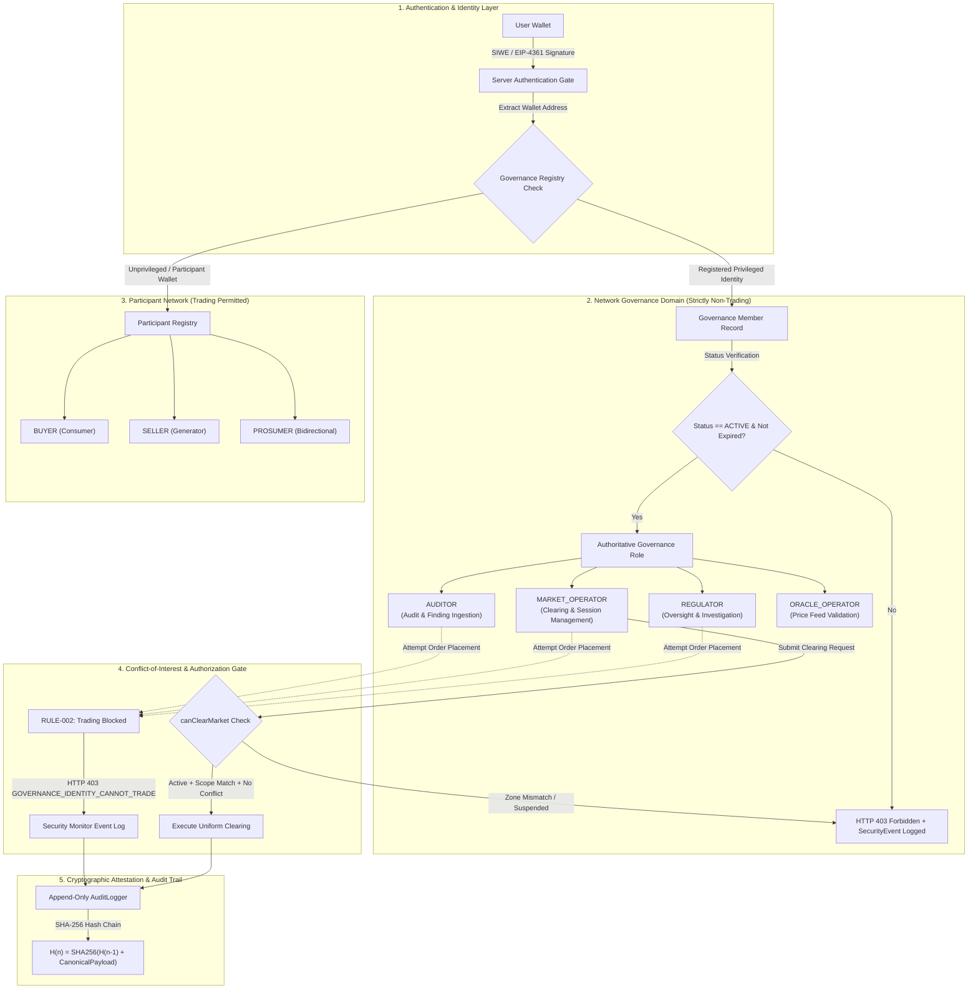
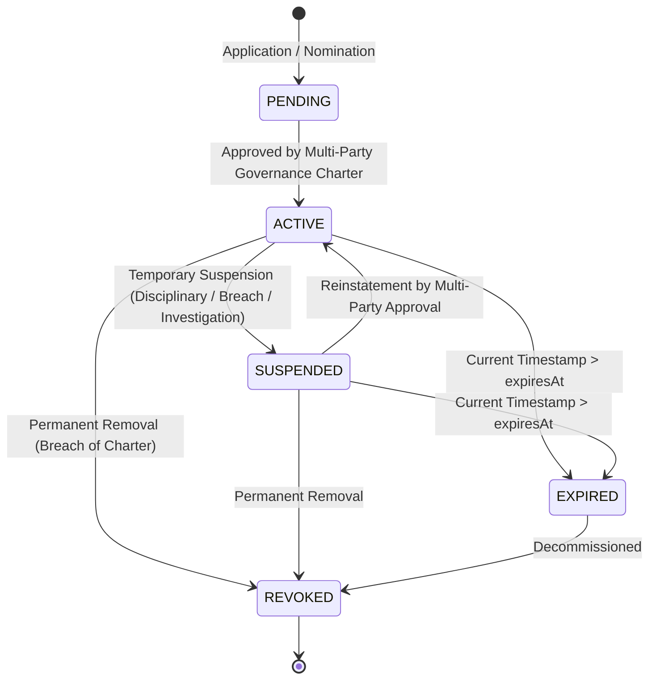
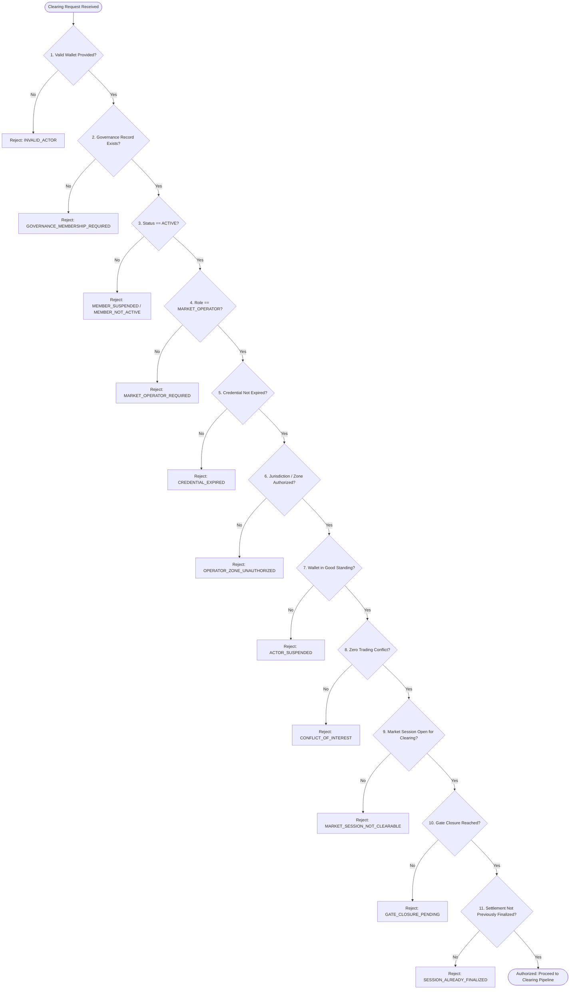

# VOLTMESH GOVERNANCE MODEL SPECIFICATION

**Version:** 2.0.0  
**Status:** Canonical Reference Architecture  
**Scope:** Identity, Role Isolation, Conflict-of-Interest, Oversight, and Cryptographic Activity Auditing  

---

## 1. Executive Summary & Architecture Overview

VoltMesh enforces strict separation between **Network Governance** (market operators, regulators, auditors, oracle operators) and **Economic Participation** (buyers, sellers, prosumers).

A connected wallet address does **not** grant authorization. Privileged capabilities are strictly gated by an authoritative, server-verified governance registry backed by cryptographic hash chains and immutable smart contract guarantees.



---

## 2. Governance Membership & Lifecycle

### 2.1 Governance Member Schema
Every governance participant is modeled authoritatively with the following minimum required schema:
```typescript
interface GovernanceMember {
  governanceMemberId: string;           // Unique identifier (UUIDv4)
  organizationId: string;               // Organization identifier (e.g., ORG-CERC-001, ORG-IEX-001)
  organizationName: string;             // Human-readable organization name
  walletAddress: `0x${string}`;         // Cryptographic wallet address (normalized checksum/lowercase)
  role: GovernanceRole;                 // REGULATOR | MARKET_OPERATOR | AUDITOR | ORACLE_OPERATOR
  status: GovernanceStatus;             // PENDING | ACTIVE | SUSPENDED | REVOKED | EXPIRED
  jurisdictionScope: string;            // Geographic / Zone boundaries (e.g., DELHI-NCT, ZONE-01, GRID-ALL)
  issuedAt: number;                     // Unix timestamp of credential issuance
  expiresAt: number;                    // Unix timestamp of credential expiration
  credentialReference: string;          // Verifiable credential / legal charter digest
  approvedBy: string;                   // Multi-party governance charter / admin wallet
  revokedAt?: number;                   // Unix timestamp if revoked
  revocationReason?: string;            // Cause of revocation
}
```

### 2.2 Lifecycle State Transitions



- **PENDING**: Registered entity awaiting official charter ratification; zero operational or trading privileges.
- **ACTIVE**: Fully chartered entity permitted to execute scoped governance duties.
- **SUSPENDED**: Temporarily locked by a Regulator or Emergency Guardian. All actions return HTTP 403 `MEMBER_SUSPENDED`.
- **REVOKED**: Permanently disenfranchised wallet; blacklisted across both governance and economic execution paths.
- **EXPIRED**: Credential lifetime exceeded (`now > expiresAt`). Requires charter renewal.

---

## 3. Governance Role Assignment & Non-Self-Assignment

### 3.1 Server-Side Authoritative Resolution
Role assignment is strictly external to client control. The system resolves roles according to the following precedence hierarchy:

```typescript
function resolveAuthoritativeRole(wallet: string): Role {
  const govMember = governanceRegistry.getMember(wallet);
  if (govMember && govMember.status === 'ACTIVE' && govMember.expiresAt > Date.now()) {
    return govMember.role; // REGULATOR, MARKET_OPERATOR, AUDITOR, ORACLE_OPERATOR
  }
  const participant = participantRegistry.get(wallet);
  if (participant) {
    return participant.role; // BUYER, SELLER, PROSUMER
  }
  return 'GUEST';
}
```

### 3.2 Elimination of Client Role Tampering
1. **Self-Assignment Disabled**: `/api/v1/participants/register` strictly blocks any request requesting `REGULATOR`, `MARKET_OPERATOR`, `AUDITOR`, `ORACLE_OPERATOR`, or `ADMIN`.
2. **Session Storage Ignored**: Client-side storage (`sessionStorage.role`) is never evaluated for access control decisions.
3. **Simulated Role Header Rejection**: Client headers (such as `x-simulated-role`) attempting to assign a trading role (`BUYER`, `SELLER`) to a recognized governance wallet trigger HTTP 403 and log `RULE-004` (Role Tampering Attempt).

---

## 4. Separation of Governance & Economic Participation

### 4.1 Strict Wallet Isolation
A governance wallet represents institutional stewardship and **cannot be conflated with an economic trading account**.

| Actor Identity | Allowed Actions | Strictly Blocked Actions |
| :--- | :--- | :--- |
| **REGULATOR** | Audit trails, suspend market/oracle, investigate | Place BUY/SELL orders, clear market, settle funds |
| **MARKET_OPERATOR** | Open/close market sessions, execute clearing | Place BUY/SELL orders, receive trading settlement |
| **AUDITOR** | Review records, publish audit findings | Place BUY/SELL orders, clear market, modify balances |
| **ORACLE_OPERATOR** | Publish validated grid meter data | Place BUY/SELL orders, operate market clearing |
| **BUYER / SELLER** | Submit orders, cancel own orders, settle trades | Clear market, suspend oracle, claim governance role |

### 4.2 Two-Wallet Model for Real-World Persons
If an institutional representative (e.g., an engineer at an ISO/DISCOM) wishes to participate as a private solar generator:
- They **must** utilize a separate, KYC-verified economic wallet.
- Under **no circumstances** may their designated governance wallet submit economic bids or asks.
- Cross-identity collusion and self-dealing are monitored via telemetry and on-chain graph analysis.

---

## 5. Conflict of Interest Rules & Enforcement

VoltMesh implements proactive, in-line blocking for conflict-of-interest vectors:

### Rule Definitions
- **RULE-001 (Suspicious Authorization Activity)**: Repeated unprivileged attempts against administrative endpoints.
- **RULE-002 (Governance Identity Trading Conflict)**: Any governance member attempting to submit a BUY or SELL order is rejected at the API gate with HTTP 403 `GOVERNANCE_IDENTITY_CANNOT_TRADE`.
- **RULE-003 (Operator Unauthorized Settlement Access)**: Market operators attempting direct manual manipulation of escrow balances.
- **RULE-004 (Role Escalation / Tampering Attempt)**: A client sending mismatched credentials or attempting to spoof privileged roles.
- **RULE-005 (Operator Out-of-Zone Execution)**: A market operator attempting to clear an order book outside their assigned `jurisdictionScope`.
- **RULE-006 (Expired Credential Invocations)**: Invocations utilizing an expired governance credential.
- **RULE-007 (Suspended Identity Invocations)**: Invocations from an identity currently marked `SUSPENDED`.
- **RULE-008 (Governance Participant Registration Conflict)**: A registered governance wallet attempting to register as a market trading participant.

---

## 6. Market Clearing Authorization (`canClearMarket`)

Market clearing recalculates supply/demand intersections and generates financial commitments. The `canClearMarket` gate verifies **11 explicit conditions** prior to execution:



---

## 7. Regulator & Oversight Authority

Regulators possess investigative, read-comprehensive, and emergency circuit-breaker capabilities:
1. **Full Transparency**: Real-time read access to order books, clearing commitments, meter telemetry, and escrow positions.
2. **Targeted Injunctions**:
   - `POST /api/v1/governance/market/suspend`: Halts clearing for a compromised zone or period.
   - `POST /api/v1/governance/oracle/suspend`: De-registers a corrupted oracle feed, causing the quorum to recalculate.
   - `POST /api/v1/governance/members/:wallet/suspend`: Suspends rogue operators or bad actors.
3. **Investigation Initiation**:
   - `POST /api/v1/governance/investigate`: Formal audit trigger generating an evidentiary packet and immutable audit log entry.
4. **Strict Boundaries**:
   - Regulators **cannot** modify clearing math.
   - Regulators **cannot** unilaterally reallocate participant escrow funds.
   - Regulators **cannot** place orders or trade.

---

## 8. Cryptographic Audit Trail & Tamper Detection

### 8.1 Append-Only Hash Chain
Every privileged action and security alert is hashed and appended to a tamper-evident audit ledger:

$$\text{EventHash}_n = \text{SHA-256}\left(\text{EventHash}_{n-1} \parallel \text{CanonicalJSON}(\text{Payload}_n)\right)$$

Where $\text{EventHash}_0 = \text{0x0000000000000000000000000000000000000000000000000000000000000000}$.

```typescript
interface AuditEvent {
  eventId: string;
  timestamp: number;
  actorWallet: string;
  actorRole: string;
  action: string;
  targetResource: string;
  reasonContext: string;
  outcome: 'ALLOWED' | 'BLOCKED';
  previousHash: string;
  eventHash: string;
}
```

### 8.2 Cryptographic Integrity Verification
At any point, any regulator or auditor can verify the audit trail via `/api/v1/security/audit-trail/verify`:
- Each link is recomputed from the genesis block.
- Any manual modification, deletion, or insertion causes an immediate verification mismatch identifying the invalid index.

---

## 9. Real-Time Monitoring & Security Alerts

The VoltMesh runtime monitors all incoming requests against high-risk operational patterns. Blocked events generate categorized alerts:

| Category | Typical Trigger | Target Action Taken |
| :--- | :--- | :--- |
| `UNAUTHORIZED_ACCESS` | Non-operator attempting clearing | HTTP 403 Forbidden + SecurityEvent Logged |
| `ROLE_TAMPERING` | Spoofed headers / claims | HTTP 403 Forbidden + Credential Scrutiny |
| `CONFLICT_OF_INTEREST` | Governance wallet submitting trade | Immediate Order Rejection + Audit Event |
| `ZONE_VIOLATION` | Operator clearing outside scope | Clearing Injunction + Incident Flag |
| `EXPIRED_CREDENTIAL` | Outdated governance key | Session Invalidation + Refresh Required |
| `SUSPENDED_ACTOR` | Action by frozen entity | Total Request Rejection |

---

## 10. Emergency Controls & Circuit Breakers

When anomalous grid behavior, oracle manipulation, or security breaches occur:
1. **Market Session Halting**: Regulators or Market Operators can trigger an emergency market pause.
2. **Oracle Quorum Adjustment**: Unresponsive or deviant oracle nodes are suspended, triggering automatic quorum reduction to prevent false clearing prices.
3. **Escrow Freezing**: In the event of catastrophic contract exploits, multi-signature emergency guardians hold the authority to pause smart contract withdrawals.

---

## 11. Separation of Powers: No Single Super-Admin

To prevent central point of failure vulnerabilities:
- **No Omnipotent Admin**: There is no single role that can clear markets, trade energy, adjudicate disputes, and alter contract balances simultaneously.
- **Principle of Least Privilege**: Each actor holds only the minimum permissions required for their institutional charter.
- **Separation of Duties**: Market operators operate clearing; regulators supervise compliance; auditors review historical integrity; participants trade.

---

## 12. Demo Mode vs. Production Real Mode

| Feature | Demo Mode (`IS_DEMO=true`) | Local / Testnet Production (`IS_DEMO=false`) |
| :--- | :--- | :--- |
| **Identity Verification** | Pre-seeded well-known accounts | Strict EIP-4361 SIWE signature verification |
| **Role Switching** | UI switcher allowed for demonstrations | **Strictly Forbidden**; roles resolved server-side |
| **Governance Validation** | Authoritative checks enforced | Authoritative checks enforced |
| **Conflict Enforcement** | **Active**: Demo regulators still cannot trade | **Active**: Real regulators cannot trade |
| **Audit Hash Chain** | Validated in-memory | Persisted to PostgreSQL with periodic on-chain anchor |

---

## 13. System Trade-Offs

### 1. Governance Membership Gating
- **Advantage (+)**: Prevents unauthorized wallets from executing sensitive operations (clearing, halts).
- **Trade-off (-)**: Decreases permissionless composability; requires off-chain charter verification.

### 2. Strict Trading Prohibition for Governance Wallets
- **Advantage (+)**: Eliminates front-running, self-dealing, and insider market manipulation.
- **Trade-off (-)**: Institutional operators must manage distinct wallet infrastructures for testing and operational tasks.

### 3. Distinct Economic and Governance Identities
- **Advantage (+)**: Guarantees complete separation of legal and financial duties.
- **Trade-off (-)**: Increased operational key management overhead for participating organizations.

### 4. Comprehensive Regulator Inspection
- **Advantage (+)**: Enables full market surveillance, anti-collusion monitoring, and auditability.
- **Trade-off (-)**: Requires careful zero-knowledge or selective disclosure mechanisms to protect commercial trading privacy.

### 5. Append-Only Cryptographic Audit Logging
- **Advantage (+)**: Absolute non-repudiation and tamper detection.
- **Trade-off (-)**: Storage overhead and sequential hashing computational requirements under high transaction volumes.

### 6. Automated In-Line Conflict Blocking
- **Advantage (+)**: Zero latency prevention of unauthorized or conflicted actions before state transition.
- **Trade-off (-)**: Risk of false positives if an organization’s internal restructuring is not promptly reflected in the governance registry.

### 7. Granular Role Separation
- **Advantage (+)**: Enforces least privilege across every operational vector.
- **Trade-off (-)**: Multi-step administration workflows and coordination overhead between operators, regulators, and auditors.

### 8. Multi-Signature Charters vs. Immediate Injunctions
- **Advantage (+)**: Protects against unilateral rogue administrator actions or compromised private keys.
- **Trade-off (-)**: Multi-party threshold schemes require latency, trading off instant sub-second incident response.

---

## 14. Verification & Testing Evidence

The governance implementation is verified by an extensive test suite:
- **`governance_separation.test.ts`**: 20 isolated unit tests (`GOV-01` through `GOV-20`) confirming role isolation, conflict blocking, zone scoping, and tamper detection.
- **`e2e_governance.test.ts`**: Complete 14-step integration test simulating multi-party lifecycle interactions between Regulators, Market Operators, Buyers, and Sellers.
- **`step1_authorization_and_selftrade.test.ts`**: 14 tests proving participant authorization and self-trade prevention.
- **Security Attack Simulation Lab**: Live server endpoint (`/api/v1/security/simulate-attack`) executing real runtime verification against all 10 attack classes.
