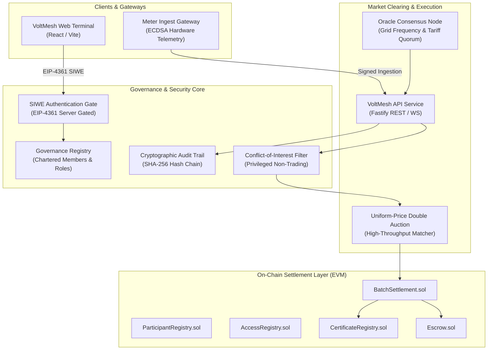

# VoltMesh — Decentralized P2P Energy Trading Platform

[](https://github.com/voltmesh/platform)
[](https://opensource.org/licenses/MIT)
[](docs/FINAL_SECURITY_HARDENING_REPORT.md)

VoltMesh is a high-throughput, decentralized peer-to-peer (P2P) energy trading platform designed for modern power distribution networks, prosumers, and regional microgrids. It integrates sub-second uniform-price market clearing, verifiable smart contract settlement, cryptographic grid meter attestations, and an authoritative governance model enforcing strict separation of powers and conflict-of-interest prevention.

---

## Architecture Overview



---

## Governance, Role Isolation & Security Model

VoltMesh enforces strict role separation between **Network Governance** and **Economic Trading Participants**:

```
                       NETWORK GOVERNANCE
                                |
        +-----------------------+-----------------------+
        |                       |                       |
    REGULATOR            MARKET OPERATOR             AUDITOR
(Oversight / Injunction) (Clearing / Sessions)  (Attestation / Audit)
        |                       |                       |
        x (Cannot Trade)        x (Cannot Trade)        x (Cannot Trade)
        |                       |                       |
-----------------------------------------------------------------
                       ECONOMIC PARTICIPANTS
                                |
             +------------------+------------------+
             |                                     |
           BUYER                                 SELLER
    (Pure Consumer)                       (Renewable Generator)
             |                                     |
             +------------------+------------------+
                                |
                             PROSUMER
                      (Bidirectional Trader)
```

### Core Security Guarantees
1. **Authoritative Server-Side Governance**: Connected wallets and JWT tokens cannot self-assert privileged roles. Roles are strictly verified server-side via the `GovernanceRegistry`.
2. **Zero Trading for Privileged Roles**: `REGULATOR`, `MARKET_OPERATOR`, `AUDITOR`, and `ORACLE_OPERATOR` identities are blocked with HTTP 403 (`GOVERNANCE_IDENTITY_CANNOT_TRADE`) if they attempt order placement (`RULE-002`).
3. **11-Point Market Clearing Gate (`canClearMarket`)**: Operators must be chartered, active, non-expired, scoped to the specific zone (`ZONE-01`), and free of economic self-interest to execute market clearing.
4. **Append-Only Cryptographic Audit Trail**: Every privileged action, market clear, suspension, and blocked attack is appended to a SHA-256 hash-chained log (`H_n = SHA256(H_{n-1} + Payload)`).
5. **Interactive Attack Simulation Lab**: Built directly into both the backend API (`/api/v1/security/simulate-attack`) and the frontend portal to demonstrate real runtime prevention against 10 attack classes.

---

## Repository Structure

```
├── apps/
│   └── web/                     # React / Vite Web Trading Terminal & Governance Portal
├── contracts/                   # Foundry smart contracts (Settlement, Escrow, Registries)
├── database/                    # PostgreSQL schemas & migrations (init.sql)
├── packages/
│   ├── types/                   # Shared TypeScript interfaces & schemas
│   ├── core/                    # Common utilities & crypto helpers
│   └── sdk/                     # Client interaction SDK
├── services/
│   ├── api/                     # Core API server, Market Matcher, Governance & Audit
│   │   ├── src/governance/      # GovernanceRegistry & AuditLogger implementation
│   │   └── test/                # Comprehensive unit and integration test suites
│   ├── ingest-gateway/          # Smart meter telemetry ingestion service
│   └── oracle-node/             # Distributed grid tariff oracle node
└── docs/                        # Architecture specs, security reports, and audits
```

---

## Key Governance Documentation

- [Governance Model Specification](GOVERNANCE_MODEL.md): Detailed specification of governance membership, lifecycle transitions, role capabilities, and trade-offs.
- [Role Permission Matrix](ROLE_PERMISSION_MATRIX.md): Granular breakdown of `READ`, `ACTION`, and `FORBIDDEN` operations per role.
- [Information Access Matrix](INFORMATION_ACCESS_MATRIX.md): Information disclosure rules preventing insider trading and front-running.
- [Governance Current State Audit](GOVERNANCE_CURRENT_STATE.md): Initial audit of legacy role handling and vulnerability mitigations.
- [Security Hardening Report](docs/FINAL_SECURITY_HARDENING_REPORT.md): In-depth security remediation and verification results.

---

## Verification & Testing

### Running Tests
Execute the comprehensive test suites across the monorepo:

```bash
# Run all test suites in the API service (including governance tests)
pnpm --filter @energy-dex/api test

# Run smart contract verification suites via Foundry
cd contracts && forge test

# Build all packages and web application
pnpm build
```

### Pre-Seeded Test Accounts (Anvil / Local Dev)

| Account | Address | Role | Scope | Trading Permitted |
| :--- | :--- | :--- | :--- | :--- |
| **Account #0** | `0xf39fd6e51aad88f6f4ce6ab8827279cfffb92266` | `ADMIN` | System | ✗ (Blocked) |
| **Account #1** | `0x70997970c51812dc3a010c7d01b50e0d17dc79c8` | `BUYER` | Consumer | ✓ Yes |
| **Account #2** | `0x3c44cdddb6a900fa2b585dd299e03d12fa4293bc` | `SELLER` | Generator | ✓ Yes |
| **Account #3** | `0x90f79bf6eb2c4f870365e785982e1f101e93b906` | `MARKET_OPERATOR` | `ZONE-01` | ✗ (Blocked) |
| **Account #4** | `0x15d34aaf54267db7d7c367839aaf71a00a2c6a65` | `REGULATOR` | `DELHI-NCT` | ✗ (Blocked) |
| **Account #5** | `0x23618e81e3f5cdf7f54c3d65f7fbc0abf5b21e8f` | `AUDITOR` | National | ✗ (Blocked) |

---

## License

VoltMesh is open-source software licensed under the [MIT License](LICENSE).
