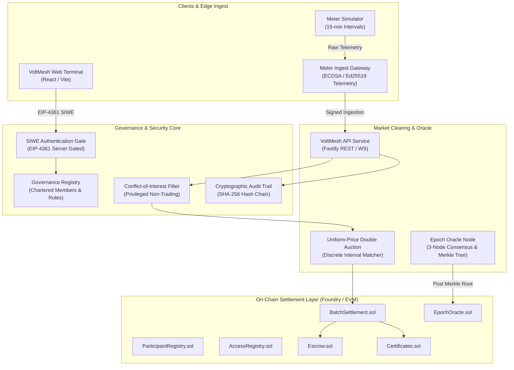

# VoltMesh — Decentralized P2P Energy Trading Platform

[](https://github.com/voltmesh/platform)
[](LICENSE)
[](https://getfoundry.sh/)
[](docs/FINAL_SECURITY_HARDENING_REPORT.md)

VoltMesh is a high-throughput, decentralized peer-to-peer (P2P) energy trading platform and research prototype designed for modern power distribution networks, prosumers, and regional microgrids.

> [!IMPORTANT]
> **Mode S Sandbox Notice & Regulatory Disclaimer**
> VoltMesh operates as a **Mode S (Simulation / Research Sandbox)** platform. All assets, tokens, and settlements are executed in a simulated sandbox environment using testnet tokens and synthetic meter attestations. VoltMesh **does NOT constitute legal electricity trading** under the Indian Electricity Act (2003) or relevant CERC/DERC/UPERC regulations. In India, peer-to-peer energy trading is strictly permitted only within regulator-approved pilots conducted by licensed distribution companies (DISCOMs). The certificates generated on VoltMesh are **prototype attestation certificates**, NOT statutory Renewable Energy Certificates (RECs) issued by central agencies (such as Grid-India).

---

## Architecture Overview

VoltMesh integrates an off-chain sub-second double auction matcher, cryptographically attested smart meter hardware telemetry, verifiable on-chain Merkle commitments, and atomic smart contract settlements.



---

## The 8-Stage Execution Pipeline

Every 15-minute trading interval progresses sequentially through an 8-stage verification pipeline:

| Stage | Name | Layer | Description |
| :--- | :--- | :--- | :--- |
| **01** | `METER` | Simulated / Edge | Smart meter hardware records interval injection/consumption (DLMS/COSEM). |
| **02** | `ATTESTATION` | Off-Chain | Cryptographic attestation envelope signed via device root-of-trust (Ed25519/ECDSA). |
| **03** | `ORACLE` | Off-Chain | Decentralized oracle quorum collects readings, validates signatures, and forms epoch. |
| **04** | `MERKLE` | On-Chain | Canonical binary Merkle root (RFC 6962 leaf prefix + OZ sorted pairs) committed to `EpochOracle.sol`. |
| **05** | `CLEARING` | On-Chain / Engine | Uniform-price double auction clears bilateral supply and demand for the slot. |
| **06** | `DELIVERY` | Simulated | Physical feeder telemetry verifies energy injection against contractual obligations. |
| **07** | `SETTLEMENT` | On-Chain | Multi-party atomic netting, collateral deduction, and payout via `BatchSettlement.sol` & `Escrow.sol`. |
| **08** | `CERTIFICATE` | On-Chain | Prototype Granular Attestation Certificates (GAC) minted on `Certificates.sol` (ERC-1155). |

---

## Governance, Role Isolation & Security

VoltMesh enforces an immutable separation between **Network Governance** and **Economic Trading Participants**:

```
                       NETWORK GOVERNANCE
                                |
        +-----------------------+-----------------------+
        |                       |                       |
    REGULATOR            MARKET OPERATOR             AUDITOR
(Oversight / Injunction) (Clearing / Sessions)  (Attestation / Audit)
        |                       |                       |
        x (Cannot Trade)        x (Cannot Trade)        x (Cannot Trade)
        |                       |                       |
-----------------------------------------------------------------
                       ECONOMIC PARTICIPANTS
                                |
             +------------------+------------------+
             |                                     |
           BUYER                                 SELLER
    (Pure Consumer)                       (Renewable Generator)
             |                                     |
             +------------------+------------------+
                                |
                             PROSUMER
                      (Bidirectional Trader)
```

- **Conflict-of-Interest Filter**: Privileged roles (`REGULATOR`, `MARKET_OPERATOR`, `AUDITOR`) are forbidden from submitting orders or holding trading positions.
- **Auditable SHA-256 Hash Chain**: Privileged state changes are logged to an append-only, tamper-evident cryptographic chain.
- **Contract Invariant Verification**: Smart contracts strictly enforce economic conservation and solvency (`locked <= balance`, `totalEscrowed == sum(deposits)`).

---

## Repository Structure

```
├── apps/
│   └── web/                     # React / Vite Web Trading Terminal & Governance Portal
├── contracts/                   # Foundry smart contracts (Solidity 0.8.24, OpenZeppelin v5.7)
│   ├── src/                     # Core protocol contracts (Settlement, Escrow, Oracle, Registries)
│   └── test/                    # Fuzz tests, invariant suites, and security simulations
├── database/                    # TimescaleDB / PostgreSQL schemas and seed data
├── packages/
│   ├── attestation/             # Canonical hashing, Merkle tree construction & proof generation
│   ├── clearing/                # Uniform-price double auction clearing engine
│   └── types/                   # Shared TypeScript interfaces & protocol definitions
├── services/
│   ├── api/                     # Fastify REST/WebSocket server, Governance registry & audit logger
│   ├── epoch-builder/           # Aggregates meter readings and builds Merkle trees
│   ├── ingest-gateway/          # Telemetry ingestion and anti-equivocation validator
│   ├── matcher/                 # Continuous and discrete batch order matching
│   └── oracle-node/             # Distributed grid tariff and consensus oracle node
├── simulators/
│   └── meter-sim/               # Realistic 15-minute grid generation and consumption simulator
└── docs/                        # Architecture specifications, security audits, and whitepapers
```

---

## Quickstart & Local Setup

### Prerequisites
- **Node.js**: `v20.x` or `v22.x`
- **pnpm**: `v9.x` or `v11.x`
- **Foundry**: `forge`, `cast`, `anvil` ([getfoundry.sh](https://getfoundry.sh/))
- **Docker & Docker Compose**: (optional, for TimescaleDB)

### 1. Install Dependencies

```bash
# Install workspace dependencies
pnpm install

# Install Foundry submodules / libraries
cd contracts
forge install
cd ..
```

### 2. Start Local Database (Optional)

```bash
docker compose up -d postgres
```

### 3. Build & Test

```bash
# Typecheck all TypeScript workspace packages
pnpm -r typecheck

# Run all TypeScript unit, benchmark, and integration suites
pnpm vitest run

# Run Foundry test and invariant suites
cd contracts
forge test
cd ..
```

### 4. Run Development Services

```bash
# Start backend API service
pnpm --filter @energy-dex/api dev

# In a separate terminal, launch the Web Terminal
pnpm --filter @energy-dex/web dev
```

---

## Pre-Seeded Development Accounts

When running against a local Anvil node (`anvil`), use the following accounts:

| Account | Address | Role | Scope | Trading Permitted |
| :--- | :--- | :--- | :--- | :--- |
| **Account #0** | `0xf39fd6e51aad88f6f4ce6ab8827279cfffb92266` | `ADMIN` | System | ✗ (Blocked) |
| **Account #1** | `0x70997970c51812dc3a010c7d01b50e0d17dc79c8` | `BUYER` | Consumer | ✓ Yes |
| **Account #2** | `0x3c44cdddb6a900fa2b585dd299e03d12fa4293bc` | `SELLER` | Generator | ✓ Yes |
| **Account #3** | `0x90f79bf6eb2c4f870365e785982e1f101e93b906` | `MARKET_OPERATOR` | `ZONE-01` | ✗ (Blocked) |
| **Account #4** | `0x15d34aaf54267db7d7c367839aaf71a00a2c6a65` | `REGULATOR` | `DELHI-NCT` | ✗ (Blocked) |
| **Account #5** | `0x23618e81e3f5cdf7f54c3d65f7fbc0abf5b21e8f` | `AUDITOR` | National | ✗ (Blocked) |

---

## License

VoltMesh is open-source software licensed under the [MIT License](LICENSE).
