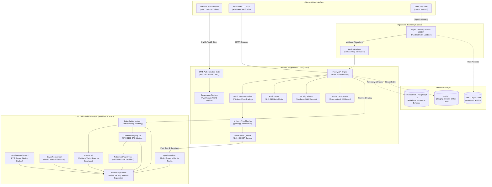
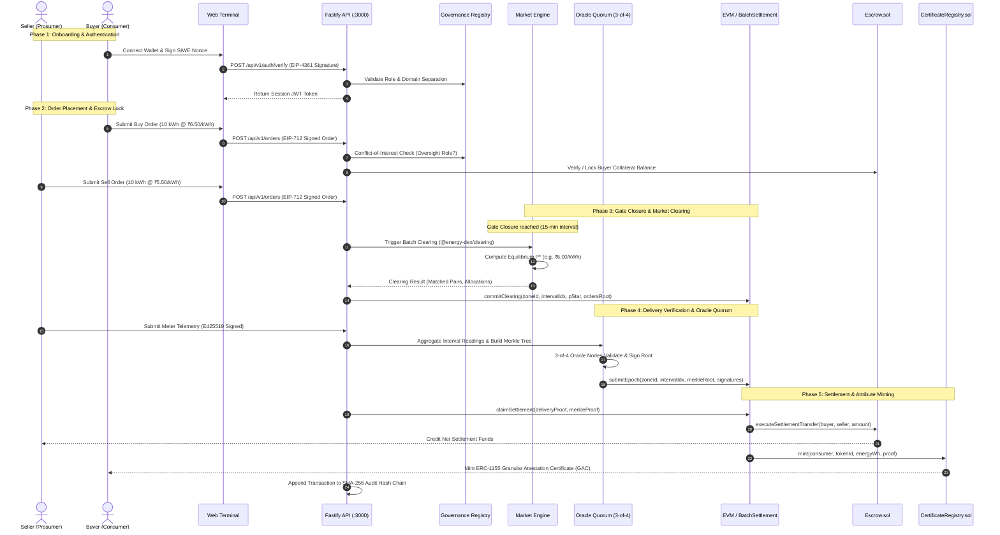
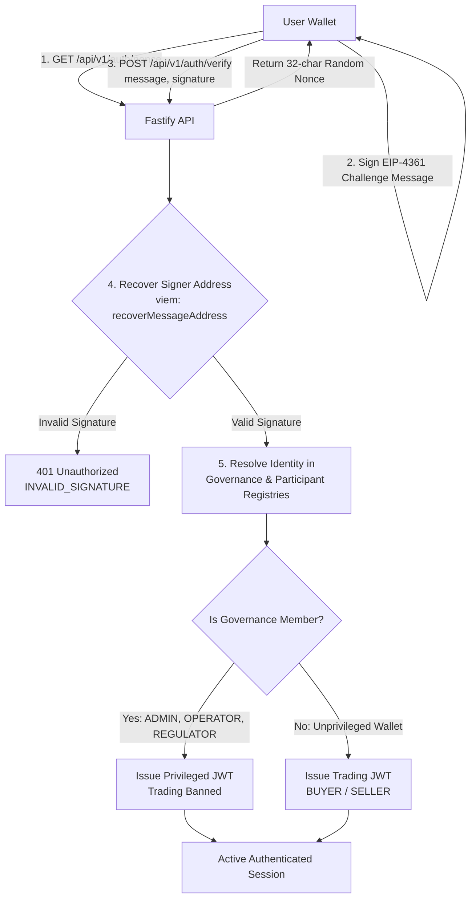
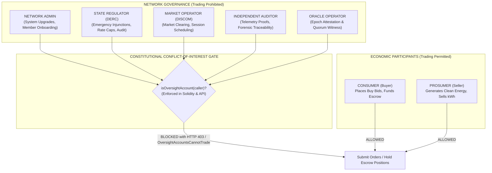
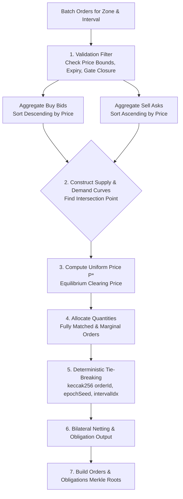
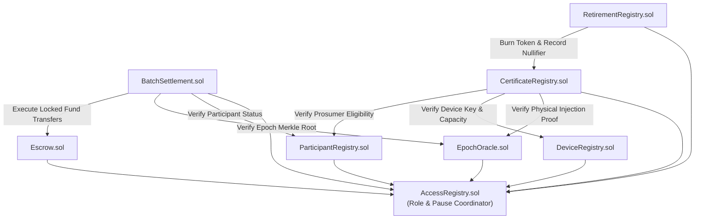
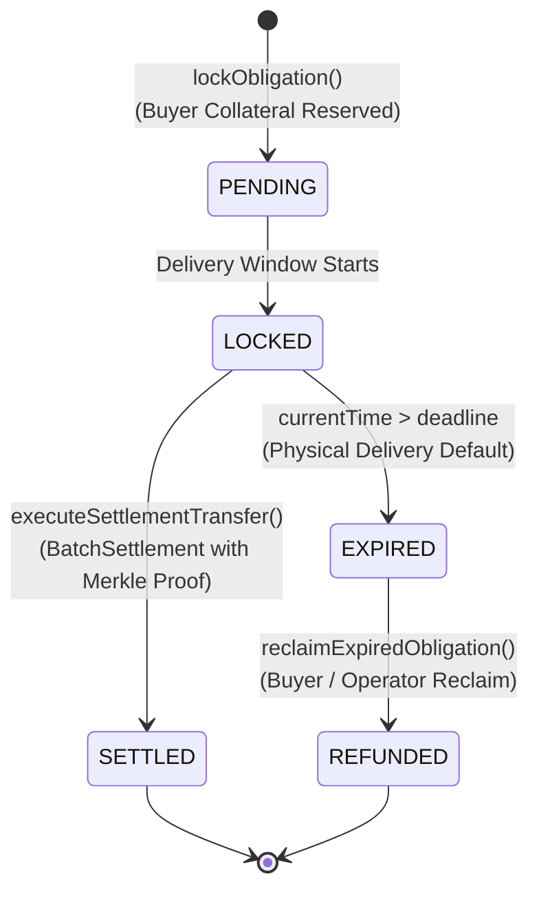
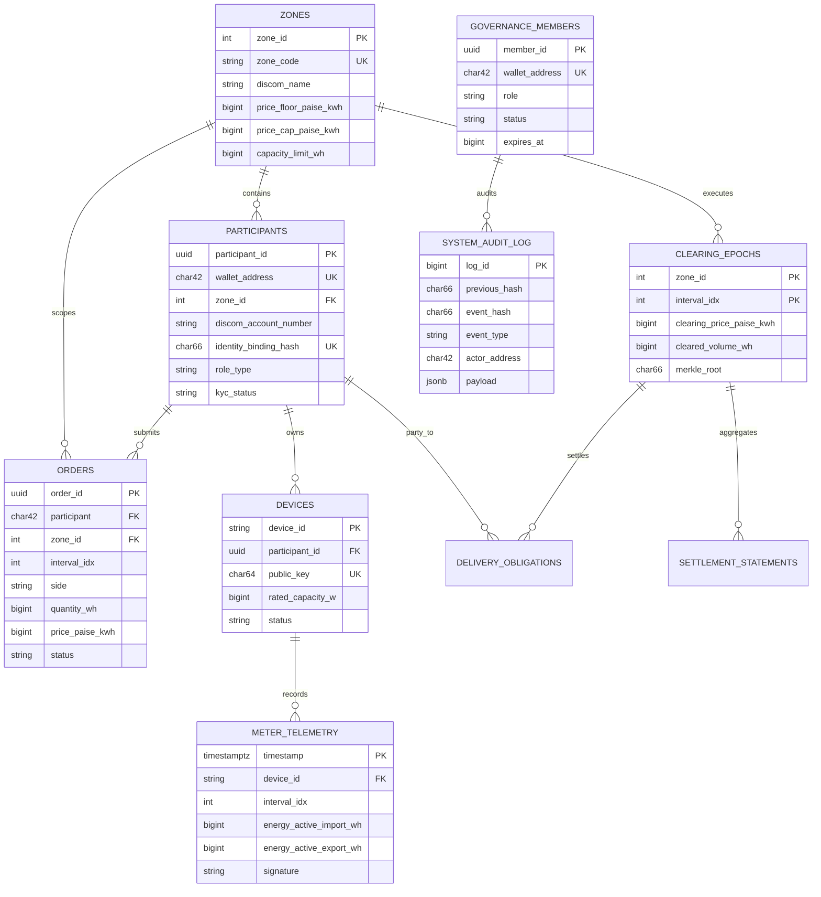

# VoltMesh — Decentralized Cyber-Physical Energy Trading Platform

[](https://github.com/voltmesh/platform)
[](LICENSE)
[](https://getfoundry.sh/)
[](https://www.typescriptlang.org/)
[](https://react.dev/)
[](https://soliditylang.org/)
[](docs/FINAL_SECURITY_HARDENING_REPORT.md)

**VoltMesh** is a high-throughput, cyber-physical peer-to-peer (P2P) energy trading and settlement platform designed for distribution grids, prosumers, renewable energy generators, and distribution utilities (DISCOMs). The system bridges sub-second off-chain call-market matching, cryptographically signed hardware smart-meter telemetry (Ed25519 / RFC 6962 canonical JSON), fault-tolerant multi-oracle quorums, tamper-evident audit logging, and deterministic EVM smart-contract escrow settlement.

> [!IMPORTANT]
> **Mode S Sandbox Notice & Regulatory Framework**
> VoltMesh is engineered and verified as a **Mode S (Simulation / Research Sandbox)** platform. All assets, tokens, and settlements are executed in a simulated sandbox environment using testnet tokens (Anvil/Sepolia) and synthetic or hardware-emulated meter attestations. VoltMesh **does NOT constitute legal electricity trading** under the Indian Electricity Act (2003) or relevant CERC/DERC/UPERC regulations. In India, peer-to-peer energy trading is strictly permitted only within regulator-approved pilots conducted by licensed distribution companies (DISCOMs). The certificates generated on VoltMesh are **prototype Granular Attestation Certificates (GAC)**, NOT statutory Renewable Energy Certificates (RECs) issued by central agencies (such as Grid-India).

---

## Table of Contents

- [Overview](#overview)
- [Why VoltMesh](#why-voltmesh)
- [Core Capabilities](#core-capabilities)
- [System Architecture](#system-architecture)
- [Component Architecture](#component-architecture)
- [End-to-End Energy Trading Flow](#end-to-end-energy-trading-flow)
- [Registration & Participant Onboarding](#registration--participant-onboarding)
- [Authentication & Authorization](#authentication--authorization)
- [Governance Model & Separation of Powers](#governance-model--separation-of-powers)
- [Market Clearing Algorithm](#market-clearing-algorithm)
- [Smart Contract Architecture](#smart-contract-architecture)
- [Settlement & Escrow Lifecycle](#settlement--escrow-lifecycle)
- [Security Architecture](#security-architecture)
- [Cybersecurity Attack Simulations](#cybersecurity-attack-simulations)
- [Data & Persistence Architecture](#data--persistence-architecture)
- [Repository Structure](#repository-structure)
- [Technology Stack](#technology-stack)
- [Prerequisites](#prerequisites)
- [Installation & Quick Start](#installation--quick-start)
- [Configured Service URLs](#configured-service-urls)
- [Testing & Invariant Verification](#testing--invariant-verification)
- [Demonstration & Evaluator Guide](#demonstration--evaluator-guide)
- [Configuration Reference](#configuration-reference)
- [Troubleshooting](#troubleshooting)
- [Documentation Index](#documentation-index)
- [Current Limitations & Known Residual Risks](#current-limitations--known-residual-risks)
- [Development Workflow](#development-workflow)
- [Design Principles](#design-principles)
- [License](#license)

---

## Overview

Modern electricity distribution networks are undergoing a rapid shift from centralized unidirectional generation (coal, hydro, nuclear) to distributed, bidirectional, intermittency-prone renewable energy sources (rooftop solar, community wind, battery storage). Traditional wholesale power exchanges operate on day-ahead or hour-ahead bulk schedules that exclude low-voltage residential prosumers and commercial microgrids.

VoltMesh solves this coordination failure by introducing a decentralized cyber-physical architecture:
- **Low-Latency Bilateral Order Matching**: Prosumers and consumers submit cryptographically signed limit orders aggregated into 15-minute discrete trading intervals (96 blocks per day).
- **Physical Delivery Verification**: Orders are settled only after cryptographic hardware smart-meter telemetry proves actual net physical injection and consumption.
- **Strict Separation of Powers**: Market operators and state regulators are structurally banned from placing economic trading orders or holding positions.
- **On-Chain Financial & Attribute Settlement**: Funds locked in an EVM escrow vault are transferred atomically alongside the minting of ERC-1155 Granular Attestation Certificates.

```
+--------------------------------------------------------------------------------------------------+
|                                    VOLTMESH SYSTEM CORE                                         |
+------------------------------------+-----------------------------+-------------------------------+
|        OFF-CHAIN EXECUTION         |      CONSENSUS & AUDIT      |       ON-CHAIN FINALITY       |
+------------------------------------+-----------------------------+-------------------------------+
|  - Fastify REST API                |  - Ed25519 Meter Signatures |  - AccessRegistry.sol         |
|  - Uniform-Price Double Auction    |  - Canonical Merkle Trees   |  - ParticipantRegistry.sol    |
|  - 15-Minute Gate Closure          |  - 3-of-4 Oracle Quorum     |  - EpochOracle.sol            |
|  - External Weather & Price Feed   |  - SHA-256 Hash Chain Log   |  - Escrow.sol                 |
|  - AI Security Advisor (Sandboxed) |  - Equivocation Detection   |  - BatchSettlement.sol        |
|                                    |                             |  - CertificateRegistry.sol    |
+------------------------------------+-----------------------------+-------------------------------+
```

---

## Why VoltMesh

| Traditional Energy Markets | Centralized P2P Trials | VoltMesh Architecture |
| :--- | :--- | :--- |
| **Monolithic Utilities**: Captive consumers face non-negotiable retail tariffs with high transmission and distribution losses. | **Closed Utility Silos**: Centralized databases vulnerable to insider manipulation, phantom generation claims, and database overrides. | **Open Trustless Network**: Cryptographically verifiable state proofs where anyone can verify market clearing fairness and settlement proofs. |
| **No Granular Provenance**: Green attributes (RECs) are bundled annually across massive geographic zones without hourly time-matching. | **Synthetic Bookkeeping**: P2P matches are purely accounting entries with no cryptographic binding to physical smart meter Secure Elements. | **Granular Attestation Certificates (GAC)**: ERC-1155 tokens minted per 15-minute epoch with Merkle leaf proofs anchored directly to meter hardware telemetry. |
| **No Insider Conflict Prevention**: Utility operators frequently trade against captive rate-payers with severe informational asymmetry. | **Weak RBAC**: Admins possess superuser rights to clear markets, withdraw funds, and modify participant ledger entries arbitrarily. | **Cryptographic Separation of Powers**: `AccessRegistry.sol` and `governanceRegistry.ts` enforce an immutable two-domain rule: oversight roles cannot trade, and trading accounts cannot govern. |

---

## Core Capabilities

### 1. Energy Trading & Clearing
- **Discrete 15-Minute Call Markets**: Bilateral double-auction matching aligned with standard grid scheduling intervals (96 intervals per 24-hour cycle).
- **Uniform Marginal Clearing Price**: Supply and demand curves intersect at an equilibrium clearing price ($P^*$) maximizing economic welfare, where all cleared buyers pay $P^*$ and all cleared sellers receive $P^*$.
- **Grid Zone Partitioning**: Bids and asks are matched within discrete physical distribution zones (`zoneId: 1` Delhi North/TPDDL) with price caps (₹12.00/kWh) and price floors (₹2.00/kWh).
- **Deterministic Tie-Breaking**: Pro-rata rationed allocations resolve price ties using pseudo-random hashing: $	ext{keccak256}(	ext{orderId}, 	ext{epochSeed}, 	ext{intervalIdx})$.

### 2. Physical Delivery & Attestation
- **DLMS/COSEM Telemetry Verification**: Smart meter readings carry Ed25519 digital signatures verified against registered public keys in `DeviceRegistry.sol`.
- **RFC 6962 Leaf Hashing**: Canonical serialization and domain-separated hashing (`0x00` leaf prefix, `0x01` interior node prefix) prevent second-preimage attacks.
- **Cryptographic Anti-Equivocation**: Automatic revocation of any smart meter or oracle signing conflicting telemetry or conflicting Merkle roots for the same delivery interval.

### 3. Smart Contract Settlement & Escrow
- **Solvent Collateral Escrow**: Buyers lock ERC-20 payment tokens (`MockERC20.sol`) in `Escrow.sol`. Funds are partitioned into free balances and obligation locks with explicit expiry deadlines.
- **Strict State Machine**: Delivery obligations advance through immutable states: `PENDING` $
ightarrow$ `LOCKED` $
ightarrow$ `SETTLED` (or `EXPIRED` $
ightarrow$ `REFUNDED`).
- **Economic Conservation Invariant**: Every batch settlement verifies on-chain that $\sum 	ext{Debits} \equiv \sum 	ext{Credits} + 	ext{Fees}$. Escrow solvency is mathematically guaranteed: $	ext{totalDeposited} \equiv \sum 	ext{balances} + \sum 	ext{lockedBalances}$.

### 4. Governance & Auditability
- **Constitutional Separation of Powers**: Dual-domain architecture strictly isolates Network Governance (`ADMIN`, `MARKET_OPERATOR`, `REGULATOR`, `AUDITOR`) from Economic Participants (`BUYER`, `SELLER`, `PROSUMER`).
- **Append-Only Audit Hash Chain**: Every security event, role transition, and privileged action is hashed into an immutable cryptographic chain: $H_n = 	ext{SHA-256}(H_{n-1} \parallel 	ext{CanonicalJSON}(E_n))$.
- **Built-in Red-Team Lab**: An interactive attack simulator executing 22 distinct cyber-physical attacks to verify platform defenses in real time.

---

## System Architecture



---

## Component Architecture

```mermaid
flowchart LR
    subgraph Apps["apps/"]
        WEB["web<br/>(Trading, Terminal, 3D Canvas, Governance)"]
    end

    subgraph Packages["packages/"]
        TYPES["@energy-dex/types<br/>(Core Interfaces, Zod Schemas)"]
        ATTEST["@energy-dex/attestation<br/>(Ed25519, RFC 6962 Merkle Trees)"]
        CLEAR["@energy-dex/clearing<br/>(Uniform-Price Auction Engine)"]
    end

    subgraph Services["services/"]
        SVC_API["api<br/>(Fastify Core Service :3000)"]
        SVC_MATCHER["matcher<br/>(Continuous & Batch Matcher)"]
        SVC_BUILDER["epoch-builder<br/>(Merkle Tree Aggregation)"]
        SVC_ORACLE["oracle-node<br/>(3-of-4 Quorum Node)"]
        SVC_INGEST["ingest-gateway<br/>(Telemetry Ingestion :3001)"]
        SVC_ADVISOR["advisor<br/>(Security Advisor Engine)"]
        SVC_DATA["market-data<br/>(Weather & Grid Tariffs)"]
    end

    subgraph Simulators["simulators/"]
        SIM_METER["meter-sim<br/>(Grid Load & Solar Generation)"]
    end

    subgraph Contracts["contracts/"]
        SOL["Solidity 0.8.24<br/>(Foundry / OpenZeppelin v5)"]
    end

    WEB --> TYPES
    WEB --> ATTEST
    WEB --> CLEAR
    WEB --> SVC_API

    SVC_API --> TYPES
    SVC_API --> ATTEST
    SVC_API --> CLEAR
    SVC_API --> SVC_MATCHER
    SVC_API --> SVC_BUILDER
    SVC_API --> SVC_ORACLE
    SVC_API --> SVC_ADVISOR
    SVC_API --> SVC_DATA

    SVC_INGEST --> ATTEST
    SVC_INGEST --> TYPES
    SIM_METER --> ATTEST
    SIM_METER --> TYPES
    Contracts -.->|ABIs & Deployments| WEB
    Contracts -.->|Contract Calls| SVC_API
```



### Component Responsibilities

- **`apps/web`**: Single-Page Application (SPA) built with React 18, Vite, Tailwind CSS, Viem, and Three.js. Provides real-time order entry, depth charts, 3D energy grid visualization, Merkle tree explorers, governance administration, and the cybersecurity attack lab.
- **`packages/types`**: Shared TypeScript definitions, enumerations (`OrderSide`, `GovernanceRole`, `EscrowState`), and Zod validation schemas for all orders, telemetry, and attestations.
- **`packages/attestation`**: Low-level cryptographic primitives. Implements Noble Ed25519 key generation and signature verification, RFC 6962 canonical JSON serialization, OpenZeppelin-compatible sorted-pair Binary Merkle Tree generation, and inclusion proof generation.
- **`packages/clearing`**: Pure deterministic implementation of the uniform-price double auction. Computes marginal market clearing prices ($P^*$), demand/supply allocations, and deterministic tie-breaking scores.
- **`services/api`**: Central backend engine running on Fastify (port `3000`). Handles SIWE authentication, governance validation, order management, market clearing execution, audit hash chaining, and red-team attack simulation endpoints.
- **`services/ingest-gateway`**: High-performance telemetry ingestion gateway (port `3001`). Validates smart-meter Ed25519 signatures and stores interval readings in TimescaleDB or in-memory ring buffers.
- **`services/epoch-builder`**: Batches meter readings into 15-minute epoch windows, canonicalizes readings, and builds canonical Merkle trees.
- **`services/oracle-node`**: Multi-signature oracle node service. Validates epoch Merkle roots and signs ECDSA consensus payloads to fulfill the 3-of-4 quorum requirement in `EpochOracle.sol`.
- **`services/advisor`**: Sandboxed AI security advisor service. Provides read-only incident summaries and log explanations using Anthropic Claude, OpenAI, or local Ollama LLMs with strict prompt-injection defenses.
- **`services/market-data`**: Fetches external reference grid tariffs and solar irradiance data (Open-Meteo API / Indian Energy Exchange IEX CSV feeds).
- **`simulators/meter-sim`**: Generates synthetic 15-minute smart-meter telemetry with realistic solar PV curves, residential load profiles, and injectable faults (clock drift, replay counter, equivocation).
- **`contracts/`**: Foundry smart contracts suite compiled with Solidity `0.8.24` and OpenZeppelin v5. Includes comprehensive unit, fuzz, invariant, and attack simulation test suites.
- **`database/`**: Production TimescaleDB / PostgreSQL 16 schema (`init.sql`) defining hypertables for meter telemetry, orders, clearing epochs, delivery obligations, and audit logs.

---

## End-to-End Energy Trading Flow

The diagram below illustrates the complete lifecycle across 15 operational stages:



---

## Registration & Participant Onboarding

VoltMesh enforces strict identity binding to ensure that trading accounts correspond to verified grid participants while preventing sybil attacks.

```mermaid
flowchart TD
    START([New Participant]) --> CONNECT[1. Connect EVM Wallet]
    CONNECT --> SIWE[2. Sign EIP-4361 SIWE Challenge]
    SIWE --> ME_CHECK{3. Check Existing Status<br/>GET /api/v1/participants/me}
    
    ME_CHECK -->|Registered & Active| TRADING_READY[Active Participant<br/>Authorized to Trade]
    ME_CHECK -->|Not Found| FORM[4. Fill Registration Profile]
    
    FORM --> SELECT_ROLE[Select Participant Type:<br/>CONSUMER | PROSUMER]
    SELECT_ROLE --> ENTER_DETAILS[Provide Grid Details:<br/>- DISCOM Account No.<br/>- Zone ID: 1 Delhi North<br/>- Government ID Salt]
    
    ENTER_DETAILS --> COMPUTE_HASH[Compute Identity Binding Hash:<br/>keccak256 wallet, discomAcc, salt]
    COMPUTE_HASH --> SUBMIT_REG[5. POST /api/v1/participants/register]
    
    SUBMIT_REG --> ONCHAIN_REG{6. Register on Contract<br/>ParticipantRegistry.sol}
    ONCHAIN_REG -->|Caller = REGISTRAR_ROLE| METER_PROMPT{Is Prosumer / Seller?}
    
    METER_PROMPT -->|Yes| REG_METER[7. Register Smart Meter<br/>POST /api/v1/devices/register<br/>Ed25519 PubKey + Rated kW]
    REG_METER --> TRADING_READY
    METER_PROMPT -->|No| TRADING_READY
```

### Registration Requirements
1. **Wallet Binding**: Every participant is tied to a single EVM wallet address.
2. **Identity Binding Hash**: A deterministic 32-byte cryptographic hash:
   $$	ext{bindingHash} = 	ext{keccak256}(	ext{walletAddress} \parallel 	ext{discomAccountNumber} \parallel 	ext{identitySalt})$$
   prevents duplicate registrations of the same utility meter across different wallets (`ParticipantAlreadyBound` error in `ParticipantRegistry.sol`).
3. **Role Assignment**:
   - `CONSUMER` (`BUYER`): Pure load consumer authorized to place buy orders and retire certificates.
   - `PROSUMER` (`SELLER`): Distributed renewable generator authorized to place sell orders and claim certificates.
   - `DISCOM_OPERATOR`: Institutional utility operator (non-trading).
4. **Device Onboarding**: Sellers must register their physical or simulated smart meter in `DeviceRegistry.sol` specifying device ID, public key, and rated capacity (e.g. 5,000 W).

---

## Authentication & Authorization

Authentication in VoltMesh is non-custodial and cryptographically verified using Sign-In with Ethereum ([EIP-4361](https://eips.ethereum.org/EIPS/eip-4361)).



### Authorization Enforcement
- **Stateless Verification**: The backend issues a signed JWT (`@fastify/jwt`) containing `address`, `role`, and expiration timestamp.
- **Role Re-Resolution**: On sensitive operations (clearing markets, submitting orders), the API re-queries the authoritative `GovernanceRegistry` in real time, making client-side JWT role tampering completely ineffective.

---

## Governance Model & Separation of Powers

VoltMesh implements a constitutional separation of powers designed to prevent market manipulation, front-running, and operator extortion.



### Governance Permissions Matrix

| Platform Role | Can Submit Orders | Can Clear Market | Can Suspend Market | Can Sign Epochs | Can Audit Logs | Can Manage Members |
| :--- | :---: | :---: | :---: | :---: | :---: | :---: |
| **`ADMIN`** | ✗ Prohibited | ✗ Prohibited | ✓ Permitted | ✗ Prohibited | ✓ Permitted | ✓ Permitted |
| **`REGULATOR`** | ✗ Prohibited | ✗ Prohibited | ✓ Permitted | ✗ Prohibited | ✓ Permitted | ✗ Prohibited |
| **`MARKET_OPERATOR`** | ✗ Prohibited | ✓ Permitted | ✗ Prohibited | ✗ Prohibited | ✓ Permitted | ✗ Prohibited |
| **`AUDITOR`** | ✗ Prohibited | ✗ Prohibited | ✓ Permitted | ✗ Prohibited | ✓ Permitted | ✗ Prohibited |
| **`ORACLE_OPERATOR`** | ✗ Prohibited | ✗ Prohibited | ✗ Prohibited | ✓ Permitted | ✓ Permitted | ✗ Prohibited |
| **`SELLER` (Prosumer)** | ✓ Permitted | ✗ Prohibited | ✗ Prohibited | ✗ Prohibited | Read-Only | ✗ Prohibited |
| **`BUYER` (Consumer)** | ✓ Permitted | ✗ Prohibited | ✗ Prohibited | ✗ Prohibited | Read-Only | ✗ Prohibited |

> **Enforcement Guarantee**:
> In `AccessRegistry.sol`, the modifier `notOversight()` reverts with `OversightAccountsCannotTrade()` if an account holding `REGULATOR_ROLE` or `OPERATOR_ROLE` attempts to execute trade functions. Furthermore, `cannotGrantOversightRoleToTradedAccount()` prevents an address with existing trading history from being promoted to a regulator or operator.

---

## Market Clearing Algorithm

VoltMesh uses a discrete **Uniform-Price Call Market** double-auction clearing algorithm (`packages/clearing/src/clearing.ts`).



### Mathematical Formulation
1. **Demand Curve**: Buyers sorted descending by willingness to pay:
   $$P^b_1 \ge P^b_2 \ge \dots \ge P^b_m$$
2. **Supply Curve**: Sellers sorted ascending by offer price:
   $$P^s_1 \le P^s_2 \le \dots \le P^s_n$$
3. **Clearing Price ($P^*$)**: The equilibrium price at which cumulative supply equals cumulative demand:
   $$P^* = rac{P^b_k + P^s_k}{2} \quad 	ext{where } P^b_k \ge P^s_k 	ext{ and } P^b_{k+1} < P^s_{k+1}$$
4. **Economic Welfare Maximization**: Every buyer with $P^b > P^*$ is fully matched; every seller with $P^s < P^*$ is fully cleared. All cleared trades settle at the exact same uniform price $P^*$.

---

## Smart Contract Architecture

The on-chain layer is deployed on EVM (Foundry local node or Ethereum Sepolia).

| Contract | File Path | Core Responsibilities | Key Dependencies |
| :--- | :--- | :--- | :--- |
| **`AccessRegistry`** | [`contracts/src/AccessRegistry.sol`](contracts/src/AccessRegistry.sol) | Role-based access control, system pause coordination, and constitutional separation between oversight and trading accounts. | OpenZeppelin `AccessControlEnumerable`, `Pausable` |
| **`ParticipantRegistry`** | [`contracts/src/ParticipantRegistry.sol`](contracts/src/ParticipantRegistry.sol) | Prosumer/consumer onboarding, utility binding hash uniqueness verification, and zone associations. | `AccessRegistry` |
| **`DeviceRegistry`** | [`contracts/src/DeviceRegistry.sol`](contracts/src/DeviceRegistry.sol) | Hardware and simulated smart-meter public key registry, rated capacity caps, and cryptographic equivocation slashing. | `AccessRegistry`, OpenZeppelin `ECDSA` |
| **`EpochOracle`** | [`contracts/src/EpochOracle.sol`](contracts/src/EpochOracle.sol) | Collects and verifies 3-of-4 ECDSA oracle quorum signatures over 15-minute zone Merkle roots. Enforces challenge dispute windows. | `AccessRegistry`, OpenZeppelin `ECDSA`, `MerkleProof` |
| **`Escrow`** | [`contracts/src/Escrow.sol`](contracts/src/Escrow.sol) | Multi-participant collateral vault. Enforces balance isolation, delivery obligation locks, deadline expiry reclaims, and solvency invariants. | `AccessRegistry`, `IERC20`, OpenZeppelin `ReentrancyGuard` |
| **`BatchSettlement`** | [`contracts/src/BatchSettlement.sol`](contracts/src/BatchSettlement.sol) | Executes daily batch settlement statements, verifies Merkle inclusion proofs for trades, and deducts escrow funds. | `AccessRegistry`, `ParticipantRegistry`, `EpochOracle`, `Escrow` |
| **`CertificateRegistry`** | [`contracts/src/CertificateRegistry.sol`](contracts/src/CertificateRegistry.sol) | Mints ERC-1155 Granular Attestation Certificates (GAC) against finalized epoch Merkle proofs. Prevents double-claiming via nullifiers. | `AccessRegistry`, `EpochOracle`, `DeviceRegistry`, `ParticipantRegistry` |
| **`RetirementRegistry`** | [`contracts/src/RetirementRegistry.sol`](contracts/src/RetirementRegistry.sol) | Permanently burns GAC tokens, records ESG retirement beneficiaries and compliance purposes on-chain. | `AccessRegistry`, `CertificateRegistry` |
| **`MockERC20`** | [`contracts/src/mocks/MockERC20.sol`](contracts/src/mocks/MockERC20.sol) | Standard ERC-20 payment token used for collateral funding and settlement payouts in testnet/sandbox mode. | OpenZeppelin `ERC20` |

### Contract Interaction Diagram



---

## Settlement & Escrow Lifecycle

The escrow vault (`Escrow.sol`) enforces a strict finite state machine for all collateral locks:



### Invariants Enforced in Escrow.sol
1. **Solvency Guarantee**: $	ext{totalDeposited} \equiv \sum 	ext{balances}[u] + \sum 	ext{lockedBalances}[u]$ across all users $u$.
2. **Reentrancy Protection**: All fund transfers use OpenZeppelin `ReentrancyGuard` and `SafeERC20`.
3. **No Phantom Unlocks**: Locked funds can only transition to `SETTLED` (transferred to seller) or `REFUNDED` (returned to buyer) via authenticated calls from `BatchSettlement.sol`.

---

## Security Architecture

VoltMesh follows a **Zero-Trust Cyber-Physical Defense-in-Depth** model across 6 distinct security boundaries:

```mermaid
flowchart TD
    subgraph Boundary1["1. Network & Ingest Boundary"]
        TLS["HTTPS / WSS Transport"]
        RATE["Redis Rate Limiter"]
        ED25519["Ed25519 Meter Signature Verification"]
    end

    subgraph Boundary2["2. Authentication & Identity Boundary"]
        SIWE_VERIFY["EIP-4361 Nonce Challenge"]
        JWT_GUARD["Stateless JWT Verification"]
        DEV_MAP["Device-to-Wallet Cryptographic Binding"]
    end

    subgraph Boundary3["3. Governance & Policy Boundary"]
        TWO_DOMAIN["Two-Domain Separation (Trading vs Oversight)"]
        COI_FILTER["Dynamic Conflict-of-Interest Order Filter"]
        JURISDICTION["Geographic Zone Authorization Checks"]
    end

    subgraph Boundary4["4. Market & Execution Boundary"]
        EIP712_ORDERS["EIP-712 Typed Order Signatures"]
        GATE_CLOSURE["Strict 15-Minute Gate Closure Deadline"]
        ANTI_WASH["Self-Trade & Wash-Trading Prevention"]
    end

    subgraph Boundary5["5. Consensus & Oracle Boundary"]
        BFT_QUORUM["3-of-4 Multi-Party Oracle Threshold"]
        MERKLE_TREE["Canonical RFC 6962 Binary Merkle Trees"]
        ANTI_EQUIV["On-Chain Equivocation Slashing"]
    end

    subgraph Boundary6["6. On-Chain Settlement Boundary"]
        ESCROW_INV["Escrow Solvency & Balance Invariants"]
        ATOMIC_BATCH["Atomic Batch Conservation (Debits == Credits)"]
        TIMELOCK["24-Hour Regulatory Timelock & Challenge Window"]
    end

    Boundary1 --> Boundary2
    Boundary2 --> Boundary3
    Boundary3 --> Boundary4
    Boundary4 --> Boundary5
    Boundary5 --> Boundary6
```



---

## Cybersecurity Attack Simulations

The platform includes an automated security attack harness (`services/api/src/app.ts`, exposed via `POST /api/v1/security/simulate-attack` and visible in the **Security Lab** UI tab). The system actively validates defenses against 22 distinct attack vectors:

| ID | Attack Name | Attack Vector Mechanics | Active Defense Mechanism | Expected Result |
| :---: | :--- | :--- | :--- | :--- |
| **01** | `UNAUTHORIZED_MARKET_CLEAR` | Retail buyer attempts to trigger market clearing auction | Capability check `CLEAR_MARKET` in `governanceRegistry.ts` | **BLOCKED** (HTTP 403 `CLEAR_UNAUTHORIZED`) |
| **02** | `GOVERNANCE_TRADE_BUY` | State regulator attempts to place an economic BUY order | Server-side conflict-of-interest check `checkTradingConflict()` | **BLOCKED** (HTTP 403 `GOVERNANCE_IDENTITY_CANNOT_TRADE`) |
| **03** | `GOVERNANCE_TRADE_SELL` | Market operator attempts to place an economic SELL order | Two-domain governance validation rejecting oversight traders | **BLOCKED** (HTTP 403 `GOVERNANCE_IDENTITY_CANNOT_TRADE`) |
| **04** | `CLIENT_ROLE_TAMPERING` | Attacker tampers with `sessionStorage` role to fake `REGULATOR` | Server re-resolves role against authoritative registry | **BLOCKED** (HTTP 403 Tampered Role Ignored) |
| **05** | `OPERATOR_CLEARS_OWN_BATCH` | Operator places order in batch, then attempts to clear market | Conflict check rejects operator with active orders in batch | **BLOCKED** (HTTP 403 `CONFLICT_OF_INTEREST`) |
| **06** | `UNAUTHORIZED_ROLE_ESCALATION` | Consumer submits request to promote self to `MARKET_OPERATOR` | Registry onboarding requires `ADMIN` signature | **BLOCKED** (HTTP 403 `ADMIN_REQUIRED`) |
| **07** | `REGULATOR_ESCROW_THEFT` | Regulator attempts direct withdrawal of escrow vault funds | `Escrow.sol` enforces `OversightAccountsCannotTrade()` | **BLOCKED** (Contract Revert) |
| **08** | `UNAUTHORIZED_QUORUM_TAMPER` | Unprivileged user attempts to modify oracle quorum threshold | `EpochOracle.sol` restricts updates to `onlyAdmin` | **BLOCKED** (Contract Revert `CallerNotAdmin`) |
| **09** | `EXPIRED_CREDENTIAL_CLEAR` | Operator with expired governance credential attempts clear | Expiration check `now >= member.expiresAt` | **BLOCKED** (HTTP 403 `CREDENTIAL_EXPIRED`) |
| **10** | `SUSPENDED_MEMBER_ACTION` | Suspended operator attempts to invoke clearing endpoint | Status check enforces `member.status === 'ACTIVE'` | **BLOCKED** (HTTP 403 `MEMBER_SUSPENDED`) |
| **11** | `FAKE_METER_SIGNATURE` | Attacker submits telemetry with forged Ed25519 signature | Ed25519 signature verification fails against payload | **BLOCKED** (HTTP 401 `INVALID_DEVICE_SIGNATURE`) |
| **12** | `WRONG_DEVICE_KEY` | Attacker signs valid payload using an unregistered key | Device registry compares provided key to registered key | **BLOCKED** (HTTP 401 `WRONG_DEVICE_KEY`) |
| **13** | `METER_EQUIVOCATION` | Meter signs two different readings for identical interval | Anti-equivocation detector revokes meter key | **BLOCKED** (HTTP 409 `METER_EQUIVOCATION_DETECTED`) |
| **14** | `ORACLE_EQUIVOCATION` | Oracle signs conflicting Merkle roots for same epoch | Anti-equivocation detector slashes oracle operator | **BLOCKED** (HTTP 409 `ORACLE_EQUIVOCATION_DETECTED`) |
| **15** | `INSUFFICIENT_QUORUM` | Submitting epoch root with only 2 valid signatures (needs 3) | `EpochOracle.sol` checks `count >= quorumThreshold` (3-of-4) | **BLOCKED** (Contract Revert `InsufficientSignatures`) |
| **16** | `REPLAY_ATTACK` | Re-submitting an already executed order or nonce | `BatchMatcher` and `BatchSettlement.sol` track spent nonces | **BLOCKED** (HTTP 400 `NONCE_ALREADY_USED`) |
| **17** | `SELF_TRADE` | Participant attempts to match buy and sell orders with self | Matching engine filters orders where buyer $\equiv$ seller | **BLOCKED** (HTTP 400 `SELF_TRADE_PROHIBITED`) |
| **18** | `DOUBLE_SELLING` | Seller attempts to offer more energy than physical capacity | Ingestion checks `quantityWh <= ratedCapacityW * 0.25h` | **BLOCKED** (HTTP 400 `CAPACITY_EXCEEDED`) |
| **19** | `CERTIFICATE_OVERCLAIM` | Prosumer attempts to mint certificates twice using same proof | `CertificateRegistry.sol` marks nullifier hash as spent | **BLOCKED** (Contract Revert `LeafAlreadyMinted`) |
| **20** | `CIRCUIT_BREAKER_VIOLATION` | Submitting orders violating grid price floor/ceiling bounds | Clearing filter rejects orders outside ₹2.00–₹12.00/kWh | **BLOCKED** (HTTP 400 `PRICE_OUT_OF_BOUNDS`) |
| **21** | `ESCROW_BYPASS_TRANSITION` | Attempting direct transition from `PENDING` to `REFUNDED` | Escrow state machine enforces explicit lifecycle graph | **BLOCKED** (Contract Revert `InvalidStateTransition`) |
| **22** | `LLM_PROMPT_INJECTION` | Malicious telemetry containing adversarial jailbreak prompt | Zod output schema enforcement and system boundary fences | **BLOCKED** (Strict JSON Output Sanitized) |

---

## Data & Persistence Architecture

The repository defines a production database schema in [`database/init.sql`](database/init.sql) using TimescaleDB (PostgreSQL 16 with time-series extensions).



> **Runtime Implementation Note**:
> While `database/init.sql` provides the fully partitioned TimescaleDB production schema, the running development API service (`services/api`) currently maintains in-memory stores for zero-dependency local testing and rapid evaluator demonstrations. In Docker Compose mode, TimescaleDB, Redis, and MinIO instances are spun up automatically.

---

## Repository Structure

```
voltmesh/
├── apps/
│   └── web/                     # React 18 / Vite / Viem Web Trading Terminal & UI
│       ├── src/
│       │   ├── auth/            # Session context & role-permission matrix
│       │   ├── components/      # UI components (terminal, canvas 3D, landing, brand)
│       │   ├── config/          # Contract ABIs, chain IDs & network configs
│       │   └── contracts/       # Local deployments.json artifact mappings
├── contracts/                   # Foundry Solidity 0.8.24 Smart Contracts Suite
│   ├── src/                     # Core protocol contracts (AccessRegistry, Escrow, etc.)
│   ├── test/                    # Unit tests, attack simulations, Merkle golden vectors
│   │   └── invariants/          # Foundry invariant suites (Escrow, BatchSettlement)
│   ├── foundry.toml             # Foundry build configuration (Cancun EVM, via-ir)
│   └── remappings.txt           # OpenZeppelin and forge-std library remappings
├── database/
│   └── init.sql                 # TimescaleDB / PostgreSQL 16 hypertable schema
├── packages/
│   ├── attestation/             # Ed25519 signing, RFC 6962 canonical JSON, Merkle trees
│   ├── clearing/                # Deterministic uniform-price double auction engine
│   └── types/                   # Shared TypeScript interfaces, types & Zod schemas
├── services/
│   ├── advisor/                 # Sandboxed AI Security Advisor service
│   ├── api/                     # Central Fastify REST API & Governance engine (:3000)
│   ├── epoch-builder/           # 15-minute epoch Merkle tree aggregator
│   ├── ingest-gateway/          # Smart-meter telemetry ingest service (:3001)
│   ├── market-data/             # Open-Meteo & IEX reference price providers
│   ├── matcher/                 # Continuous and batch order matching engine
│   └── oracle-node/             # 3-of-4 multi-signature consensus oracle node
├── simulators/
│   └── meter-sim/               # Synthetic 15-minute solar PV & load telemetry generator
├── tests/                       # Monorepo integration and benchmark test suites
│   ├── benchmarks/              # Scale & throughput benchmark suites
│   ├── e2e/                     # End-to-end full lifecycle integration tests
│   └── properties/              # Property-based workflow correctness tests
├── scripts/
│   ├── data-integrity-check.ts  # Cross-tier data integrity verification script
│   └── seed-demo-accounts.ts    # Anvil devnet demo accounts funding and seeding script
├── docker-compose.yml           # TimescaleDB, Redis 7, Anvil EVM & MinIO services
├── package.json                 # Monorepo workspace configuration (pnpm 11.25.0)
├── pnpm-workspace.yaml          # pnpm workspace definition (apps, services, packages)
├── tsconfig.base.json           # Shared base TypeScript compiler options
└── vitest.config.ts             # Vitest test runner configuration
```

---

## Technology Stack

| Layer | Technology | Version | Purpose |
| :--- | :--- | :--- | :--- |
| **Frontend Framework** | React / TypeScript | 18.3.1 / 5.7.2 | Reactive Trading Terminal and Governance Portal UI |
| **Build & Tooling** | Vite | 6.0.5 | Ultra-fast frontend bundling and HMR development |
| **Web3 Client** | Viem | 2.21.57 | Type-safe Ethereum JSON-RPC client and wallet client |
| **3D Visualization** | Three.js / React Three Fiber | 0.170.0 | Interactive 3D microgrid energy canvas |
| **Backend Engine** | Fastify | 5.2.0 | High-performance asynchronous REST & WebSocket server |
| **Authentication** | `@fastify/jwt` / EIP-4361 | 9.0.3 | Nonce challenge verification and stateless JWT sessions |
| **Smart Contracts** | Solidity | 0.8.24 | Protocol contracts compiled with Cancun EVM & `via_ir` |
| **Smart Contract Tooling**| Foundry (`forge`, `anvil`) | Latest | Fast testing, invariant fuzzing, and local EVM testnet |
| **Contract Security** | OpenZeppelin Contracts | 5.0.2 / 5.7.0 | Audited ERC-20, ERC-1155, AccessControl, Pausable libraries |
| **Cryptography** | `@noble/curves` (Ed25519) | 1.8.1 | RFC 8032 Ed25519 digital signatures for smart meters |
| **Database** | TimescaleDB / PostgreSQL | 16 | Relational persistence with time-series hypertables |
| **Cache & Streams** | Redis | 7-alpine | Ingestion stream buffering and rate limiting |
| **Object Storage** | MinIO | Latest | S3-compatible raw meter attestation payload storage |
| **Testing** | Vitest / Forge Test | 2.1.8 | Unit, property, benchmark, and smart contract test suites |

---

## Prerequisites

Before installing and running VoltMesh, ensure your local environment meets these requirements:

- **Node.js**: `v20.x` or `v22.x` (LTS recommended)
- **pnpm**: `v9.x` or `v11.x` (`pnpm@11.25.0` used in repository)
- **Foundry**: `forge`, `cast`, and `anvil` installed ([getfoundry.sh](https://getfoundry.sh/))
- **Docker & Docker Compose**: (Required for containerized TimescaleDB, Redis, and MinIO)
- **Git**: Installed and configured

---

## Installation & Quick Start

### 1. Clone the Repository
```bash
git clone https://github.com/voltmesh/platform.git voltmesh
cd voltmesh
```

### 2. Install Workspace Dependencies
```bash
pnpm install
```

### 3. Environment Configuration
Copy the provided `.env.example` file to create your local `.env`:
```bash
cp .env.example .env
```
*(The default settings in `.env.example` are pre-configured for local Anvil development with zero changes required.)*

### 4. Start Infrastructure (Anvil EVM & Services)

You can run the environment in **Docker Mode** or **Native Local Mode**:

#### Mode A: Docker Compose (All-in-one Infrastructure)
```bash
docker compose up -d
```
*Starts TimescaleDB (port `5432`), Redis (port `6379`), Anvil EVM (port `8545`), and MinIO (ports `9000`/`9001`).*

#### Mode B: Native Local Development (Recommended for quick evaluation)
In separate terminal windows:

```bash
# Terminal 1: Start local Anvil blockchain node
anvil --port 8545 --chain-id 31337 --block-time 1

# Terminal 2: Start Fastify API backend service
pnpm --filter @energy-dex/api dev

# Terminal 3: Start Web Frontend Terminal
pnpm --filter @energy-dex/web dev
```

### 5. Compile Smart Contracts & Seed Dev Accounts
```bash
# Compile contracts using Foundry
pnpm run contracts:build

# (Optional) Seed Anvil testnet accounts with demo balances
pnpm run seed:demo
```

---

## Configured Service URLs

When running the local development environment, services bind to the following ports:

| Service / Component | Local URL / Endpoint | Protocol / Port | Purpose |
| :--- | :--- | :--- | :--- |
| **VoltMesh Web Terminal** | [`http://localhost:5173`](http://localhost:5173) | HTTP / `5173` | React / Vite Single Page Application |
| **Fastify API Server** | [`http://localhost:3000`](http://localhost:3000) | HTTP / `3000` | REST API, Auth, Orders, Clearing & Attacks |
| **API Health Check** | [`http://localhost:3000/health`](http://localhost:3000/health) | HTTP / `3000` | System health and timestamp check |
| **Meter Ingest Gateway** | [`http://localhost:3001`](http://localhost:3001) | HTTP / `3001` | Dedicated telemetry ingestion gateway |
| **Anvil Ethereum RPC** | [`http://127.0.0.1:8545`](http://127.0.0.1:8545) | JSON-RPC / `8545` | EVM Local Blockchain Node (Chain ID: `31337`) |
| **TimescaleDB / Postgres** | `localhost:5432` | TCP / `5432` | Database (`dex_platform`, user: `dex_user`) |
| **Redis Server** | `localhost:6379` | TCP / `6379` | Telemetry buffer and rate limiter |
| **MinIO Console** | [`http://localhost:9001`](http://localhost:9001) | HTTP / `9001` | S3 Storage UI (user: `minioadmin`) |

---

## Testing & Invariant Verification

VoltMesh includes comprehensive test coverage spanning TypeScript microservices, property tests, end-to-end integration flows, and formal Foundry invariant fuzzing.

### 1. Run All TypeScript Tests
Executes unit tests across `@energy-dex/types`, `@energy-dex/attestation`, `@energy-dex/clearing`, and all services:
```bash
pnpm test
```

### 2. Run End-to-End Lifecycle Test
Executes a complete 15-minute interval simulation from order placement through matching, Merkle generation, and settlement:
```bash
pnpm run test:e2e
```

### 3. Run Foundry Smart Contract Tests
Runs Foundry unit tests, Merkle golden vector validations, and role access control tests:
```bash
pnpm run test:contracts
```

### 4. Run Foundry Invariant Tests
Executes stateful property fuzzing against `Escrow.sol` and `BatchSettlement.sol` to mathematically verify solvency:
```bash
pnpm run test:contracts:invariant
```
*Verifies that `totalDeposited == sum(balances) + sum(lockedBalances)` across 256 consecutive random state transitions.*

### 5. Run Cross-Tier Data Integrity Check
```bash
pnpm run integrity-check
```

---

## Demonstration & Evaluator Guide

For a rapid technical evaluation, use the pre-configured Anvil development accounts and follow the 5 concrete drills detailed in [`FINAL_EVALUATOR_DEMO.md`](FINAL_EVALUATOR_DEMO.md):

### Pre-Seeded Development Accounts

| Account # | Address | Role | Economic Scope | Trading Permitted |
| :---: | :--- | :--- | :--- | :---: |
| **#0** | `0xf39fd6e51aad88f6f4ce6ab8827279cfffb92266` | `ADMIN` | System Governance | ✗ **BLOCKED** |
| **#1** | `0x70997970c51812dc3a010c7d01b50e0d17dc79c8` | `BUYER` | Consumer (Delhi Zone 1) | ✓ **ALLOWED** |
| **#2** | `0x3c44cdddb6a900fa2b585dd299e03d12fa4293bc` | `SELLER` | Prosumer (Solar Generator) | ✓ **ALLOWED** |
| **#3** | `0x90f79bf6eb2c4f870365e785982e1f101e93b906` | `MARKET_OPERATOR` | DISCOM Operator | ✗ **BLOCKED** |
| **#4** | `0x15d34aaf54267db7d7c367839aaf71a00a2c6a65` | `REGULATOR` | State Regulator (DERC) | ✗ **BLOCKED** |
| **#5** | `0x23618e81e3f5cdf7f54c3d65f7fbc0abf5b21e8f` | `AUDITOR` | Independent Auditor | ✗ **BLOCKED** |

---

### Step-by-Step Evaluator Walkthrough

#### Drill 1: Unauthorized Market Clearing Blocked (CLI / cURL)
Verify that an unprivileged retail buyer cannot trigger market clearing:
```bash
# 1. Generate Buyer JWT Token
BUYER_TOKEN=$(node -e "
  const jwt = require('jsonwebtoken');
  console.log(jwt.sign({ address: '0x70997970c51812dc3a010c7d01b50e0d17dc79c8', role: 'buyer' }, 'dex-super-secret-key-32-chars-long!'));
")

# 2. Attempt Market Clearing as Buyer
curl -s -X POST http://localhost:3000/api/v1/markets/zones/1/clear/30   -H "Authorization: Bearer $BUYER_TOKEN"   -H "Content-Type: application/json"
```
**Expected Response:** `HTTP 403 Forbidden`
```json
{
  "error": "CLEAR_UNAUTHORIZED",
  "message": "Participant does not have required capability: CLEAR_MARKET"
}
```

#### Drill 2: Fake Smart-Meter Signature Rejected
Simulate an attacker submitting tampered meter telemetry:
```bash
curl -s -X POST http://localhost:3000/api/v1/security/simulate-attack   -H "Content-Type: application/json"   -d '{"attackType": "FAKE_METER_SIGNATURE"}'
```
**Expected Response:** `HTTP 401 Unauthorized` (`INVALID_DEVICE_SIGNATURE`), security alert logged in hash chain.

#### Drill 3: Interactive Web Terminal Walkthrough
1. Open [`http://localhost:5173`](http://localhost:5173) in your browser.
2. Toggle identity between **Seller** and **Buyer** in the header.
3. In **Order Entry**, place a Buy order (10 kWh @ ₹6.50/kWh) and a Sell order (10 kWh @ ₹5.50/kWh).
4. Switch identity to **DISCOM (Market Operator)**. Observe that order entry is disabled (Conflict-of-Interest enforcement).
5. Click **Clear Market**. Observe the uniform clearing price ($P^* = 	ext{₹6.00/kWh}$) and allocation calculations.
6. Navigate to the **Security Tab** and execute any of the 22 built-in red-team drills.

---

## Configuration Reference

The platform reads configuration from `.env` in the repository root:

| Variable | Required | Default Value | Description |
| :--- | :---: | :--- | :--- |
| `PORT` | Optional | `3000` | Port for the central Fastify API backend service |
| `NODE_ENV` | Optional | `development` | Runtime environment (`development`, `test`, `production`) |
| `JWT_SECRET` | Required | `dex-super-secret-key-32-chars-long!` | Secret key used for signing session JWT tokens |
| `ALLOW_DEV_KEYS` | Optional | `true` | Allows pre-seeded Anvil private keys in development mode |
| `SANDBOX_MODE` | Optional | `true` | Enables Mode S sandbox flags and simulation endpoints |
| `CHAIN_ID` | Optional | `31337` | EVM target network (`31337` Anvil local devnet, `11155111` Sepolia) |
| `RPC_URL` | Optional | `http://127.0.0.1:8545` | EVM JSON-RPC endpoint for contract transactions |
| `BATCH_SETTLEMENT_ADDRESS` | Optional | `0x8A79...FDC318` | Deployed address of `BatchSettlement.sol` |
| `EPOCH_ORACLE_ADDRESS` | Optional | `0x0165...42Eb8F` | Deployed address of `EpochOracle.sol` |
| `MOCK_ERC20_ADDRESS` | Optional | `0xa513...C4D5C853`| Deployed address of `MockERC20.sol` |
| `MARKET_DATA_PROVIDER` | Optional | `mock` | Weather provider (`mock` or `openmeteo`) |
| `PRICE_PROVIDER` | Optional | `mock` | Reference price provider (`mock` or `iexcsv`) |
| `VITE_API_URL` | Optional | `http://localhost:3000` | API base URL consumed by the Vite web application |
| `ADVISOR_ENABLED` | Optional | `false` | Enables LLM-powered incident reporting service |
| `LLM_PROVIDER` | Optional | `mock` | AI provider (`mock`, `anthropic`, `openai-compatible`, `ollama`) |

---

## Troubleshooting

### 1. `connect ECONNREFUSED 127.0.0.1:8545`
- **Cause**: The local Anvil blockchain node is not running.
- **Resolution**: Run `anvil --port 8545 --chain-id 31337` in a separate terminal before starting services.

### 2. `CLEAR_UNAUTHORIZED` or `OversightAccountsCannotTrade`
- **Cause**: Attempting to clear the market using a consumer wallet, or attempting to place an order using a regulator or operator wallet.
- **Resolution**: Verify role assignment in the web header or switch to an authorized identity (Buyer/Seller for trading, DISCOM for clearing).

### 3. Port `3000` or `5173` Already in Use
- **Cause**: A previous instance of the API or Vite dev server is still running.
- **Resolution**: Terminate existing processes: `lsof -ti:3000,5173 | xargs kill -9`.

### 4. Foundry Contract Compilation Errors
- **Cause**: OpenZeppelin submodules or dependencies not found.
- **Resolution**: In the repository root, run `cd contracts && forge build && cd ..`.

---

## Documentation Index

VoltMesh includes in-depth technical specifications, architectural designs, and security audits:

### Architecture & Runtime
- [`REAL_RUNTIME_FLOW.md`](REAL_RUNTIME_FLOW.md): Step-by-step audit of all 23 runtime stages and execution paths.
- [`docs/VOLTMESH_FINAL_ARCHITECTURE.md`](docs/VOLTMESH_FINAL_ARCHITECTURE.md): Comprehensive system specification and mass-scale architecture.
- [`docs/ARCHITECTURE-V1.md`](docs/ARCHITECTURE-V1.md): Mass-Scale Research & Architecture Specification V1 (Phase 2, 792 lines).
- [`docs/RESEARCH_BLUEPRINT.md`](docs/RESEARCH_BLUEPRINT.md): Condensed 16-section executive research blueprint with Mermaid system workflows.
- [`docs/V1.1_Technical_Design_Specification.md`](docs/V1.1_Technical_Design_Specification.md): Low-level wire formats, byte schemas, and math models.
- [`docs/SETTLEMENT_AND_BILLING_MODEL.md`](docs/SETTLEMENT_AND_BILLING_MODEL.md): Tariff structures, wheeling charge models, and escrow mechanics.

### Governance & Access Control
- [`GOVERNANCE_MODEL.md`](GOVERNANCE_MODEL.md): Separation of powers, two-domain structure, and regulator mandates.
- [`GOVERNANCE_CURRENT_STATE.md`](GOVERNANCE_CURRENT_STATE.md): Implementation audit of current governance code.
- [`ROLE_PERMISSION_MATRIX.md`](ROLE_PERMISSION_MATRIX.md): Exhaustive role capabilities and access permissions.
- [`INFORMATION_ACCESS_MATRIX.md`](INFORMATION_ACCESS_MATRIX.md): Confidentiality rules and public/private data access limits.

### Cybersecurity & Threat Modeling
- [`THREAT_MODEL.md`](THREAT_MODEL.md): 14 STRIDE threat actor profiles and cyber-physical attack surfaces.
- [`SECURITY_ATTACK_MATRIX.md`](SECURITY_ATTACK_MATRIX.md): Detailed mechanics and code defenses for 25 attack vectors.
- [`FINAL_SECURITY_AUDIT.md`](FINAL_SECURITY_AUDIT.md): Code-level security audit across smart contracts and APIs.
- [`SECURITY_SCORECARD.md`](SECURITY_SCORECARD.md): Objective scoring across 14 cybersecurity categories (Overall: 4.32/5.00).
- [`SECURITY_TRADEOFFS.md`](SECURITY_TRADEOFFS.md): Systems analysis of 12 engineering compromises and trade-offs.
- [`SECURITY_REMEDIATION_STATUS.md`](SECURITY_REMEDIATION_STATUS.md): Historical vulnerability resolution log.

### Evaluation & Audits
- [`FINAL_EVALUATOR_DEMO.md`](FINAL_EVALUATOR_DEMO.md): 5 concrete evaluative security demonstrations with cURL commands.
- [`FINAL_SECURITY_DEMO.md`](FINAL_SECURITY_DEMO.md): Red-team evaluation script and attack lab verification.
- [`FEATURE_UTILIZATION_AUDIT.md`](FEATURE_UTILIZATION_AUDIT.md): Traced taxonomy of implemented vs connected mechanisms.
- [`DEAD_FEATURES_AND_UNUSED_SECURITY.md`](DEAD_FEATURES_AND_UNUSED_SECURITY.md): Catalog of orphaned views, dead code, and uncalled routes.
- [`FINAL_REMAINING_RISK.md`](FINAL_REMAINING_RISK.md): Analysis of top residual cyber-physical attack vectors.

---

## Current Limitations & Known Residual Risks

VoltMesh documents all architectural compromises and residual risks transparently:

1. **Dual-Execution Model**:
   - The uniform-price double auction is implemented in TypeScript (`packages/clearing`) and executed in the Fastify backend as well as locally in the React terminal for instant user feedback. Final trade settlements are anchored on-chain via `BatchSettlement.sol`.
2. **Oracle Collusion Risk (`RISK-01`)**:
   - The contract verifies that signatures come from 3 distinct, sorted accounts with `ORACLE_ROLE`. If 3 of the 4 oracle operators collude to sign a fraudulent Merkle root, the on-chain contract cannot cryptographically detect the fraud in real time; mitigation relies on the off-chain 24-hour regulatory challenge window.
3. **Database Dual Mode**:
   - The repository provides a full TimescaleDB hypertable schema (`database/init.sql`). For local developer convenience and zero-dependency testing, `services/api` runs with in-memory stores by default, while Docker Compose provisions the full persistent stack.
4. **Hardware Root of Trust Emulation**:
   - While wire-formats match DLMS/COSEM HDLC standards, development tests utilize software Ed25519 key generation (`packages/attestation`) rather than physical DIN-rail smart meter secure element hardware.

---

## Development Workflow

VoltMesh is organized as a pnpm monorepo. Common development commands include:

```bash
# 1. Typecheck all packages, services, and web app
pnpm -r typecheck

# 2. Build all packages and services
pnpm run build

# 3. Lint workspace code
pnpm run lint

# 4. Run all unit and integration test suites
pnpm test

# 5. Clean compiled artifacts
pnpm run clean
```

---

## Design Principles

1. **Cyber-Physical Soundness**: Financial settlement must never precede or diverge from attested physical energy telemetry.
2. **Constitutional Separation of Powers**: Oversight and regulatory entities must never participate in economic trading.
3. **Deterministic Solvency**: On-chain escrow vaults must enforce strict balance conservation ($\sum 	ext{Debits} \equiv \sum 	ext{Credits} + 	ext{Fees}$) without fractional-reserve assumptions.
4. **Defense-in-Depth**: Multi-layered security checks ensure that client-side tampering, network interception, and unprivileged execution are caught at the server and smart-contract boundaries.
5. **Radical Transparency**: Cryptographic Merkle inclusion proofs allow any participant to independently verify that their trades were settled fairly according to the public clearing price.

---

## License

VoltMesh is open-source software licensed under the [MIT License](LICENSE).
