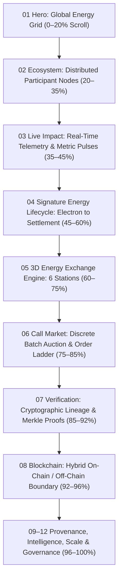

# Motion System Specification: Energy Infrastructure × Fluid Physical Dynamics

**Document Version:** 1.0.0  
**Scope:** Physics-inspired motion, scroll choreography, procedural energy field shaders, and transition state machines for the Decentralized Energy Exchange.

---

## 1. Core Motion Philosophy

Motion in the Decentralized Energy Exchange is **functional, informational, and physical**, never decorative. Every animation communicates:
1. **Flow & Causality:** Energy moving from source (solar inverters) through physical meters to the market and consumers.
2. **State & Transition:** Clear indication of interval gate closure, threshold quorum consensus, and settlement finalization.
3. **Cryptographic Lineage:** Explicit tracking of data packets transforming into signed envelopes, Merkle leaves, and on-chain commitments.
4. **Physical Energy Dynamics:** Particle velocity, acceleration, impedance, and magnetic node attraction rather than arbitrary UI bouncing.

---

## 2. Scroll Choreography: The Continuous Visual Journey

Rather than isolated sections snapping into place, the entire experience acts as a single continuous camera traveling through an operating energy system across **12 interconnected chapters**.

### Chapter Scroll Milestones (0% to 100% Viewport Journey)

| Scroll Range | Visual State | Camera & Network Behavior | Particle & Kinetic Dynamics |
| :--- | :--- | :--- | :--- |
| **0% – 20%** | **01 Hero: The Energy Grid** | Global macro perspective. Topographic grid lines slowly emerge (`opacity: 0 → 0.6`). Camera dollys forward along Z-axis toward the central transformer node. | Ambient energy particles stream along feeder lines at $v = 1.2\,\text{px/frame}$. Rate proportional to simulated solar irradiance. |
| **20% – 35%** | **02 Ecosystem Nodes** | Camera pans slightly down and left. Central network expands into distributed participant clusters (Prosumers, DISCOMs, Regulators). | Particles branch outward from generation clusters into feeder substations; hovering an entity pulls nearby particle trajectories via magnetic vector force ($F = \frac{G \cdot m_1 m_2}{r^2}$). |
| **35% – 45%** | **03 Live Impact Counter** | Camera locks into an orthographic plane. Metric counters trigger odometer animations (`1,284.7 MWh`, `9,482 Epochs`). | Periodic telemetry pulse waves emanate horizontally across the screen every 2.4 seconds, accompanied by live ledger rail updates. |
| **45% – 60%** | **04 Electron to Settlement** | Horizontal timeline pinning. The camera moves laterally along an 8-stage physical transmission track from Solar Panel $\to$ Meter $\to$ Oracle $\to$ Market $\to$ Certificate. | Particles visibly change color and state: Gold/Amber (physical electrons) $\to$ Cyan (signed telemetry bytes) $\to$ Emerald (settled rupee credits). |
| **60% – 75%** | **05 3D Exchange Engine** | The 3D abstract physical machine activates. The user can scrub through 4 inspection modes (`SYSTEM`, `ARCHITECTURE`, `STATIONS`, `ONE TRANSACTION`). | In `ONE TRANSACTION` mode, a single golden particle packet travels sequentially through all 6 physical stations with camera tracking. |
| **75% – 85%** | **06 Call Market & Order Book** | Visual transition from physical wires to financial order book depth. Dual-sided step curves assemble dynamically. | Bids (cyan) and Asks (emerald) stream into the order book ladder. Upon clearing, matched pairs compress into a single horizontal clearing line at ₹4.50/kWh. |
| **85% – 92%** | **07 Verification & Merkle Trees** | Telemetry packets compress into 32-byte hexadecimal hashes. Two leaves concatenate to form parent tree nodes. | Tree construction animates bottom-up using bezier curved spline lines. Oracle quorum signatures converge from 3 distinct nodes into the root. |
| **92% – 100%** | **08–12 Hybrid Settled Infrastructure** | Split screen visually divides off-chain high-frequency streaming from on-chain immutable consensus. Final transition to architecture blueprints and CTA. | Particles gracefully dissipate into an ambient quiescent background grid. |

---

## 3. Physical Particle Engine & Fluid Field Dynamics

### Particle Motion Equation
Particle positions update on each animation frame ($60\,\text{FPS}$) using deterministic procedural integration:
$$\vec{x}_{t+1} = \vec{x}_t + \vec{v}_t \cdot \Delta t$$
$$\vec{v}_{t+1} = (\vec{v}_t + \vec{a}_{\text{target}} \cdot \Delta t + \vec{F}_{\text{pointer}}) \cdot (1 - \gamma)$$

Where:
- $\vec{x}$: Particle position vector $(x, y, z)$.
- $\vec{v}$: Particle velocity vector.
- $\vec{a}_{\text{target}}$: Attraction acceleration toward the next network node path.
- $\vec{F}_{\text{pointer}}$: Pointer repulsion or magnetic attraction field within radius $R = 120\,\text{px}$.
- $\gamma$: Drag coefficient ($0.04$ for laminar current feel, preventing endless oscillation).

### Ambient Energy Field Shader (WebGL Canvas)
Instead of a generic AI blur or glowing blob, the background is rendered via a custom GLSL fragment shader simulating **equipotential electric field lines and topographic elevation**:
- **Simplex Perlin Noise:** Low-frequency ($0.0015\,\text{scale}$) domain warping to simulate subtle atmospheric electromagnetic variations.
- **Isoline Rendering:** Thin contour lines ($1\,\text{px}$) drawn at mathematical intervals $f(x, y) \pmod k < \epsilon$, evoking electrical potential maps.
- **Low Contrast Zinc Palette:** Background `#09090b` with contour lines at `#18181b` and active current pulses at `#27272a`, gently glowing to `#22c55e` (emerald) only along active feeder paths.

---

## 4. Section-to-Section Cinematic Morphing

1. **Hero $\to$ Ecosystem:** The central energy transformer node splits outward into a radial network of 7 stakeholder nodes (Prosumer, Consumer, DISCOM, Market Operator, Oracle, Auditor, Regulator).
2. **Ecosystem $\to$ Live Impact:** Peripheral connections fade to 10% opacity as numeric metric counters scale up from zero using ease-out cubic interpolation.
3. **Live Impact $\to$ Signature Flow:** The camera rotates 90 degrees into an isometric profile view, transforming the metrics into an 8-station physical transmission track.
4. **Signature Flow $\to$ Market:** Physical feeder lines straighten and align vertically, morphing into the symmetric price rungs of the order book ladder.
5. **Market $\to$ Verification:** Matched bilateral obligations dissolve into 64-character hexadecimal byte streams that flow into Merkle tree leaves.
6. **Verification $\to$ Blockchain:** The Merkle tree root hash drops vertically into an on-chain block container, locking with a cryptographic key animation.

---

## 5. Microinteractions & Ergonomics

| Element | Interaction Trigger | Motion Response | Physics / Timing |
| :--- | :--- | :--- | :--- |
| **Action Buttons** | Hover / Cursor approach | Magnetic translation towards pointer ($\Delta x \le 4\,\text{px}, \Delta y \le 4\,\text{px}$) with 1px border highlight. | Spring tension: $180$, damping: $22$. |
| **Order Book Rows** | Click / Tap | Row background highlights with subtle horizontal flash ($100\,\text{ms}$); 440px detail drawer slides in from the right edge. | Easing: `cubic-bezier(0.16, 1, 0.3, 1)`, duration: $240\,\text{ms}$. |
| **Detail Drawer** | Open / Close | Slides over canvas with backdrop opacity fade (`0 → 0.6`). | Translation: $X(100\% \to 0)$, duration: $200\,\text{ms}$. |
| **Status Indicators** | Active State | Continuous soft rhythmic pulse ($1.8\,\text{s}$ period) on inner core; outer ring scales $1.0 \to 1.6$ with opacity $0.8 \to 0$. | Deterministic CSS keyframe pulse. |
| **Interval Clock** | Interval Tick (15 min) | Number digit rolls vertically with odometer slide effect. | Duration: $350\,\text{ms}$, cubic ease. |
| **Fault Injection** | Button Toggle | Red alert wave propagates outward from simulator node to verification gateway ($v = 400\,\text{px/s}$). | Duration: $400\,\text{ms}$, sharp attack. |

---

## 6. Performance Budget & Accessibility Guarantees

1. **Strict 60 FPS Target:**
   - All particle updates batched into single `requestAnimationFrame` loops.
   - Zero DOM element creation during runtime loops; particles rendered to a single `<canvas>` using instanced point arrays.
   - GPU-accelerated CSS properties only: `transform` (3D translate) and `opacity`. Zero layout thrashing or `width`/`height` animations.
2. **Dynamic Level of Detail (LOD):**
   - **Desktop (High-DPI):** 180 particles, full shader contour lines, pointer magnetic attraction enabled.
   - **Mobile / Touch:** 60 particles, simplified 2D noise shader, touch magnetic field reduced, Three.js shadow maps disabled.
3. **Accessibility (`prefers-reduced-motion: reduce`):**
   - When detected, all particle motion freezes into a static, elegant topographic diagram.
   - Scroll animations switch from smooth camera travel to immediate section snaps.
   - Metric counters render instantly at their final values without odometer rolls.
