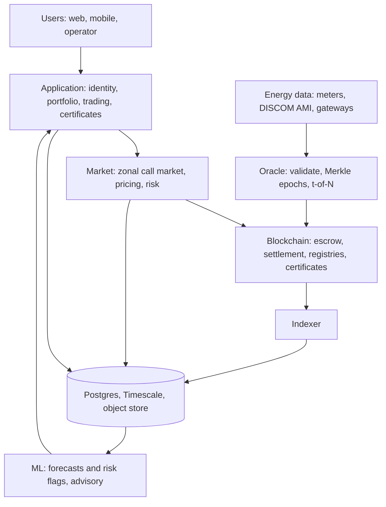
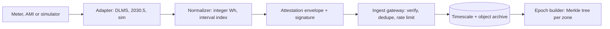
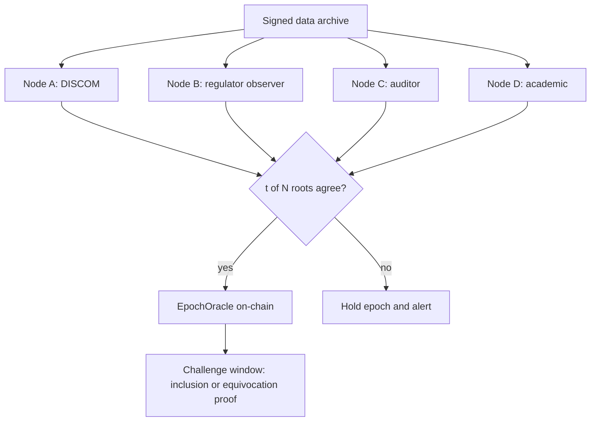
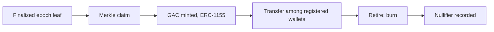
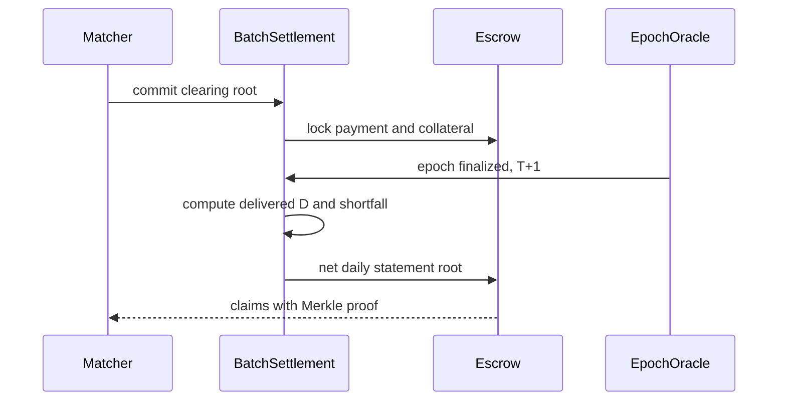
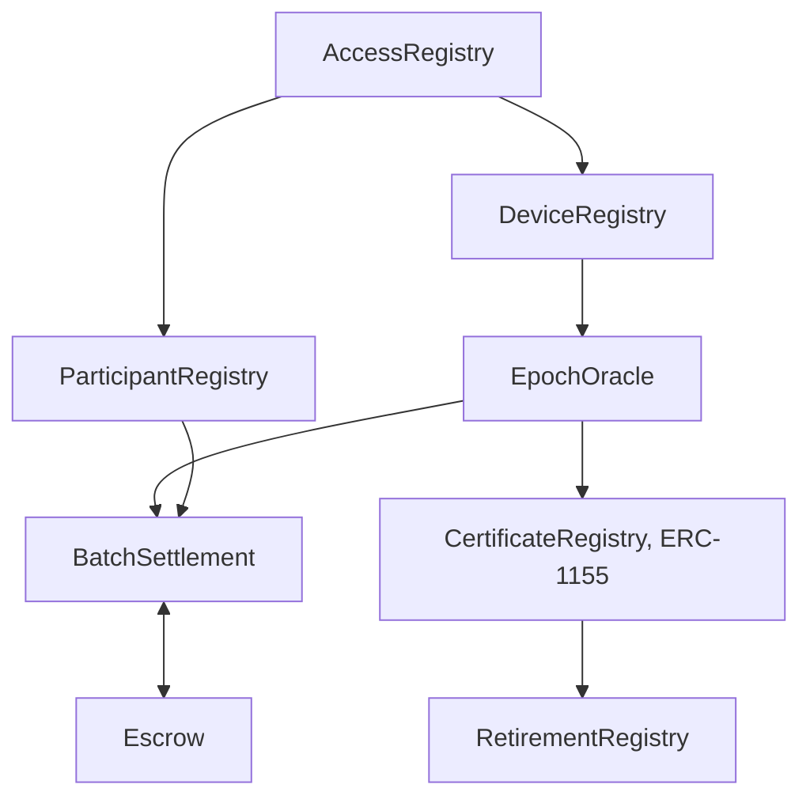

# VoltMesh: Decentralized Energy Exchange
## Mass-scale Architecture, V1 (Phase 2) · 1 Oct 2026 · Jurisdiction: India · Status: Research Blueprint

> **Full research notes, patent tables and appendices:** [docs/ARCHITECTURE-V1.md](file:///Users/achyutranaut/Desktop/energy-trading-platform/docs/ARCHITECTURE-V1.md)  
> *Not legal advice. Patent and regulatory notes are technical design research. Freedom-to-operate and compliance need a patent attorney and Indian power-sector regulatory counsel.*

### Evidence Tags
- **`[P1]`**: Patent claims read in full
- **`[P2]`**: Patent identified only (claims unread)
- **`[R]`**: Regulator or standards text / official orders
- **`[L]`**: Peer-reviewed or preprint literature
- **`[A]`**: Independent technical analysis (to validate by prototype / benchmark)
- **`[B]`**: Background knowledge (to verify before relying)

---

## Table of Contents
1. [Summary](#1-summary)
2. [Problem and Vision](#2-problem-and-vision)
3. [India Regulatory Context](#3-india-regulatory-context)
4. [System Architecture](#4-system-architecture)
5. [Energy Data and Meters](#5-energy-data-and-meters)
6. [Oracle Architecture](#6-oracle-architecture)
7. [Marketplace](#7-marketplace)
8. [Tokens and Certificates](#8-tokens-and-certificates)
9. [Settlement](#9-settlement)
10. [Smart Contracts](#10-smart-contracts)
11. [Backend and Data Stores](#11-backend-and-data-stores)
12. [ML, Privacy and Security](#12-ml-privacy-and-security)
13. [Scale, Failures and Testing](#13-scale-failures-and-testing)
14. [IP-Sensitive Areas](#14-ip-sensitive-areas)
15. [Repository and Roadmap](#15-repository-and-roadmap)
16. [Final Decisions](#16-final-decisions)

---

## 1. Summary

Research changed the Phase 1 design in four key ways:
1. **India has regulator-approved P2P pilots** (Delhi and Uttar Pradesh, Feb 2026), run by licensed DISCOMs under the India Energy Stack. P2P is permitted only in time-bound, licensee-run pilots. A student or research platform cannot itself trade electricity. `[R]`
2. **Metering authority is the DISCOM's AMI**, not a prosumer secure element. The dominant signer in a real deployment is an institutional AMI/MDMS signer. `[R]`
3. **"EnergyLot" is split in two**: a non-transferable delivery obligation and a separate granular attestation certificate (a research analogue of a REC). Indian RECs are 1 MWh and centrally issued, so a prototype cannot replicate them. `[R][A]`
4. **Pro-rata release is replaced by metered-delivery settlement** with a bounded shortfall charge and T+1 finality. Physical power flows regardless of any contract. `[A]`

*Kept:* off-chain interval batch clearing with on-chain commitment, Merkle-committed meter epochs, a hybrid chain design, ML as advisory only.

---

## 2. Problem and Vision

Rooftop surplus is monetised today only through net-metering or feed-in deals with the DISCOM. Direct neighbour trading needs trusted energy data, price discovery, settlement and provenance. Existing blockchain energy designs usually put too much on-chain, trust unverifiable meter data, or ignore regulation and grid physics.

VoltMesh is a reference architecture that turns attested meter data into verifiable epoch commitments, clears markets off-chain with an auditable deterministic algorithm, settles on a blockchain, and offers ML intelligence that never touches settlement. It runs in two operational modes:

| Mode | Purpose |
| :--- | :--- |
| **S: Sandbox** | Synthetic meters, test tokens, no real money, no claim of legal trading. This is what we build and demo. |
| **R: Regulated-pilot compatible** | Same core plus adapters for DISCOM AMI data and billing. Interfaces only; we do not claim to be a licensed operator. |

---

## 3. India Regulatory Context

| Topic | Finding | Tag |
| :--- | :--- | :--- |
| **P2P status** | DERC approved six-month P2P solar pilots (TPDDL, BRPL) in Feb 2026, including Delhi to UP interstate trades; UPERC approved the interstate pilot. | `[R]` |
| **Framework** | India Energy Stack (June 2025, Ministry of Power); REC Limited is nodal agency. | `[R]` |
| **Pilot terms** | Platform price discovery; transaction fee Rs 0.42/kWh (example only); wheeling waived inside TPDDL area; P2P settlement integrated into DISCOM billing. | `[R]` |
| **Who may operate** | Licensees petition for pilots. Unlicensed third parties cannot be assumed allowed. | `[A]` |
| **RECs** | CERC REC Regulations 2022: 1 MWh per certificate, issued centrally (Grid-India), traded on IEX/PXIL. | `[R]` |
| **Smart meters** | IS 16444 meters, IS 15959 / DLMS-COSEM data protocols, DISCOM reads at least daily. | `[R]` |
| **Data protection** | DPDP Act 2023 applies to consumption data. | `[B]` |

### Consequences for the Design
- Metering truth is the DISCOM AMI, so the oracle must accept institutional signers.
- In Mode R, money moves through DISCOM billing. Settlement needs a payment-adapter abstraction; token escrow is Mode S only.
- Daily AMI reads bound settlement latency, so final settlement is T+1 with provisional interval results.
- Certificates are strictly labelled **"prototype attestation certificates"** everywhere, not RECs.
- In Mode R, Sybil resistance comes from binding a wallet to a DISCOM consumer account.

---

## 4. System Architecture

Layers: User, Application, Market, Energy Data, Oracle, Blockchain, Data/Analytics. Deployment is a hybrid: a modular monolith for API, identity, portfolio and certificates, plus separate processes where trust or scale demands it (ingest gateway, oracle nodes, matcher, settlement relayer, indexer, ML service).



### Trust Model

| Question | Answer |
| :--- | :--- |
| **Trusted** | Registered device/AMI keys as data sources (bounded by plausibility checks); the registrar for identity binding; t-of-N independent oracle operators; audited contract code. |
| **Not trusted** | The operator for clearing correctness (it is verifiable); any single oracle node; the gateway for data content; users; ML output for settlement. |
| **Proven cryptographically** | Reading authenticity, Merkle inclusion, order signatures, equivocation. |
| **Enforced economically** | Oracle honesty (stake, slashing); seller delivery (collateral); buyer payment (escrow). |
| **Irreducible gap** | A signature proves a trusted device said a number, not that the physical event happened. Defence is layered detection and penalties, not proof. |

---

## 5. Energy Data and Meters



- **Normalization**: integer Wh per 15-min interval per device, no floats, monotonic counter.
- **Missing intervals**: explicit `MISSING` marker, never interpolated into a certificate or settlement.
- **Late data**: accepted until a cut-off (default T+3 days) as supplemental epochs; finalized roots are never rewritten.
- **Duplicates**: unique `(deviceId, intervalIdx)`. Two conflicting signed values form an equivocation proof.
- **Archive**: raw signed attestations kept in object storage (Parquet) so Merkle proofs can be regenerated.
- **Envelope**: `(deviceId, intervalIdx, energyWh, direction, counter, signerType, signature)`, with COSE_Sign1/CBOR as the reference format.
- **Signer tiers**: `SIMULATED`, `DEVICE_SE`, `DISCOM_MDMS`. Contracts treat them identically except for trust weight in `DeviceRegistry`.
- **Signatures**: Ed25519 for devices, secp256k1/EIP-712 for user orders.
- **Simulator**: pluggable fault injector (drift, replay, bypass, offline, equivocation) for testing.

---

## 6. Oracle Architecture

A plain "3-of-5" quorum is modified: operators all reading one upstream source (a single DISCOM head-end) is not decentralization.



- **Source tier**: signed attestations.
- **Validation tier**: N independent operators each check signatures, device status, counter monotonicity, interval uniqueness, capacity bounds, weather residuals and peer consistency, then build their own Merkle tree and compare roots.
- **Acceptance**: t-of-N signatures over `(zoneId, intervalRange, root, leafCount, totalWh)`. Prototype posts a list of t ECDSA signatures.
- **Liveness**: stale reads rejected; sequencer uptime monitored on L2.
- **Disputes**: submission of inclusion proof or equivocation proof triggers device revocation and operator review.
- **Compromised AMI signer mitigation**: plausibility checks, cross-source anomaly flags, sampled physical audits, per-device exposure caps tied to registered capacity.

---

## 7. Marketplace

Chosen mechanism: discrete-time uniform-price double auction (call market) per zone and 15-minute delivery interval. `[A]`

| Mechanism | Verdict | Reason |
| :--- | :--- | :--- |
| **Continuous double auction** | Reject | Speed advantage, high MEV exposure if on-chain |
| **Uniform-price call market** | **Select** | One auditable price, no ordering advantage, fits 15-min intervals |
| **Pay-as-bid** | Reject | Bid shading, hard for small prosumers |
| **Combinatorial auction** | Reject | Very high computation complexity |
| **Truthful (McAfee-style)** | Tier 3 research | Sacrifices one marginal trade to achieve budget balance |


- **Gate closure**: T minus 60 min (tunable).
- **Algorithm**: Sort bids descending and asks ascending; find largest $q$ where $\text{bid}(q) \ge \text{ask}(q)$; set price at $k = 0.5$ between marginal bid and ask; pro-rata at margin with hash-based tie-break.
- **Determinism**: Integer math only (Wh, paise), stable sorts, one shared pure library (TypeScript/WASM) used by matcher and independent verifier.
- **Price band**: Set per zone by operator/regulator. Fees (transaction, wheeling) are distinct line items.
- **Front-running mitigations**: EIP-712 off-chain signed messages; order-set Merkle root published before clearing results; verifiable deterministic reproduction.

---

## 8. Tokens and Certificates

| Asset | What it is | Representation | Transferable |
| :--- | :--- | :--- | :--- |
| **Delivery obligation** | Financial overlay on metered positions (buyer, seller, zone, interval, Wh, price, collateral). | Merkle leaf in `BatchSettlement` | No |
| **Granular attestation certificate (GAC)** | Environmental attribute claim for attested renewable generation (not a REC). | ERC-1155, ID = $\text{hash}(\text{zone}, \text{source}, \text{interval})$, amount in Wh. Lazy Merkle-claim minting. | Yes (among registered wallets) |
| **Payment currency** | Settlement currency | Test stablecoin / ERC-20 (Mode S); billing credit (Mode R). | Per adapter |



Double counting is blocked by `RetirementRegistry` storing nullifier = $\text{hash}(\text{leafId}, \text{amountRange})$. Certificate granularity is 15 minutes and one distribution zone.

---

## 9. Settlement

Metered-delivery settlement with bounded shortfall charge and T+1 finality. `[A]`

1. **At clearing (provisional)**: Buyer payment and seller collateral locked (Mode S escrow; Mode R licensee credit check).
2. **After interval**: Matcher publishes provisional obligations root.
3. **After epoch finalization (T+1)**: Delivered volume $D = \min(Q, \text{seller metered injection}, \text{buyer metered draw})$.
4. **Payment**: $D \times P_{\text{clearing}}$. Shortfall $S = Q - D$ incurs a charge on the non-performing party equal to replacement cost delta to reference tariff, bounded by collateral.
5. **Daily net statement**: Merkle root published on-chain; users claim or licensee imports to billing.



---

## 10. Smart Contracts



| Contract | Purpose | Key Invariant |
| :--- | :--- | :--- |
| **`AccessRegistry`** | Role definitions: REGISTRAR, OPERATOR, ORACLE, AUDITOR, PAUSER | No escalation without timelock |
| **`ParticipantRegistry`** | Wallet to participant ID, zone, role | 1 active participant per binding hash |
| **`DeviceRegistry`** | Device key, signerType, zone, capacity, status | Revoked devices cannot enter new epochs |
| **`EpochOracle`** | Accepts t-of-N signed epoch roots | Roots immutable once finalized; staleness checks |
| **`Escrow`** | Deposits, locks, collateral | $\sum \text{balances} = \text{token balance}$; $\text{locked} \le \text{balance}$ |
| **`BatchSettlement`** | Order root, clearing commitments, daily statements | Each leaf claimed at most once; credits equal debits |
| **`CertificateRegistry`** | GAC mint-by-claim (ERC-1155) | $\text{Minted Wh} \le \text{Epoch attested Wh}$ |
| **`RetirementRegistry`** | Nullifiers for certificates | Nullifier uniqueness strictly enforced |

---

## 11. Backend and Data Stores

- **Core API** (TypeScript/Node modular monolith): identity, devices, orders, portfolio, statements, certificates, admin.
- **Workers**: `ingest-gateway`, `epoch-builder`, `oracle-node`, `matcher`, `settlement-relayer`, `indexer`, `ml-service` (Python).
- **Messaging**: Redis Streams for prototype event logging; Redis for rate limiting and cache.

| Data Type | Primary Store |
| :--- | :--- |
| Users, orders, trades, obligations, statements, audit trail | **PostgreSQL** (partitioned by month) |
| Meter telemetry (~35B rows/yr @ 1M meters) | **TimescaleDB** hypertables, daily chunks, zone space-partitioned |
| Raw signed attestations | **Object Storage** (Parquet + zstd) |
| Chain events & logs | Custom indexer into PostgreSQL |

---

## 12. ML, Privacy and Security

ML is **strictly advisory** and never triggers financial settlement or oracle acceptance automatically.

| Task | Methodology |
| :--- | :--- |
| **PV & Load Forecast** | Seasonal-naive baseline, then Gradient-Boosted Trees (LightGBM/XGBoost). |
| **Meter Anomaly Score** | Rule bounds & residual z-scores, Isolation Forest for review flags. |
| **Fraud / Sybil Flags** | Rule heuristics first, graph analytics later. |

### Threat Model Summary

| Component | Main Threat | Primary Mitigation |
| :--- | :--- | :--- |
| **User / Wallet** | Sybil, phishing, blind signing | DISCOM binding, EIP-712 typed signing, short nonces |
| **Meter** | Tamper, bypass, replay | Monotonic counters, capacity bounds, equivocation proofs |
| **Gateway** | Dropping or delaying telemetry | Signed payloads, multi-gateway ingest, late-data window |
| **Oracle** | Collusion, key compromise | Independent t-of-N operators, public archive, challenge window |
| **Matcher** | Reordering, censorship | Published order-set roots, deterministic verification |
| **Smart Contracts** | Reentrancy, replay, rounding | Pull payments, nonces, invariant fuzzing, circuit breaker pause |

---

## 13. Scale, Failures and Testing

### Scale Estimates (1M Smart Meters) `[A]`
- **Readings**: ~96,000,000 / day (~35.04B / year)
- **Ingest rate**: 1,111 readings/sec average; 16,667 readings/sec peak burst
- **Storage**: ~3.4 TB/year (compact) to 5.6 TB/year (COSE)
- **On-chain footprint**: 96 super-roots/day (~4.3M gas total)

### Testing Disciplines
- **Contracts**: Unit, fuzz, and invariant tests (conservation of escrow, credit/debit balance, nullifier uniqueness).
- **Clearing**: Differential testing, golden vector suites, determinism cross-runtime checks.
- **Oracle / Meter**: Fault-injection simulator (drift, replay, bypass, offline, equivocation).

---

## 14. IP-Sensitive Areas

| Area | Patent Reference | Technical Stance |
| :--- | :--- | :--- |
| **Dual-meter cross-check before certificate** | US12380497 `[P1]` | Use authoritative meter as sole source; use cross-checks as advisory flags only. |
| **Merkle hashing by fixed energy quantum** | US11720526 `[P1]` | VoltMesh aggregates by time interval and zone instead of fixed energy quantum. |
| **Central model generating bids to queue** | US11983765B2 `[P1]` | Users submit their own EIP-712 signed orders; ML is advisory only. |
| **True-up of traded vs metered volumes** | US11983765B2 `[P1]` | Bounded shortfall charges against escrow collateral parameterized by utility tariff. |
| **On-chain optimizer replacing contracts** | US10762564B2 `[P1]` | Omitted. Contract state transitions require explicit signed participant actions. |

---

## 15. Repository Structure and Roadmap

```
voltmesh/
├── apps/
│   ├── web/               # Next.js trader and prosumer terminal
│   └── console/           # Operator, oracle, and auditor portal
├── services/
│   ├── api/               # Modular monolith API
│   ├── ingest-gateway/    # High-throughput attestation intake
│   ├── epoch-builder/     # Merkle epoch generation
│   ├── oracle-node/       # Independent validator daemon
│   ├── matcher/           # Deterministic call-market matcher
│   ├── settlement-relayer/# On-chain commitment daemon
│   ├── indexer/           # Chain event ingestion
│   └── ml-service/        # Python forecasting & anomaly flags
├── contracts/             # Foundry: Access, Participant, Device, Oracle, Settlement, Escrow
├── packages/              # Shared libraries (clearing, attestation, types, contracts-client)
├── simulators/meter-sim/  # Fault-injecting smart-meter software fleet
└── docs/                  # Architecture specs, security audits, patent analyses
```

---

## 16. Final Decisions

- **Blockchain**: EVM-compatible, chain-agnostic; L2 testnet for demos; permissioned EVM for utility pilots.
- **Tokens**: No token for delivery obligations; ERC-1155 for GAC; ERC-20 test token for Mode S payment.
- **Marketplace**: Zonal uniform-price double auction, 15-minute intervals, deterministic clearing.
- **Settlement**: Metered delivery, bounded shortfall charges, daily net statements, T+1.
- **Oracle**: Independent t-of-N signed roots with equivocation challenge window.
- **Meters**: Three signer tiers (`SIMULATED`, `DEVICE_SE`, `DISCOM_MDMS`) with capacity plausibility limits.
- **ML**: Purely advisory forecasting and fraud scoring; never executes trades or settlement.
