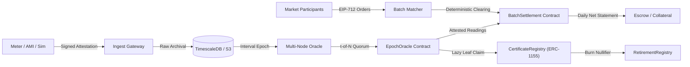
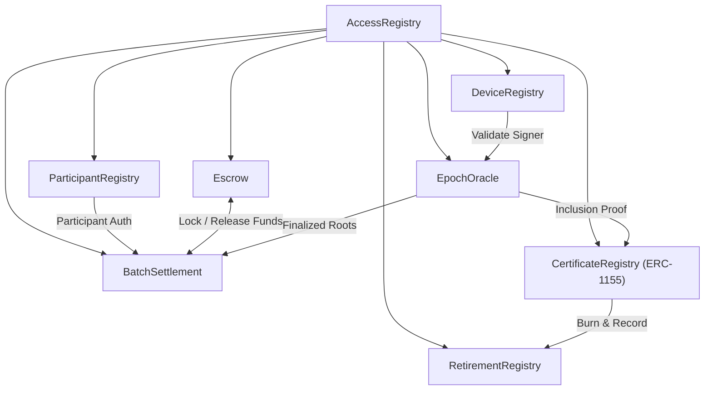
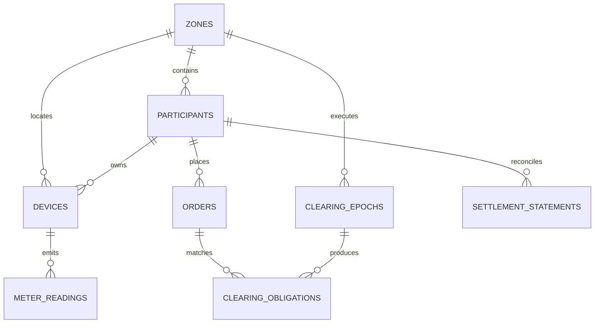
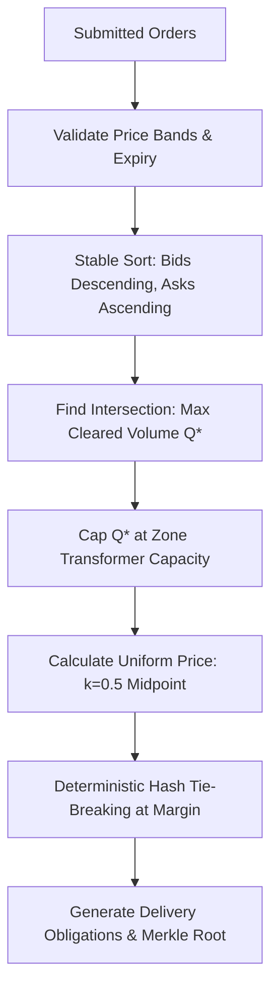
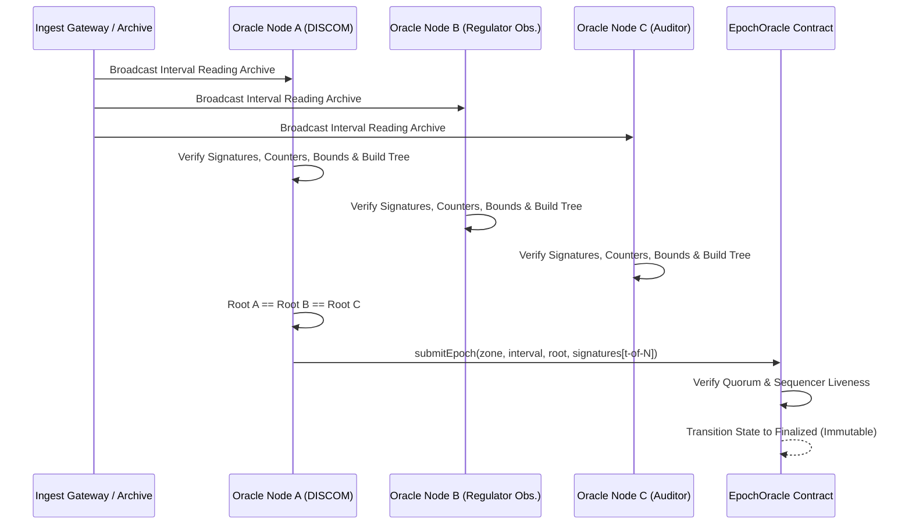
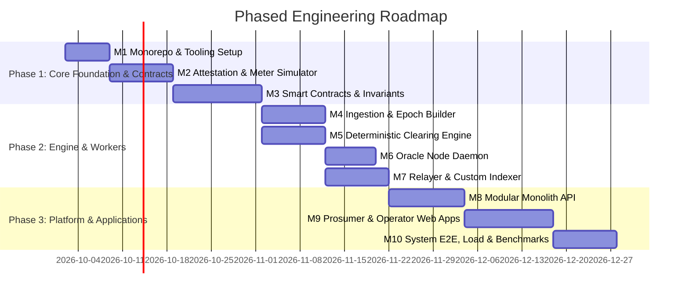

# Decentralized Energy Exchange: V1.1 Technical Design Specification & Execution Plan

**Document Version:** 1.1.0  
**Status:** Locked Technical Baseline (Architecture Freeze)  
**Jurisdiction Baseline:** India (DERC/UPERC Pilot Context; DERC P2P Guidelines 2024; India Energy Stack / REC Limited)  
**Execution Mode:** Dual-Track — Mode S (Autonomous Sandbox Simulation) with Mode R (Regulated Institutional Licensee Adapter Interfaces)  

---

## Executive Summary & Architectural Freeze

This specification freezes the technical design and contract interfaces derived from the *Decentralized Energy Exchange: Mass-Scale Architecture V1*. It translates the 792-line architectural research into an engineering specification to prevent fragmented development.

### Core Architectural Axioms
1. **Separation of Physical Delivery from Environmental Attributes:**  
   Physical energy delivery is a financial settlement overlay against metered interval data. It is **not** tokenized. Environmental provenance is represented as granular attestation certificates (GACs) via ERC-1155, distinct from statutory 1 MWh Indian RECs.
2. **Authoritative Metering Source:**  
   In regulated reality (Mode R), the DISCOM AMI (IS 16444 / IS 15959 DLMS/COSEM) head-end is the authoritative signer. In the research sandbox (Mode S), simulated smart meters utilize hardware secure-element emulation (Ed25519). Contracts treat signer types polymorphously based on configurable trust weights.
3. **Deterministic Off-Chain Clearing with On-Chain Anchors:**  
   Call-market batch auctions clear off-chain via a pure, zero-floating-point deterministic algorithm. Commitments are anchored to EVM smart contracts using Merkle roots.
4. **T+1 Settled Finality:**  
   Physical power flows continuously; metering reads arrive in periodic batches (daily AMI cadence). Settlement finality occurs at T+1 with bounded shortfall charges and escrow/collateral reconciliation.



---

## 1. Protocol Specification: Canonical Data Structures & Serialization

To guarantee cross-platform compatibility across TypeScript, Solidity, Python, and Rust/WASM, all data structures use fixed integer precision:
- **Energy:** Integer Watt-hours (`uint64 Wh`). $1\text{ kWh} = 1,000\text{ Wh}$; $1\text{ MWh} = 1,000,000\text{ Wh}$.
- **Monetary Currency:** Integer Paise (`uint64 Paise`). ₹$1.00 = 100\text{ Paise}$.
- **Time Representation:** Standardized 15-minute interval indices (`uint32 intervalIdx`) aligned with Indian Standard Time (IST = UTC+05:30).
  $$\text{intervalIdx} = \left\lfloor \frac{\text{unix\_timestamp\_utc} + 19800}{900} \right\rfloor$$

### 1.1 Attestation Envelope (Meter $\to$ Gateway $\to$ Oracle)
Meter readings use a compact binary serialization based on COSE/CBOR with canonical field ordering.

```protobuf
syntax = "proto3";
package energy_dex.attestation.v1;

enum SignerType {
  SIGNER_TYPE_UNSPECIFIED = 0;
  SIGNER_TYPE_SIMULATED = 1;     // Sandbox simulated device
  SIGNER_TYPE_DEVICE_SE = 2;     // Edge gateway with hardware Secure Element
  SIGNER_TYPE_DISCOM_MDMS = 3;   // Institutional DISCOM Head-End / MDMS
}

enum EnergyDirection {
  DIRECTION_INJECTION = 0;       // Net Generation (Solar Export)
  DIRECTION_CONSUMPTION = 1;     // Net Consumption (Load Import)
}

message MeterReadingPayload {
  bytes device_id = 1;           // 16-byte UUIDv7 or 32-byte registered ID
  uint32 zone_id = 2;            // Zonal transformer/feeder identifier
  uint32 interval_idx = 3;       // 15-minute interval index
  uint64 energy_wh = 4;          // Energy volume in Wh (non-negative integer)
  EnergyDirection direction = 5; // Injection vs Consumption
  uint64 counter = 6;            // Strictly monotonic per-device counter
  uint64 timestamp_utc = 7;      // Unix timestamp (seconds)
}

message AttestationEnvelope {
  uint32 version = 1;            // Envelope format version (1)
  SignerType signer_type = 2;    // Signer classification
  bytes payload_bytes = 3;       // Canonical CBOR/Protobuf encoded payload
  bytes signature = 4;           // Ed25519 (64 bytes) or secp256k1 (65 bytes)
  bytes public_key = 5;          // Signer public key identifier
}
```

#### Canonical Hashing for Merkle Tree Leaves
Each validated meter reading produces a unique Merkle leaf:
$$\text{leafHash} = \text{keccak256}(\text{abi.encodePacked}(\text{LEAF\_PREFIX}, \text{deviceId}, \text{zoneId}, \text{intervalIdx}, \text{energyWh}, \text{direction}, \text{counter}))$$
Where $\text{LEAF\_PREFIX} = \text{bytes1}(0\text{x}00)$ to prevent second-preimage attacks.

---

### 1.2 Order Schema & EIP-712 Typed Structured Data
Traders submit off-chain cryptographically signed orders compliant with EIP-712.

```solidity
// EIP-712 Domain Separator
bytes32 public constant DOMAIN_SEPARATOR_TYPEHASH = keccak256(
    "EIP712Domain(string name,string version,uint256 chainId,address verifyingContract)"
);

// Order TypeHash
bytes32 public constant ORDER_TYPEHASH = keccak256(
    "Order(address participant,uint32 zoneId,uint32 intervalIdx,uint8 side,uint64 quantityWh,uint64 pricePaisePerKWh,uint256 nonce,uint64 expiry)"
);

struct Order {
    address participant;      // Registered participant wallet
    uint32 zoneId;            // Trading grid zone
    uint32 intervalIdx;       // Delivery interval
    uint8 side;               // 0 = BUY, 1 = SELL
    uint64 quantityWh;        // Order volume in Watt-hours
    uint64 pricePaisePerKWh;  // Limit price in Paise per kWh (1 kWh = 1000 Wh)
    uint256 nonce;            // Sequential participant nonce
    uint64 expiry;            // Unix timestamp deadline (must precede gate closure)
}
```

#### Matcher Receipt Format
Upon ingestion, the gateway provides a cryptographic receipt proving submission sequence:
$$\text{receiptHash} = \text{keccak256}(\text{abi.encodePacked}(\text{orderHash}, \text{sequenceNumber}, \text{receivedTimestampUtc}))$$
Signed by the Matcher Gateway's public key.

---

### 1.3 Clearing Commitment Schema
At gate closure, the matcher clears the market and publishes a deterministic commitment:
```solidity
struct ClearingCommitment {
    uint32 zoneId;                 // Trading zone
    uint32 intervalIdx;            // Delivery interval
    uint64 clearingPricePaiseKWh;  // Uniform clearing price in Paise/kWh
    uint64 totalVolumeWh;          // Total matched volume
    bytes32 ordersMerkleRoot;      // Root of closed order set
    bytes32 obligationsMerkleRoot; // Root of resulting delivery obligations
    bytes32 stateHash;             // Hash of tie-break seed + solver metadata
}
```

---

### 1.4 Delivery Obligation Leaf Schema
Each cleared match is recorded in the obligations Merkle tree:
```solidity
struct DeliveryObligation {
    bytes32 obligationId;     // keccak256(orderId, counterpartyOrderId)
    address buyer;            // Buyer wallet address
    address seller;           // Seller wallet address
    uint32 zoneId;            // Grid zone
    uint32 intervalIdx;       // Delivery interval
    uint64 quantityWh;        // Cleared volume
    uint64 pricePaisePerKWh;  // Cleared execution price
    uint64 buyerEscrowLock;   // Locked currency amount in escrow
    uint64 sellerCollateral;  // Locked performance bond
}
```

$$\text{obligationLeafHash} = \text{keccak256}(\text{abi.encodePacked}(\text{OBLIGATION\_PREFIX}, \text{obligationId}, \text{buyer}, \text{seller}, \text{quantityWh}, \text{pricePaisePerKWh}))$$

---

### 1.5 Daily Settlement Statement Schema
At T+1, provisional obligations are reconciled against finalized meter readings:
```solidity
struct SettlementStatementLeaf {
    address participant;           // Participant wallet
    uint32 dateEpoch;              // Day index (unixTimestamp / 86400)
    uint32 zoneId;                 // Zone
    int256 netAmountPaise;         // Positive = Credit (payout), Negative = Debit (charge)
    uint64 deliveredWh;            // Total verified delivered energy
    uint64 shortfallWh;            // Unmet delivery volume
    uint64 shortfallPenaltyPaise;  // Assessed shortfall charge
    uint32 leafIndex;              // Position in statement Merkle tree
}
```

---

## 2. Smart-Contract Specification: State Machines, Interfaces & Invariants

All contracts are targeted at EVM (Solidity `0.8.24+`) utilizing Foundry. Contracts enforce `Pausable`, OpenZeppelin AccessControl (`AccessRegistry`), and strict ReentrancyGuards.



### 2.1 Complete Contract Inventory & Responsibilities

| Contract | State Storage | Critical Functions | Core Invariants |
| :--- | :--- | :--- | :--- |
| **`AccessRegistry`** | Role mapping, Timelock proposals | `grantRoleTimelocked()`, `executeRoleGrant()`, `revokeRole()` | No privileged role assigned without statutory timelock. |
| **`ParticipantRegistry`** | `mapping(address => Participant)` | `registerParticipant()`, `updateZone()`, `suspend()` | Exactly 1 active wallet address per unique identity `bindingHash`. |
| **`DeviceRegistry`** | `mapping(bytes32 => Device)` | `registerDevice()`, `revokeDevice()`, `submitEquivocationProof()` | Revoked device cannot participate in future epochs. Capacity bounds strictly enforced. |
| **`EpochOracle`** | `mapping(zone => mapping(interval => Epoch))` | `submitEpoch()`, `challengeEpoch()`, `setQuorum()` | Finalized roots are strictly immutable. Enforces $t$-of-$N$ valid signatures. |
| **`Escrow`** | `mapping(address => Balance)` | `deposit()`, `withdraw()`, `lockCollateral()`, `settleTransfer()` | $\sum \text{balances} \equiv \text{token.balanceOf}(\text{this})$. Locked $\le$ Total Balance. |
| **`BatchSettlement`** | `mapping(bytes32 => Clearing)`, `mapping(bytes32 => bool) claimed` | `commitClearing()`, `postDailyStatement()`, `claimSettlement()` | Single claim per leaf bitmap. $\sum \text{Statement Credits} \equiv \sum \text{Debits} + \text{Fees}$. |
| **`CertificateRegistry`** | ERC-1155 supplies, claimed leaves | `claimCertificate(merkleProof)`, `transferFrom()`, `burn()` | Total minted GAC Wh $\le$ Attested injection Wh in `EpochOracle`. |
| **`RetirementRegistry`** | `mapping(bytes32 => bool) nullifiers` | `retireCertificate(tokenId, amount, beneficiary)` | Nullifiers are strictly single-use. Burn is atomic with event emission. |

---

### 2.2 Detailed Solidity Interfaces

#### `IEpochOracle.sol`
```solidity
// SPDX-License-Identifier: MIT
pragma solidity ^0.8.24;

interface IEpochOracle {
    struct EpochRecord {
        bytes32 merkleRoot;
        uint32 leafCount;
        uint64 totalWh;
        uint64 finalizedAt;
        bool disputed;
    }

    event EpochSubmitted(uint32 indexed zoneId, uint32 indexed intervalIdx, bytes32 merkleRoot, uint64 totalWh);
    event EpochFinalized(uint32 indexed zoneId, uint32 indexed intervalIdx, bytes32 merkleRoot);
    event EpochChallenged(uint32 indexed zoneId, uint32 indexed intervalIdx, address indexed challenger, string reason);

    function submitEpoch(
        uint32 zoneId,
        uint32 intervalIdx,
        bytes32 merkleRoot,
        uint32 leafCount,
        uint64 totalWh,
        bytes[] calldata signatures
    ) external;

    function verifyLeafInclusion(
        uint32 zoneId,
        uint32 intervalIdx,
        bytes32 leafHash,
        bytes32[] calldata merkleProof
    ) external view returns (bool);

    function getEpoch(uint32 zoneId, uint32 intervalIdx) external view returns (EpochRecord memory);
}
```

#### `IBatchSettlement.sol`
```solidity
// SPDX-License-Identifier: MIT
pragma solidity ^0.8.24;

interface IBatchSettlement {
    struct ClearingCommitmentInput {
        uint32 zoneId;
        uint32 intervalIdx;
        uint64 clearingPricePaiseKWh;
        uint64 totalVolumeWh;
        bytes32 ordersMerkleRoot;
        bytes32 obligationsMerkleRoot;
    }

    event ClearingCommitted(uint32 indexed zoneId, uint32 indexed intervalIdx, uint64 pricePaiseKWh, uint64 volumeWh);
    event DailyStatementPosted(uint32 indexed dateEpoch, uint32 indexed zoneId, bytes32 statementRoot);
    event SettlementClaimed(address indexed participant, uint32 indexed dateEpoch, int256 netAmountPaise);

    function commitClearing(ClearingCommitmentInput calldata input) external;

    function postDailyStatement(
        uint32 dateEpoch,
        uint32 zoneId,
        bytes32 statementRoot,
        uint256 totalCreditsPaise,
        uint256 totalDebitsPaise,
        bytes[] calldata oracleSignatures
    ) external;

    function claimSettlement(
        uint32 dateEpoch,
        uint32 zoneId,
        int256 netAmountPaise,
        uint64 deliveredWh,
        uint64 shortfallWh,
        uint64 shortfallPenaltyPaise,
        uint32 leafIndex,
        bytes32[] calldata merkleProof
    ) external;
}
```

#### `ICertificateRegistry.sol`
```solidity
// SPDX-License-Identifier: MIT
pragma solidity ^0.8.24;

interface ICertificateRegistry {
    event CertificateClaimed(
        address indexed claimant,
        uint256 indexed tokenId,
        uint64 amountWh,
        bytes32 indexed leafNullifier
    );

    function claimCertificate(
        uint32 zoneId,
        uint32 intervalIdx,
        bytes32 deviceId,
        uint64 energyWh,
        uint8 sourceType,
        uint64 counter,
        bytes32[] calldata oracleMerkleProof
    ) external returns (uint256 tokenId);

    function burnForRetirement(address account, uint256 tokenId, uint256 amountWh) external;
}
```

---

## 3. Database Specification: Relational & Time-Series Engine

The persistence tier pairs **PostgreSQL 16** (transactional domain) with **TimescaleDB** (high-frequency meter telemetry).



### 3.1 PostgreSQL Transactional Schema (DDL)

```sql
-- Core Extensions
CREATE EXTENSION IF NOT EXISTS "uuid-ossp";
CREATE EXTENSION IF NOT EXISTS "timescaledb";

-- 1. Grid Zones Table
CREATE TABLE zones (
    zone_id SERIAL PRIMARY KEY,
    zone_code VARCHAR(32) UNIQUE NOT NULL,
    discom_name VARCHAR(64) NOT NULL,
    substation_identifier VARCHAR(64) NOT NULL,
    price_floor_paise_kwh BIGINT NOT NULL DEFAULT 200,   -- ₹2.00 / kWh
    price_cap_paise_kwh BIGINT NOT NULL DEFAULT 1200,    -- ₹12.00 / kWh
    transformer_capacity_kva NUMERIC(10,2) NOT NULL,
    created_at TIMESTAMPTZ NOT NULL DEFAULT NOW()
);

-- 2. Participants Table
CREATE TABLE participants (
    participant_id UUID PRIMARY KEY DEFAULT gen_random_uuid(),
    wallet_address CHAR(42) UNIQUE NOT NULL,
    zone_id INT NOT NULL REFERENCES zones(zone_id),
    discom_account_number VARCHAR(64) NOT NULL,
    identity_binding_hash CHAR(66) UNIQUE NOT NULL, -- keccak256(discom_acc + secret)
    role_type VARCHAR(16) NOT NULL CHECK (role_type IN ('PROSUMER', 'CONSUMER', 'DISCOM_OPERATOR')),
    kyc_status VARCHAR(16) NOT NULL DEFAULT 'PENDING' CHECK (kyc_status IN ('PENDING', 'VERIFIED', 'SUSPENDED')),
    created_at TIMESTAMPTZ NOT NULL DEFAULT NOW(),
    updated_at TIMESTAMPTZ NOT NULL DEFAULT NOW()
);
CREATE INDEX idx_participants_wallet ON participants(wallet_address);
CREATE INDEX idx_participants_zone ON participants(zone_id);

-- 3. Device Registry Table
CREATE TABLE devices (
    device_id UUID PRIMARY KEY DEFAULT gen_random_uuid(),
    participant_id UUID NOT NULL REFERENCES participants(participant_id),
    zone_id INT NOT NULL REFERENCES zones(zone_id),
    meter_serial_number VARCHAR(64) UNIQUE NOT NULL,
    signer_type VARCHAR(16) NOT NULL CHECK (signer_type IN ('SIMULATED', 'DEVICE_SE', 'DISCOM_MDMS')),
    signer_public_key BYTEA NOT NULL,
    source_type VARCHAR(16) NOT NULL CHECK (source_type IN ('SOLAR_PV', 'WIND', 'STORAGE', 'GRID')),
    rated_capacity_w BIGINT NOT NULL,
    trust_weight INT NOT NULL DEFAULT 100,
    is_revoked BOOLEAN NOT NULL DEFAULT FALSE,
    revocation_reason TEXT,
    created_at TIMESTAMPTZ NOT NULL DEFAULT NOW()
);
CREATE INDEX idx_devices_participant ON devices(participant_id);
CREATE INDEX idx_devices_signer_key ON devices(signer_public_key);

-- 4. Market Orders (Monthly Partitioning)
CREATE TABLE orders (
    order_id UUID NOT NULL,
    participant_id UUID NOT NULL REFERENCES participants(participant_id),
    zone_id INT NOT NULL REFERENCES zones(zone_id),
    interval_idx INT NOT NULL,
    side SMALLINT NOT NULL CHECK (side IN (0, 1)), -- 0: Buy, 1: Sell
    quantity_wh BIGINT NOT NULL CHECK (quantity_wh > 0),
    price_paise_kwh BIGINT NOT NULL CHECK (price_paise_kwh > 0),
    nonce NUMERIC(78, 0) NOT NULL,
    expiry_utc TIMESTAMPTZ NOT NULL,
    eip712_signature BYTEA NOT NULL,
    matcher_receipt_id VARCHAR(64) UNIQUE,
    status VARCHAR(16) NOT NULL DEFAULT 'PENDING' CHECK (status IN ('PENDING', 'MATCHED', 'PARTIAL', 'EXPIRED', 'CANCELLED')),
    created_at TIMESTAMPTZ NOT NULL DEFAULT NOW(),
    PRIMARY KEY (order_id, created_at)
) PARTITION BY RANGE (created_at);

-- 5. Daily Settlement Statements
CREATE TABLE settlement_statements (
    statement_id UUID PRIMARY KEY DEFAULT gen_random_uuid(),
    participant_id UUID NOT NULL REFERENCES participants(participant_id),
    zone_id INT NOT NULL REFERENCES zones(zone_id),
    date_epoch INT NOT NULL, -- Days since Unix epoch
    net_amount_paise BIGINT NOT NULL, -- Signed: positive credit, negative debit
    delivered_wh BIGINT NOT NULL,
    shortfall_wh BIGINT NOT NULL,
    shortfall_penalty_paise BIGINT NOT NULL,
    merkle_leaf_index INT NOT NULL,
    statement_root CHAR(66) NOT NULL,
    is_claimed BOOLEAN NOT NULL DEFAULT FALSE,
    claim_tx_hash CHAR(66),
    created_at TIMESTAMPTZ NOT NULL DEFAULT NOW(),
    CONSTRAINT unq_statement_participant_day UNIQUE (participant_id, date_epoch)
);
CREATE INDEX idx_statements_day_zone ON settlement_statements(date_epoch, zone_id);

-- 6. Cryptographically Chained Audit Log
CREATE TABLE system_audit_log (
    log_id BIGSERIAL PRIMARY KEY,
    action_type VARCHAR(32) NOT NULL,
    entity_name VARCHAR(32) NOT NULL,
    entity_id VARCHAR(64) NOT NULL,
    payload_json JSONB NOT NULL,
    prev_entry_hash CHAR(64) NOT NULL,
    entry_hash CHAR(64) NOT NULL,
    created_at TIMESTAMPTZ NOT NULL DEFAULT NOW()
);
```

### 3.2 TimescaleDB Telemetry Schema (Hypertable)

```sql
CREATE TABLE meter_telemetry (
    reading_timestamp TIMESTAMPTZ NOT NULL,
    device_id UUID NOT NULL,
    zone_id INT NOT NULL,
    interval_idx INT NOT NULL,
    energy_wh BIGINT NOT NULL,
    direction SMALLINT NOT NULL CHECK (direction IN (0, 1)),
    reading_counter BIGINT NOT NULL,
    raw_signature BYTEA NOT NULL,
    anomaly_flag BOOLEAN NOT NULL DEFAULT FALSE,
    anomaly_score NUMERIC(5, 4) DEFAULT 0.0,
    ingested_at TIMESTAMPTZ NOT NULL DEFAULT NOW(),
    CONSTRAINT pk_meter_telemetry PRIMARY KEY (reading_timestamp, device_id)
);

-- Convert to Hypertable with 1-day chunk interval
SELECT create_hypertable('meter_telemetry', 'reading_timestamp', chunk_time_interval => INTERVAL '1 day');

-- Compound Indexes
CREATE INDEX idx_telemetry_device_time ON meter_telemetry(device_id, reading_timestamp DESC);
CREATE INDEX idx_telemetry_zone_interval ON meter_telemetry(zone_id, interval_idx);

-- Compression Policy: Compress chunks older than 7 days
ALTER TABLE meter_telemetry SET (
    timescaledb.compress,
    timescaledb.compress_segmentby = 'zone_id, device_id',
    timescaledb.compress_orderby = 'reading_timestamp DESC'
);
SELECT add_compression_policy('meter_telemetry', INTERVAL '7 days');
```

---

## 4. API Specification: OpenAPI 3.1 Contract Definitions

The backend API follows strict REST conventions with EIP-4361 (Sign-In with Ethereum) JWT authentication.

### Key API Endpoints & Request/Response Contracts

```yaml
openapi: 3.1.0
info:
  title: Decentralized Energy Exchange Core API
  version: 1.1.0
paths:
  /api/v1/auth/nonce:
    get:
      summary: Request SIWE authentication nonce
      responses:
        '200':
          content:
            application/json:
              schema:
                type: object
                properties:
                  nonce: { type: string }
                  issuedAt: { type: string, format: date-time }

  /api/v1/auth/verify:
    post:
      summary: Verify signed EIP-4361 payload and obtain JWT session
      requestBody:
        content:
          application/json:
            schema:
              type: object
              required: [message, signature]
              properties:
                message: { type: string }
                signature: { type: string }
      responses:
        '200':
          content:
            application/json:
              schema:
                type: object
                properties:
                  accessToken: { type: string }
                  refreshToken: { type: string }
                  participantId: { type: string, format: uuid }

  /api/v1/metering/attestation:
    post:
      summary: Ingest signed meter reading envelope
      requestBody:
        content:
          application/json:
            schema:
              type: object
              required: [version, signerType, payloadBytes, signature, publicKey]
              properties:
                version: { type: integer, example: 1 }
                signerType: { type: string, enum: [SIMULATED, DEVICE_SE, DISCOM_MDMS] }
                payloadBytes: { type: string, format: byte }
                signature: { type: string, format: byte }
                publicKey: { type: string, format: byte }
      responses:
        '202':
          description: Attestation accepted into staging queue
        '400':
          description: Signature verification failed or malformed payload
        '409':
          description: Duplicate or equivocation conflict detected

  /api/v1/orders:
    post:
      summary: Submit cryptographically signed EIP-712 trading order
      requestBody:
        content:
          application/json:
            schema:
              type: object
              required: [order, signature]
              properties:
                order:
                  type: object
                  required: [participant, zoneId, intervalIdx, side, quantityWh, pricePaisePerKWh, nonce, expiry]
                  properties:
                    participant: { type: string }
                    zoneId: { type: integer }
                    intervalIdx: { type: integer }
                    side: { type: integer, enum: [0, 1] }
                    quantityWh: { type: integer }
                    pricePaisePerKWh: { type: integer }
                    nonce: { type: string }
                    expiry: { type: integer }
                signature: { type: string }
      responses:
        '201':
          content:
            application/json:
              schema:
                type: object
                properties:
                  receiptId: { type: string }
                  sequenceNumber: { type: integer }
                  orderHash: { type: string }
                  gatewaySignature: { type: string }

  /api/v1/clearing/epochs/{zoneId}/{intervalIdx}:
    get:
      summary: Retrieve verified clearing results and Merkle proofs
      parameters:
        - name: zoneId
          in: path
          required: true
          schema: { type: integer }
        - name: intervalIdx
          in: path
          required: true
          schema: { type: integer }
      responses:
        '200':
          content:
            application/json:
              schema:
                type: object
                properties:
                  zoneId: { type: integer }
                  intervalIdx: { type: integer }
                  clearingPricePaiseKWh: { type: integer }
                  totalVolumeWh: { type: integer }
                  ordersMerkleRoot: { type: string }
                  obligationsMerkleRoot: { type: string }
                  onChainTxHash: { type: string }

  /api/v1/certificates/claim-proof/{deviceId}/{intervalIdx}:
    get:
      summary: Get Merkle inclusion proof for ERC-1155 certificate minting
      parameters:
        - name: deviceId
          in: path
          required: true
          schema: { type: string, format: uuid }
        - name: intervalIdx
          in: path
          required: true
          schema: { type: integer }
      responses:
        '200':
          content:
            application/json:
              schema:
                type: object
                properties:
                  leafHash: { type: string }
                  energyWh: { type: integer }
                  sourceType: { type: integer }
                  merkleProof:
                    type: array
                    items: { type: string }
```

---

## 5. Clearing Algorithm Specification: Deterministic Discrete Uniform-Price Call Market

The market clears as a discrete-time uniform-price double auction per $(zone, interval)$.

### 5.1 Mathematical Formulation
1. **Valid Order Book Construction:**
   - Filter bids $\mathcal{B} = \{(p_j^B, q_j^B, \text{id}_j)\}$ such that $P_{min} \le p_j^B \le P_{max}$ and expiry $\ge T_{close}$.
   - Filter asks $\mathcal{A} = \{(p_i^A, q_i^A, \text{id}_i)\}$ such that $P_{min} \le p_i^A \le P_{max}$ and expiry $\ge T_{close}$.
2. **Deterministic Stable Sorting:**
   - Sort bids $\mathcal{B}$ descending by price $p_j^B$. If $p_j^B = p_k^B$, break ties by order submission timestamp, then by $\text{id}$.
   - Sort asks $\mathcal{A}$ ascending by price $p_i^A$. If $p_i^A = p_l^A$, break ties by order submission timestamp, then by $\text{id}$.
3. **Discrete Cumulative Step Curves:**
   $$\text{Demand}(p) = \sum_{\{j \in \mathcal{B} \mid p_j^B \ge p\}} q_j^B, \quad \text{Supply}(p) = \sum_{\{i \in \mathcal{A} \mid p_i^A \le p\}} q_i^A$$
4. **Optimal Cleared Volume:**
   $$Q^* = \max \left\{ q \in \mathbb{N} \mid \exists p \text{ such that } \text{Demand}(p) \ge q \text{ and } \text{Supply}(p) \ge q \right\}$$
   Enforce physical distribution transformer constraint:
   $$Q_{cleared} = \min(Q^*, C_{zone})$$
5. **Uniform Clearing Price Calculation ($k = 0.5$ Midpoint Rule):**
   - Let marginal bid be $P_B^* = \min \{ p_j^B \mid \text{bid } j \text{ partially or fully cleared} \}$.
   - Let marginal ask be $P_A^* = \max \{ p_i^A \mid \text{ask } i \text{ partially or fully cleared} \}$.
   $$P^* = \left\lfloor \frac{P_B^* + P_A^*}{2} \right\rfloor$$
6. **Deterministic Marginal Rationing & Tie-Breaking:**
   If at price $P^*$ total marginal volume exceeds available counter-volume, allocate using integer rationing with deterministic pseudo-random hash prioritization:
   $$\text{tieBreakScore}(m) = \text{uint256}(\text{keccak256}(\text{abi.encodePacked}(\text{orderId}_m, \text{epochSeed}, \text{intervalIdx})))$$
   Orders are allocated in order of highest `tieBreakScore` until $Q_{cleared}$ is exhausted. This eliminates operator favoritism and front-running.



---

## 6. Oracle Specification: Quorum, Merkle Construction & Dispute Proofs



### 6.1 Multi-Operator Quorum Design
- Node Operators: 5 distinct institutional entities (DISCOM IT, State Load Despatch Centre / Regulator Observer, Independent Certified Energy Auditor, Academic Research Node, Platform Operator).
- Threshold: $t = 3$ of $N = 5$ signatures required for epoch finalization.
- Staleness Window: Readings must be finalized within 96 intervals (24 hours). Roots submitted beyond the statutory window trigger contract rejection.
- Sequencer Uptime Check: On L2 testnets, the contract queries the Chainlink Sequencer Uptime Feed (`latestRoundData`). If the sequencer was down within grace period $\Delta t$, epoch consumption is frozen.

### 6.2 Merkle Tree Specification
- **Tree Standard:** Complete binary Merkle tree with sorted pairs to prevent order ambiguity.
- **Node Combination Formula:**
  $$\text{parentHash} = \text{keccak256}(\text{abi.encodePacked}(\min(\text{left}, \text{right}), \max(\text{left}, \text{right})))$$
- Leaf serialization matches Section 1.1.

### 6.3 Cryptographic Equivocation & Inclusion Dispute Proofs
1. **Equivocation Challenge:**
   If a meter or compromised signer signs two differing readings for the same $(deviceId, intervalIdx)$, anyone can invoke `DeviceRegistry.submitEquivocationProof(envelopeA, envelopeB)`:
   - Verifies both envelopes bear valid signatures from the registered `signerPublicKey`.
   - Confirms $(deviceId_A == deviceId_B) \land (intervalIdx_A == intervalIdx_B) \land (payload_A \ne payload_B)$.
   - Result: Immediate automated revocation of the device, slashing of operator stake, and flagging of the containing epoch.
2. **Inclusion Challenge:**
   If an oracle publishes a root omitting valid signed readings, a challenger submits the signed reading and epoch archive proof to initiate an on-chain dispute review.

---

## 7. Security Specification: STRIDE Threat $\to$ Mitigation $\to$ Verification Matrix

| Component | Threat Category (STRIDE) | Attack Vector | Technical Impact | Architectural Mitigation | Automated Test Verification |
| :--- | :--- | :--- | :--- | :--- | :--- |
| **Meter / AMI** | **Spoofing / Tampering** | Replaying past high generation readings or spoofing meter ID | Erroneous generation credit; inflation of GACs | Monotonic counter check + $(deviceId, intervalIdx)$ uniqueness constraint in DB & contract | Fault-injection simulator test: `test_reject_replay_and_stale_counter()` |
| **Meter / AMI** | **Tampering** | Inverter hacking: reporting 50 kWh on a 3 kW rooftop solar array | Fraudulent certificate minting | Strict capacity bound enforcement: $E_{max} = \text{Capacity}_W \times 0.25\text{ h} \times 1.15$ | Invariant test: `test_reading_exceeding_rated_capacity_rejected()` |
| **Ingest Gateway** | **Denial of Service** | Flooding gateway with unsigned or garbage telemetry | Resource exhaustion; delayed epochs | Reverse proxy WAF rate limiting; per-device IP whitelisting; early signature drop | k6 load test: 20,000 req/s synthetic flood; check p99 latency $< 150\text{ms}$ |
| **Batch Matcher** | **Information Disclosure / MEV** | Insider front-running: trading ahead of submitted prosumer orders | Unfair price extraction; market manipulation | Matcher issues signed sequence receipts; gate closure commits closed-order Merkle root before clearing | Integration test: `test_clearing_recomputable_by_independent_verifier()` |
| **Batch Matcher** | **Repudiation** | Operator alters prices or favors preferred participants | Distorted wealth transfer | Deterministic clearing engine compiled to WASM; zero float math; hash tie-breaker | Differential fuzz test: 100,000 randomized order books vs Python reference |
| **EpochOracle** | **Elevation of Privilege** | Rogue oracle node attempts single-handed epoch finalization | False root commitment | Smart contract enforces $t$-of-$N$ ECDSA signature quorum across verified `ORACLE_ROLE` keys | Foundry unit test: `test_revert_below_quorum_threshold()` |
| **Escrow** | **Tampering** | Reentrancy exploit on collateral withdrawal or claims | Escrow fund drainage | Pull-over-push payment architecture; OpenZeppelin `ReentrancyGuard`; Checks-Effects-Interactions | Foundry attack simulation: `test_reentrancy_attack_reverts()` |
| **Escrow** | **Tampering** | Rounding errors or ledger drift across multi-party settlements | Insolvent contract | Integer paise arithmetic; invariant: $\sum \text{credited} + \text{fees} \equiv \sum \text{debited}$ | Foundry invariant test: `invariant_escrow_token_balance_equals_total_balances()` |
| **Certificates** | **Repudiation / Tampering** | Double claiming or recycling retired certificates | Greenwashing; double counting | `RetirementRegistry` single-use nullifiers: $\text{hash}(\text{leafId}, \text{range})$; atomic burn | Invariant test: `test_revert_duplicate_nullifier_retirement()` |
| **API Backend** | **Elevation of Privilege** | IDOR: Prosumer A views/modifies Prosumer B's meter data or orders | Data breach; regulatory non-compliance (DPDP) | Strict object-level RBAC; Prisma/Postgres Row-Level Security (RLS) scoped to `participant_id` | Security contract test: Automated authorization matrix across all endpoints |

---

## 8. Implementation Roadmap: Execution Strategy



### Phase 1: Core Foundation & Smart Contracts (Days 1–31)
- **Milestone 1: Monorepo & Foundations**  
  Initialize pnpm workspace, Foundry contract suite, Docker Compose topology (Postgres 16 + TimescaleDB, Redis, Anvil/Hardhat local node, MinIO). Setup CI workflows.
- **Milestone 2: Attestation Library & Fault-Injecting Meter Simulator**  
  Build `@energy-dex/attestation` package (canonical Protobuf/CBOR serializer, Ed25519 signing, Merkle tree builder). Build `simulators/meter-sim` supporting normal solar generation profiles and injectable attack faults (counter replay, clock drift, equivocation).
- **Milestone 3: Smart-Contract Suite & Invariant Tests**  
  Implement the 8 core contracts in Foundry (`AccessRegistry`, `ParticipantRegistry`, `DeviceRegistry`, `EpochOracle`, `Escrow`, `BatchSettlement`, `CertificateRegistry`, `RetirementRegistry`). Write comprehensive unit, fuzz, and invariant test suites.

### Phase 2: Execution Engine & Off-Chain Workers (Days 32–54)
- **Milestone 4: Ingest Gateway & Epoch Builder Worker**  
  Build high-throughput ingestion gateway (Fastify) with Redis Streams buffer, persisting readings to TimescaleDB. Implement `epoch-builder` worker generating Merkle trees per $(zone, interval)$.
- **Milestone 5: Deterministic Clearing Library & Matcher Worker**  
  Develop `@energy-dex/clearing` pure library (zero-float integer call market). Implement `services/matcher` reading closed order sets, computing cleared obligations, and generating EIP-712/Merkle commitments.
- **Milestone 6: Oracle Node Daemon**  
  Build standalone `services/oracle-node` supporting independent multi-operator deployments with automated signature verification, bounds checking, and $t$-of-$N$ threshold multi-signing.
- **Milestone 7: Settlement Relayer & Custom Indexer**  
  Build idempotent `settlement-relayer` managing chain transaction queues, nonce tracking, and gas spikes. Build `services/indexer` consuming on-chain contract events into PostgreSQL.

### Phase 3: Platform Integration & Demonstration (Days 55–80)
- **Milestone 8: Modular Monolith API & SIWE Auth**  
  Develop `services/api` providing OpenAPI 3.1 endpoints, EIP-4361 authentication, participant onboarding, order management, and Merkle proof generation.
- **Milestone 9: Prosumer Web App & Operator/Auditor Console**  
  Next.js 15 applications using Tailwind CSS and Viem/Wagmi:
  - Prosumer App: Order submission, solar generation view, settlement claims, certificate retirement.
  - Console: Oracle node agreement status, clearing audit inspector, equivocation dispute console.
- **Milestone 10: System Integration, Chaos Drills & Scale Benchmarking**  
  Execute end-to-end simulation across 10,000 synthetic prosumer meters. Run RPC failure, sequencer stall, and DB recovery drills. Reconcile on-chain Escrow balances against off-chain clearing books.

### Phase 4: Long-Term Production-Scale Infrastructure (Deferred)
- Enterprise Kafka message broker replacement for Redis Streams.
- Mode R institutional DLMS/COSEM (IEC 62056) hardware head-end adapters and DISCOM billing credit reconciliation.
- ClickHouse analytical hyper-cube for 1M+ meter fleet reporting.
- Zero-Knowledge (ZK) SNARK proofs for private order books and verifiable off-chain clearing.
