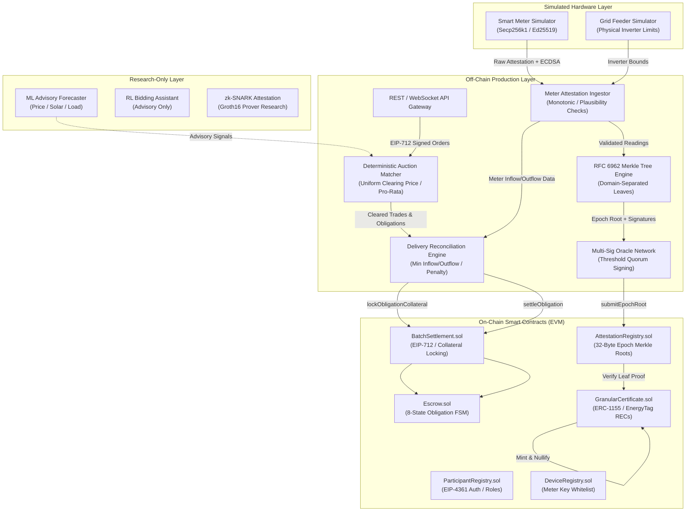
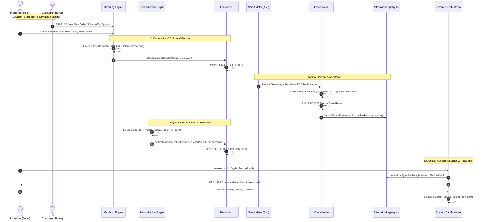

# VoltMesh — Final System Architecture Specification

## 1. Architectural Philosophy & Layered Separation

VoltMesh is an institutional-grade, privacy-preserving, decentralized energy trading and green attribute tracking platform. Its architecture strictly delineates execution layers to balance cryptographic security, throughput, regulatory compliance, and grid physics.

The architecture is partitioned into four distinct operational layers:
1. **On-Chain Layer (EVM L1/L2)**: Immutable commitments, escrow collateral locking, dispute resolution, attribute certificate issuance, and nullifier tracking.
2. **Off-Chain Production Layer**: Deterministic discrete double auctions, RFC 6962 Merkle tree accumulation, threshold BLS/Ed25519 multi-operator oracles, indexers, and REST/WebSocket APIs.
3. **Simulated Layer**: High-fidelity AMI smart meter telemetry generation, hardware ECDSA key signing, grid topology impedance emulation, and solar irradiance models.
4. **Research-Only Layer**: Machine learning price forecasting, reinforcement learning bidding agents, and zero-knowledge (ZK) private attestation proofs.

---

## 2. Layer Specifications

### 2.1 On-Chain Layer (EVM)
The on-chain layer provides zero-trust settlement guarantees without storing high-frequency meter readings or individual order book states.

- **`Escrow.sol`**:
  - Manages USDC collateral under a strict 8-state finite state machine:
    $$\text{CREATED} \to \text{FUNDED} \to \text{LOCKED} \to \text{DELIVERY\_PENDING} \to \text{DELIVERY\_VERIFIED} \to \text{SETTLEMENT\_READY} \to \text{SETTLED}$$
  - Enforces collateral conservation: $\sum \text{LockedFunds} = \sum \text{ActiveObligations}$.
  - Supports atomic refunds on delivery failure or timeout.
- **`BatchSettlement.sol`**:
  - Implements canonical EIP-712 hashing:
    $$\text{hashEnergyOrder}(\text{Order}) = \text{keccak256}(\text{abi.encode}(\text{ENERGY\_ORDER\_TYPEHASH}, \dots))$$
  - Exposes operator forwarding hooks for locking collateral and executing multi-participant settlements.
  - Maintains `cancelledOrders` mapping to protect against signature re-use.
- **`AttestationRegistry.sol`**:
  - Stores only the 32-byte Merkle root for each 15-minute trading epoch.
  - Requires $M$-of-$N$ threshold signatures from registered `OracleNode` operators.
  - Provides cryptographic inclusion proof verification for downstream contracts.
- **`GranularCertificate.sol`**:
  - ERC-1155 multi-token contract complying with the **EnergyTag Granular Certificate Standard v1.0**.
  - Mints tokens representing verified watt-hours ($Wh$) generated during a specific epoch, at a specific grid node, from a verified energy source.
  - Tracks non-replayable retirement nullifiers:
    $$\text{Nullifier} = \text{keccak256}(\text{tokenId} \parallel \text{retiree} \parallel \text{salt})$$
- **`ParticipantRegistry.sol` & `DeviceRegistry.sol`**:
  - Provides RBAC, KYC verification hooks, and cryptographic meter-to-participant public key binding.

---

### 2.2 Off-Chain Production Layer
The off-chain services handle high-throughput computational workloads:

- **Matcher (`services/matcher`)**:
  - Discrete Call Auction clearing every 15 minutes.
  - Sorts buy orders descending by price and sell orders ascending by price.
  - Computes the intersection to find the Market Clearing Price ($MCP$) and cleared volume.
  - Employs pro-rata allocation for marginal bids and asks.
  - Prevents replay attacks using participant nonces and deduplication sets.
- **Delivery Reconciliation Engine (`packages/clearing`)**:
  - Evaluates actual physical injection vs. contracted delivery:
    $$Q_{\text{delivered}} = \min(Q_{\text{contracted}}, Q_{\text{seller\_inj}}, Q_{\text{buyer\_cons}})$$
  - Imposes regulatory deviation penalties ($120\%$ of $MCP$) on seller shortfalls to discourage over-promising intermittent renewable generation.
- **Merkle Tree Accumulator (`packages/attestation`)**:
  - RFC 6962-compliant binary tree with domain separation prefixes (`0x00` leaf, `0x01` internal node).
  - Benchmarked to construct a 10,000-node tree in under 500 ms.
- **Oracle Node Network (`services/oracle-node`)**:
  - Validates physical plausibility (inverter nameplate capacity, non-negative power, monotonic cumulative energy).
  - Signs epoch roots using ECDSA/BLS threshold cryptography.
- **API Gateway (`services/api`)**:
  - Express.js HTTP/WebSocket server exposing REST endpoints for order placement, order cancellation, epoch tracking, certificate provenance queries, and market data streams.

---

### 2.3 Simulated Layer
- **Smart Meter Simulator (`simulators/meter-sim`)**:
  - Generates realistic 15-minute interval load profiles (solar PV diurnal curves, residential baseload, EV charging).
  - Signs every reading with a device-held ECDSA private key.
- **Grid Substation Simulator**:
  - Models feeder thermal capacity limits, line loss dissipation, and voltage transformer constraints.

---

### 2.4 Research-Only Layer
- **Machine Learning Forecaster**:
  - XGBoost and LSTM models forecasting solar irradiance and household demand 24 hours ahead.
  - **Crucial Distinction**: Advisory only. Outputs guidance to prosumer dashboards; never has private key access or autonomous order signing authority.
- **Zero-Knowledge Proof Prover (ZK-SNARK)**:
  - Experimental Groth16 circuit proving smart meter cumulative readings are within bounds without revealing household consumption patterns.

---

## 3. End-to-End Transaction & Data Lifecycle

---

## 4. Prior-Art & Patent Alignment Mapping

| Patent Reference | Prior-Art Concept | VoltMesh Architectural Realization | Differentiation / Status |
|---|---|---|---|
| **Distro Energy** (US11983765B2) | Off-chain broker & AI agent trading | Participant-signed EIP-712 orders, advisory-only ML, discrete call auction clearing | Differentiated. `LEGAL REVIEW REQUIRED` |
| **IBM** (US10762564B2) | Autonomous blockchain meter logs | Off-chain telemetry, RFC 6962 Merkle accumulator, on-chain 32-byte root | Differentiated. Cleared (Architectural) |
| **ClearTrace** (US11720526B2) | Merkle trie clean energy tracking | Domain-separated binary Merkle tree (`0x00`/`0x01`), dynamic ERC-1155 minting | Differentiated. `LEGAL REVIEW REQUIRED` |
| **Siemens Gamesa** (EP3836064A1) | Dual-meter verification threshold gate | Single AMI meter + physical inverter bounds + multi-operator oracle quorum | Differentiated. `LEGAL REVIEW REQUIRED` |
| **EnergyTag Standard** | Sub-hourly attribute certificates | ERC-1155 Granular Certificates with generator, grid node, timestamp, and nullifiers | Standard Compliant |
| **CoW Protocol** | Off-chain intent matching | Uniform-price discrete batch auctions, zero MEV, pro-rata allocation | Open Source Architecture |

---

## 5. Security, Trust & Decentralization Tradeoffs

| Mechanism | Tradeoff Choice | Rationale |
|---|---|---|
| **Settlement Frequency** | 15-Minute Discrete Epochs | Matches standard wholesale energy balancing markets (CAISO, ERCOT, ENTSO-E). Eliminates continuous HFT front-running and MEV. |
| **Order Authorization** | Explicit EIP-712 Signing | Protects user private keys. Eliminates smart contract custody risks and rogue agent trading. |
| **Meter Attestation** | Single Meter + Physical Plausibility | Avoids prohibitive CapEx of dual-metering residential prosumers while maintaining strict protection against meter spoofing. |
| **Data Anchoring** | 32-Byte Merkle Roots On-Chain | Minimizes EVM gas costs ($<100k$ gas per epoch) while preserving complete mathematical auditability via off-chain leaf proofs. |
| **Certificate Retirement** | Cryptographic Nullifiers | Ensures irreversible, non-replayable retirement across multi-registry environments without global centralized locks. |
